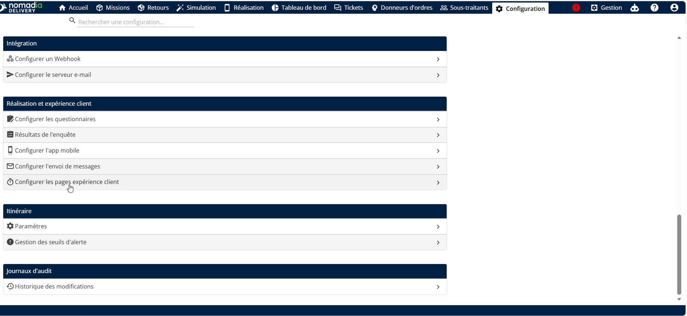
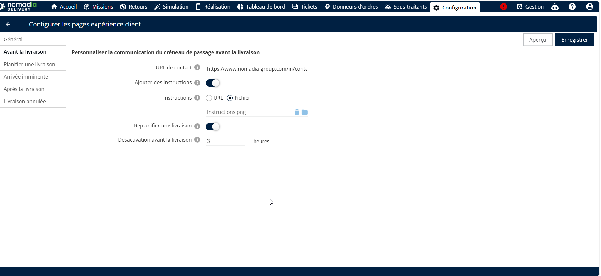
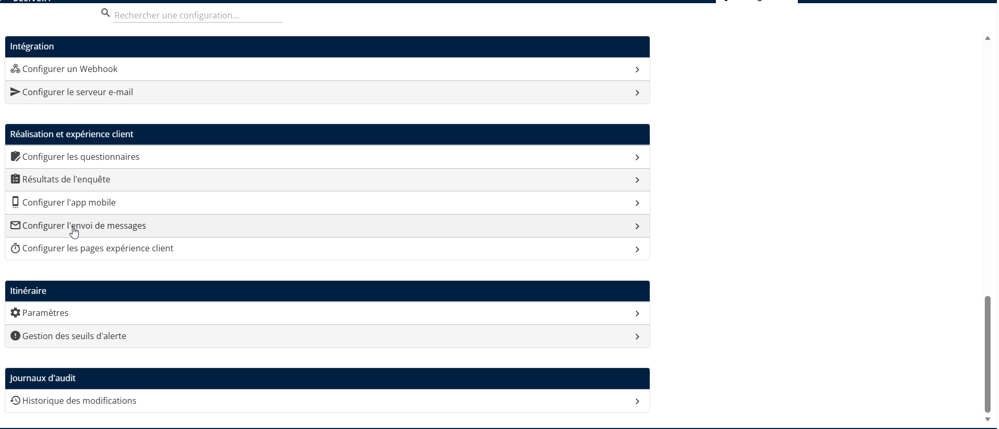
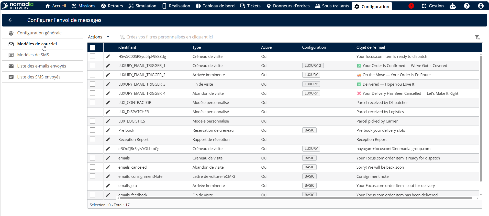
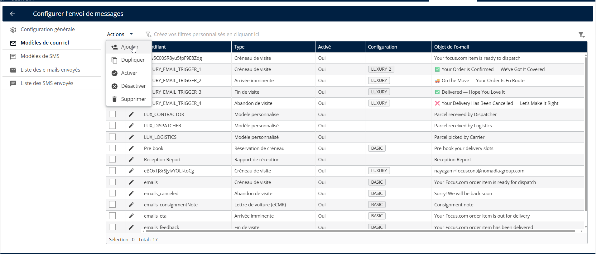
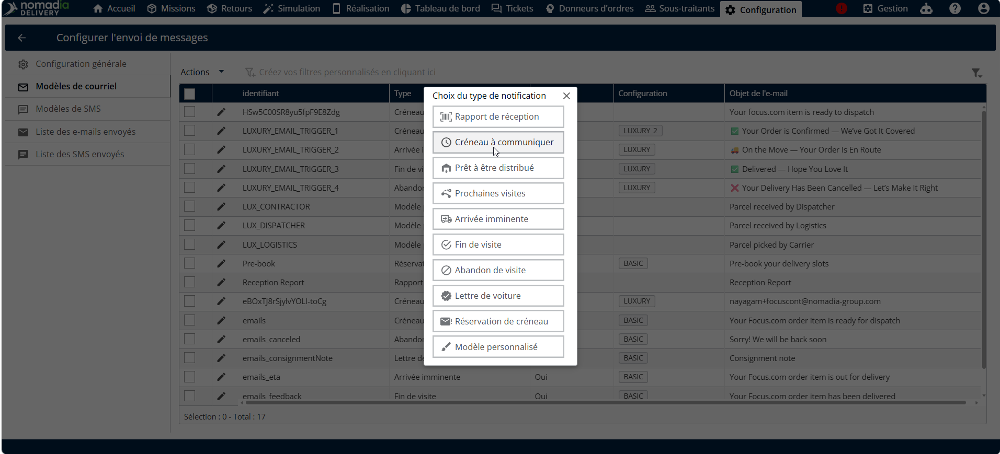
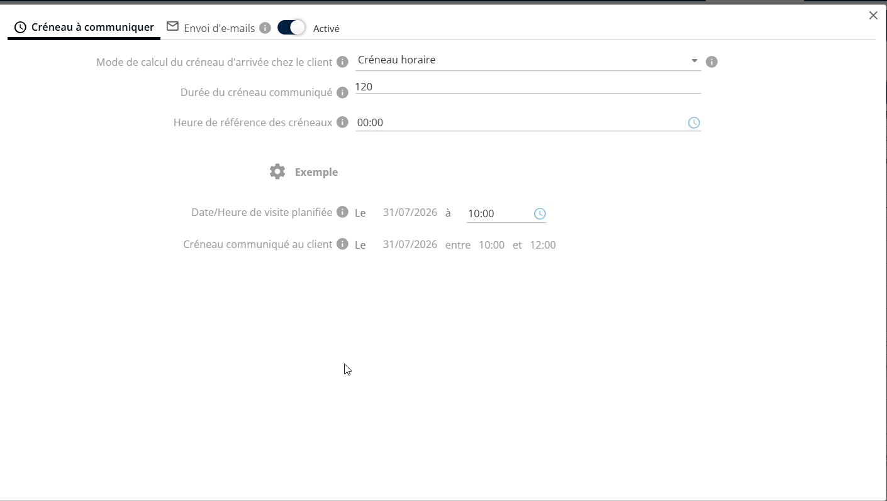
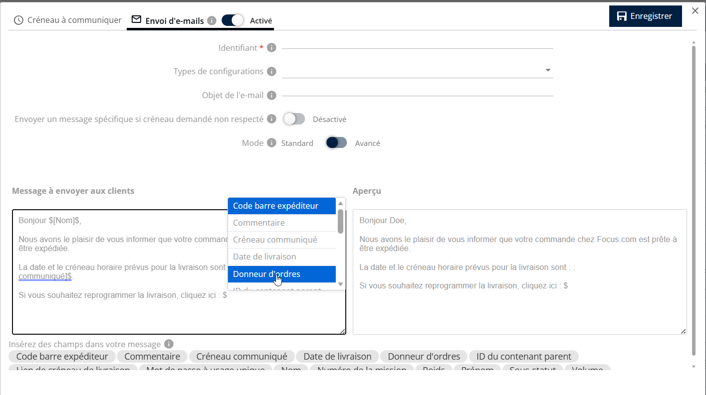
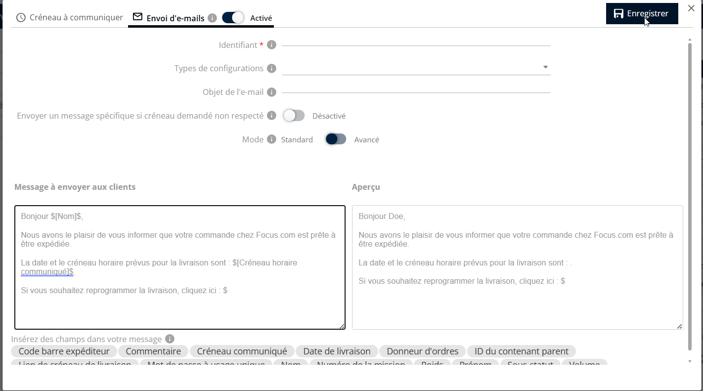

# Configuration du report

Ce guide propose des instructions étape par étape pour les transporteurs utilisant Nomadia Delivery, permettant aux clients finaux de reprogrammer facilement leur mission de livraison ou d’enlèvement. Ces nouvelles fonctionnalités améliorent la commodité et la communication avec les clients en leur permettant de choisir un créneau horaire adapté à leur emploi du temps.

Pour configurer le bouton de replanification dans les communications par e-mail, suivez ces étapes :

1. Lancez l’application Nomadia Delivery et allez dans l’onglet **Configuration** .
2. Dans le menu déroulant, sélectionnez **Configurez les pages d’expérience client.**

<figure><figcaption></figcaption></figure>

3. Cliquez sur le **Avant la livraison** élément de menu.
4. Activez le **Reprogrammer une livraison** pour activer le **replanifier** bouton dans **les communications par e-mail avec les clients**

<figure><figcaption></figcaption></figure>

5. Définissez la validité du lien de replanification à l’aide de l’option Désactiver avant la livraison. Vous pouvez configurer le lien pour qu’il soit actif au maximum 12 heures avant la livraison et au minimum 3 heures avant la livraison, en fonction de vos besoins opérationnels.
6. Cliquez sur **Enregistrer** pour appliquer et enregistrer la configuration de replanification.

<figure><figcaption></figcaption></figure>

Pour configurer le lien de replanification dans les communications par e-mail avec les clients, suivez ces étapes :

1. Lancez l’application Nomadia Delivery et allez dans l’onglet **Configuration** .

<figure><figcaption></figcaption></figure>

2. Dans le menu déroulant, sélectionnez **Configurer les messages sortants**.

<figure><figcaption></figcaption></figure>

3. Cliquez sur le **Modèles d’e-mail** élément de menu.

<figure><figcaption></figcaption></figure>

4. Cliquez sur **Actions** menu déroulant et sélectionnez Ajouter

<figure><figcaption></figcaption></figure>

5. Cliquez sur « **Fenêtre horaire pour communiquer** »

<figure><figcaption></figcaption></figure>

6. Activez les e-mails sortants pour permettre la communication avec le client final.

<figure><figcaption></figcaption></figure>

7. Lors de la rédaction du message, utilisez le mot-clé $ pour insérer des liens et des valeurs spécifiques à la mission.

<figure><figcaption></figcaption></figure>

8. Cliquez sur **Enregistrer**

<figure><figcaption></figcaption></figure>
