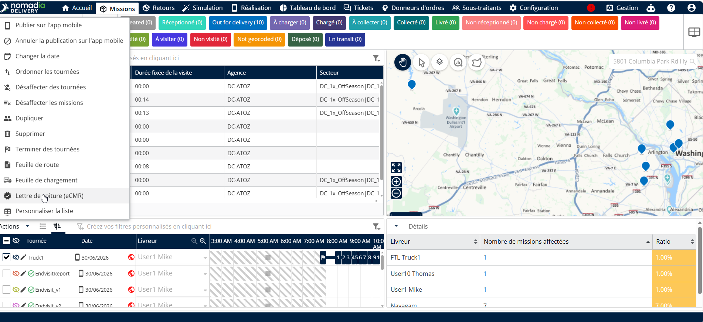
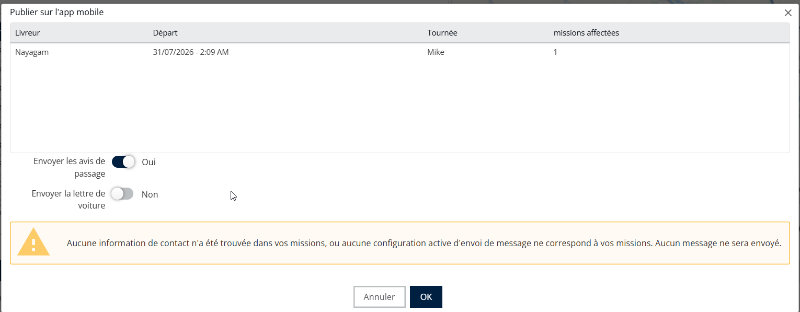

# Report par le client

Pour envoyer des notifications par e-mail au client final, suivez ces étapes :

1. Accédez à **Missions** onglet et attribuez une mission à un livreur.
2. Cliquez sur le **Actions** menu et sélectionnez **Publier sur l’application mobile.**

<figure><figcaption></figcaption></figure>

3. Activez le **Envoyer les bons de livraison** interrupteur pour envoyer des notifications par e-mail aux clients finaux, puis cliquez sur **OK**.

<figure><figcaption></figcaption></figure>

4. Une fenêtre contextuelle apparaîtra pour confirmer que les e-mails ont été envoyés, en indiquant le nombre d’e-mails distribués.

<figure><figcaption></figcaption></figure>

Veuillez noter que la mission a été configurée avec l’adresse e-mail de livraison/retrait, ce qui permet à Nomadia Delivery d’envoyer des notifications par e-mail à votre client final.

<figure><figcaption></figcaption></figure>

Pour reprogrammer une mission, le client final doit suivre les étapes suivantes

1. Le jour de la livraison, le client recevra un e-mail.

<figure><figcaption></figcaption></figure>

2. Le client doit cliquer sur le lien dans l’e-mail pour reprogrammer la mission.

<figure><figcaption></figcaption></figure>

3. Si la date et l’heure proposées ne conviennent pas, le client peut cliquer sur le **Reprogrammer** bouton.

<figure><figcaption></figcaption></figure>

4. Le client peut alors choisir l’un des créneaux disponibles suggérés par le moteur d’optimisation en temps réel.

<figure><figcaption></figcaption></figure>

4. Les créneaux horaires marqués d’une feuille verte indiquent des options écologiques, montrant qu’un livreur sera à proximité à ce moment-là, ce qui en fait le choix le plus optimal.
5. Après avoir sélectionné un créneau préféré, le client doit cliquer sur le **Choisir** bouton.

<figure><figcaption></figcaption></figure>

4. Une confirmation du créneau sélectionné est envoyée au client final.

<figure><figcaption></figcaption></figure>

8. Le plan d’itinéraire est automatiquement mis à jour en fonction du créneau choisi par le client.
