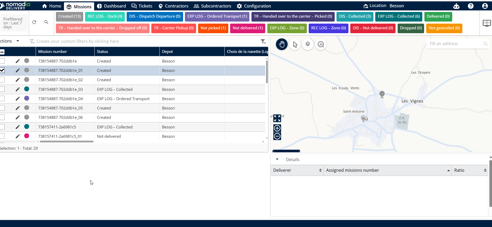
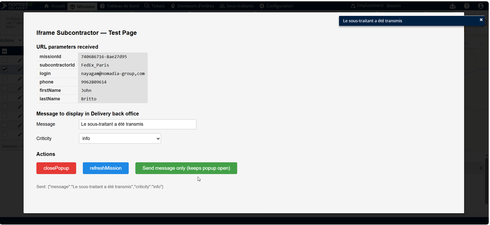
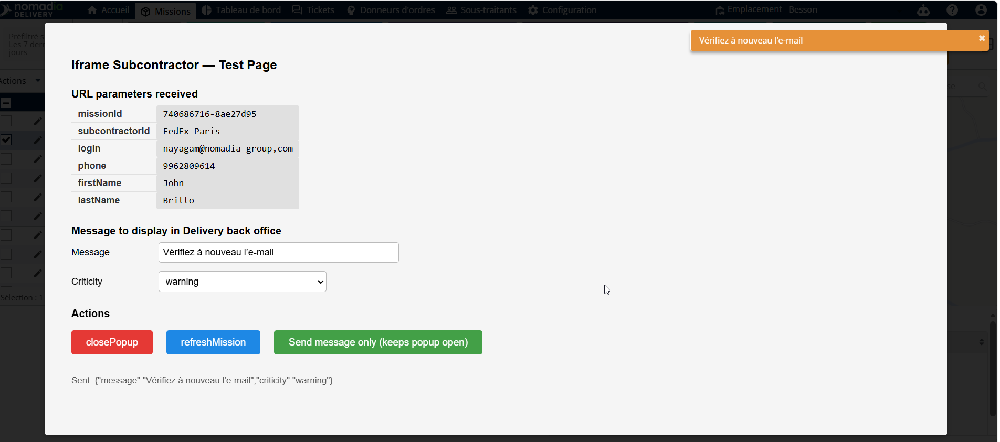
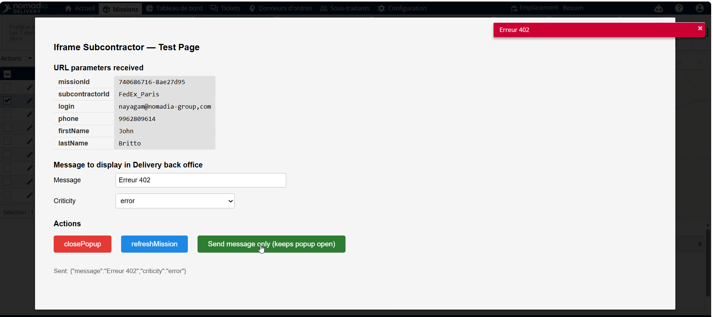

# Interaction avec l'iFrame

Cette fonctionnalité vous permet de communiquer directement avec les sous-traitants via une interface externe intégrée. Vous pouvez envoyer des mises à jour de statut et des messages spécifiques sans quitter l'application principale. Cela garantit un transfert de données fluide entre votre système et le portail externe du sous-traitant.

**Prérequis**

* Accès à la page **Missions**.
* Une URL de sous-traitant préconfigurée dans les paramètres de votre système.

**Étapes**

1. Accédez à la page **Missions**.
2. Sélectionnez la **Mission** souhaitée dans la liste.
3. Cliquez sur **Actions**.
4. Cliquez sur **Assigner au sous-traitant**.

<figure><figcaption></figcaption></figure>

**Aperçu de la fonctionnalité**

* **Champ Message** : Utilisez cette zone pour saisir des instructions personnalisées ou des mises à jour de statut.
* **Actions** : Catégories de statut sélectionnables telles que **Info**, **Avertissement**, **Erreur** ou **Succès**.
* **Envoyer le message** : Soumet vos données et déclenche une fenêtre contextuelle de confirmation dans l'interface.

**Comment faire : Envoyer des communications de statut**

**Envoyer une mise à jour Info**

1. Saisissez votre message dans le **champ Message**.
2. Sélectionnez le statut **Info**.
3. Cliquez sur **Envoyer le message**.
4. Vérifiez la fenêtre contextuelle « Le sous-traitant a été transmis ».

<figure><figcaption></figcaption></figure>

**Envoyer un avertissement**

1. Modifiez le texte existant dans le **champ Message**.
2. Changez le statut en **Avertissement**.
3. Cliquez sur **Envoyer le message uniquement**.
4. Vérifiez la fenêtre contextuelle « Vérifiez à nouveau l'e-mail ».

<figure><figcaption></figcaption></figure>

**Envoyer une erreur**

1. Saisissez les informations requises dans le **champ Message**.
2. Sélectionnez le statut **Erreur**.
3. Cliquez sur **Envoyer le message uniquement**.
4. Vérifiez la fenêtre contextuelle du message d'erreur.

<figure><figcaption></figcaption></figure>

**Finaliser une assignation réussie**

1. Sélectionnez le statut **Succès**.
2. Modifiez le **message** final.
3. Cliquez sur **Envoyer le message uniquement**.
4. Vérifiez la fenêtre contextuelle « Le sous-traitant a été assigné avec succès ».

<figure><figcaption></figcaption></figure>

**Quitter l'interface**

1. Actualisez la page une fois les tâches terminées.
2. Fermez la fenêtre contextuelle.

<figure><figcaption></figcaption></figure>

**Conseils de productivité**

* 💡 **Retour aux missions** : La fermeture de la dernière fenêtre contextuelle vous ramène automatiquement à la page **Missions**.
* ⚠️ **Confirmer l'action** : Cliquez toujours sur **Envoyer le message** pour déclencher la fenêtre contextuelle de statut requise et vous assurer que la mise à jour est traitée.
