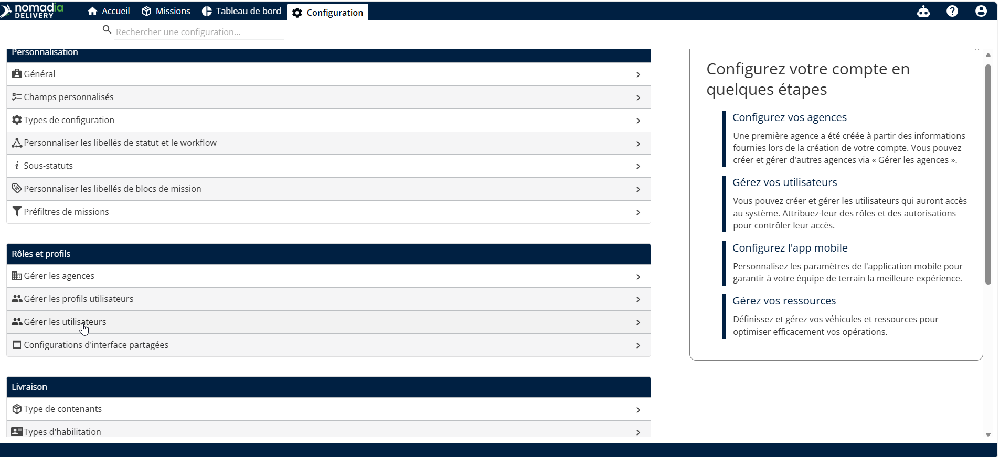
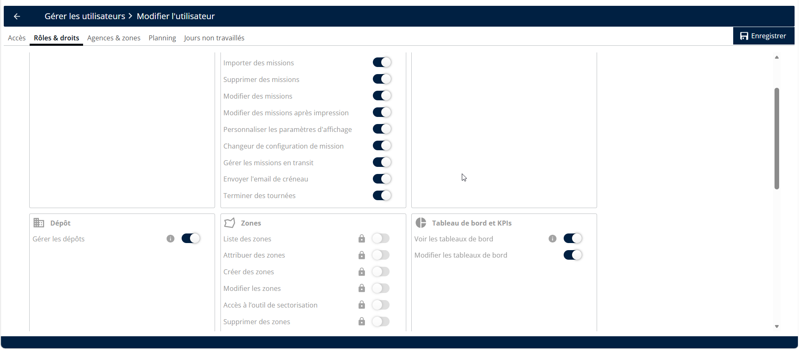

# Gérer les dépôts / bâtiments

Gérer les dépôts / bâtiments vous permet de contrôler l'accès aux bâtiments et leur visibilité pour votre équipe. Cette fonctionnalité garantit que les répartiteurs et les employés ne voient que les emplacements pertinents pour leurs opérations quotidiennes. Vous obtiendrez un flux de travail simplifié en associant des bâtiments spécifiques aux bons utilisateurs.

**Prérequis**

Prérequis et étapes de configuration initiale :

* Accès administratif à la page **Configuration**.
* Comptes utilisateurs actifs créés dans le système.

**Étapes**

1. Ouvrez la page **Configuration**.
2. Sélectionnez **Gérer les utilisateurs**.

<figure><figcaption></figcaption></figure>

**Aperçu de la fonctionnalité**

* **Gérer les dépôts /** **bâtiments** : Cette option sous la section **Livraison** vous permet de visualiser et d'organiser les affectations de bâtiments.
* **Rôles et droits** : Un sous-menu dans un profil utilisateur où vous activez des autorisations de fonctionnalités spécifiques.
* **Liste déroulante d'emplacement** : Un menu de sélection dans le profil utilisateur utilisé pour associer un bâtiment spécifique à un employé.
* **Sélecteur rapide de bâtiment** : Un outil dans le coin supérieur droit pour changer rapidement de bâtiment.

**Comment faire : Activer la gestion des dépôts / bâtiments**

1. Accédez à la page **Configuration** et cliquez sur **Gérer les utilisateurs**.
2. Cliquez sur un **utilisateur** spécifique.

<figure><figcaption></figcaption></figure>

3. Sélectionnez **Rôles et droits**.
4. Activez l'option **Gérer les dépôts**.
5. Cliquez sur la **flèche gauche** pour revenir au menu principal.

<figure><figcaption></figcaption></figure>

**Comment faire : Associer un bâtiment à un utilisateur**

1. Sélectionnez **Gérer les utilisateurs** et cliquez sur l'**utilisateur** souhaité.
2. Localisez le menu **Liste déroulante d'emplacement**.

<figure><figcaption></figcaption></figure>

3. Sélectionnez le bâtiment dans la liste.
4. Actualisez la page pour confirmer que l'association est reflétée dans le tableau **Gérer les utilisateurs**.

<figure><figcaption></figcaption></figure>

**Conseils de productivité**

* 💡 **Accès rapide** : Utilisez le sélecteur dans le coin supérieur droit pour changer de bâtiment instantanément sans accéder aux paramètres utilisateur.
* 💡 **Synchronisation mobile** : Les modifications effectuées dans l'application mobile seront automatiquement mises à jour dans les paramètres du back-office.
