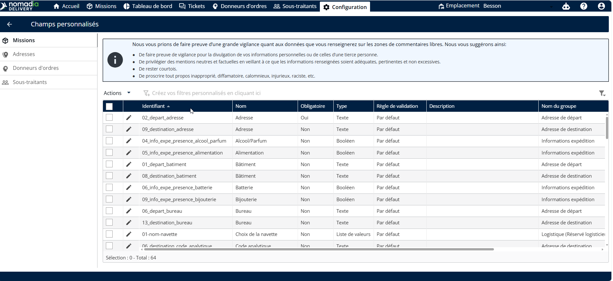
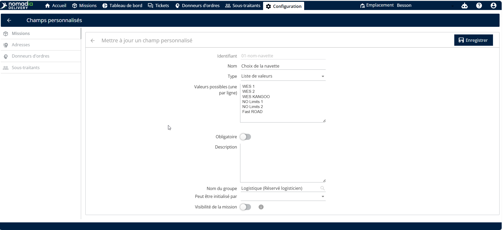
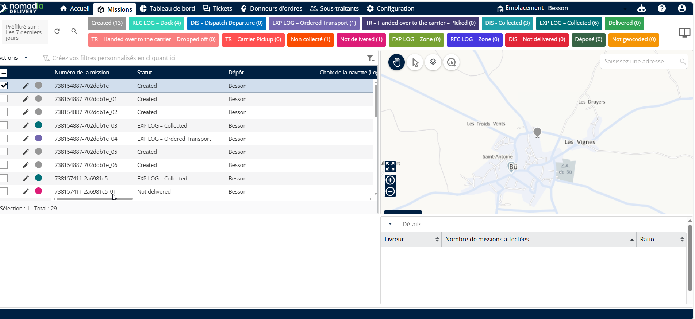
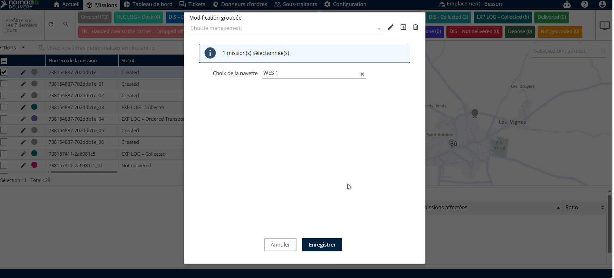

# Gestion des navettes

La gestion des navettes vous permet d'organiser et de nommer les ressources de votre flotte de transport. Utilisez cette fonctionnalité pour personnaliser les identifiants des navettes et les affecter à des missions spécifiques. Cela garantit un suivi précis et une planification efficace pour vos opérations logistiques.

**Prérequis**

* Accès au tableau de bord **Nomadia Delivery**.
* Autorisations administratives pour modifier les **Champs personnalisés** et les **Missions**.

**Étapes**

1. Connectez-vous à votre compte.
2. Accédez au menu **Configuration**.

<figure><figcaption></figcaption></figure>

**Aperçu de la fonctionnalité**

* **Configuration** : Le menu principal pour les paramètres système et la structure des données.
* **Champs personnalisés** : Une section pour définir et modifier des libellés de données spécifiques tels que les noms de navettes.
* **Icône crayon** : Le bouton de modification utilisé pour changer les noms des navettes existantes.
* **Missions** : Le module où toutes les unités de flotte et le matériel sont répertoriés et gérés.
* **Actions** : Un bouton qui ouvre un menu d'outils de gestion en masse pour les éléments sélectionnés.
* **Modification en masse** : Un outil pour appliquer le même changement à plusieurs missions simultanément.

**Comment faire : Mettre à jour les noms des navettes**

1. Accédez à **Configuration**.

<figure><figcaption></figcaption></figure>

2. Cliquez sur **Champs personnalisés**.
3. Cliquez sur l'**icône crayon** à côté du nom du champ navette.
4. Modifiez la liste des noms de navettes selon vos besoins.
5. Cliquez sur **Enregistrer**.

<figure><figcaption></figcaption></figure>

**Comment faire : Affecter des navettes aux missions**

1. Accédez à **Missions**.
2. Cochez les cases des missions que vous souhaitez mettre à jour.

<figure><figcaption></figcaption></figure>

3. Cliquez sur **Actions**.
4. Cliquez sur **Modification en masse**.
5. Cliquez sur le menu déroulant à côté de **Noms des navettes**.
6. Sélectionnez un nom de navette dans la liste.
7. Cliquez sur **Enregistrer**.

<figure><figcaption></figcaption></figure>

**Conseils de productivité**

* 💡 **Mises à jour en masse** : Gagnez du temps en utilisant la fonctionnalité **Modification en masse** pour affecter la même navette à plusieurs missions en une seule fois.
