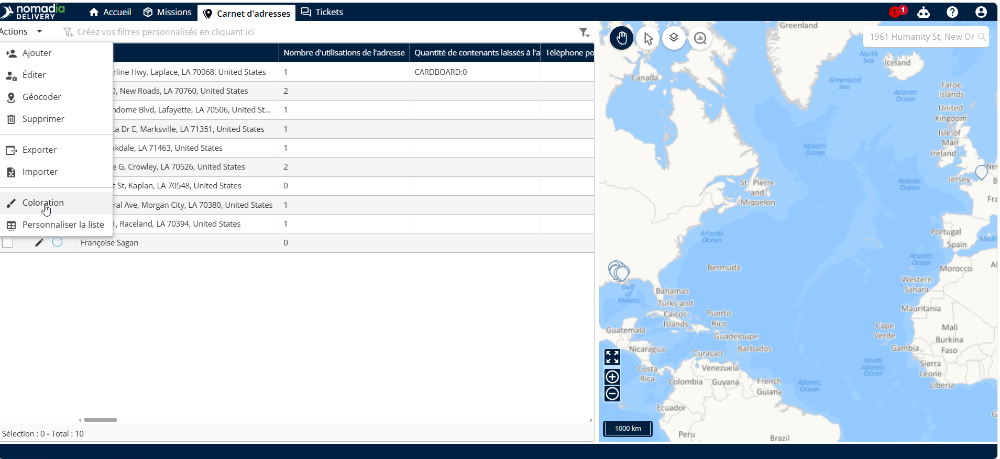
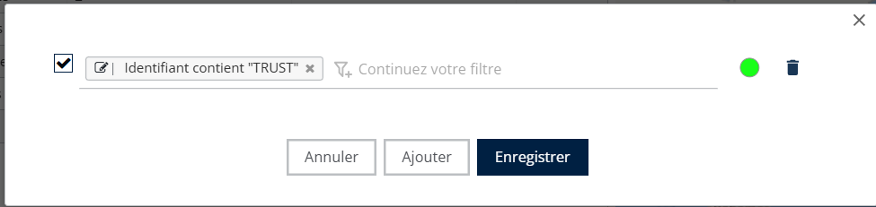
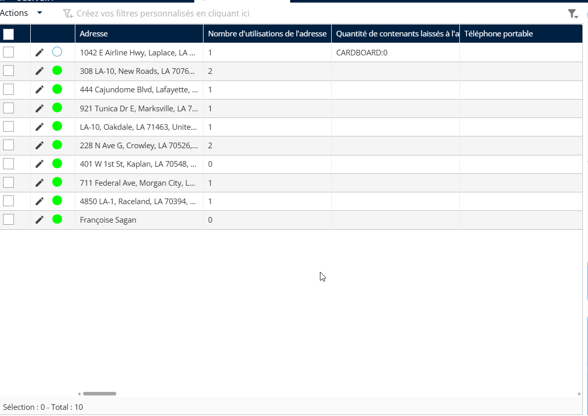

# Coloration et filtre

1. Utilisez les options « Coloration » et « Filtre » pour organiser et afficher les données selon des conditions spécifiques.

<figure><figcaption></figcaption></figure>

2. Dans la fenêtre contextuelle « Coloration », appliquez des conditions selon vos préférences

<figure><figcaption></figcaption></figure>

3. La liste affiche alors les adresses avec des couleurs personnalisées selon les conditions que vous avez définies

<figure><figcaption></figcaption></figure>
