# Restrictions des sous-traitants

Les restrictions des sous-traitants vous permettent de contrôler précisément l’accès aux modèles et aux autorisations de modification des missions.

Pour restreindre les sous-traitants à des documents spécifiques et à des modèles de configuration de mission, suivez les étapes ci-dessous.

1. Ouvrez l’application Nomadia Delivery et accédez à l’onglet Configuration.

<figure>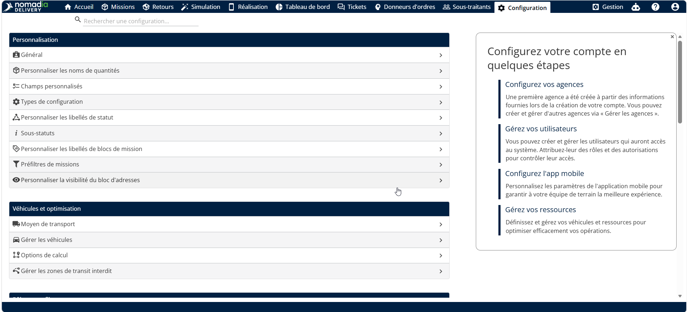<figcaption></figcaption></figure>

2. Cliquez sur la page Sous-traitants dans l’en-tête principal.

<figure>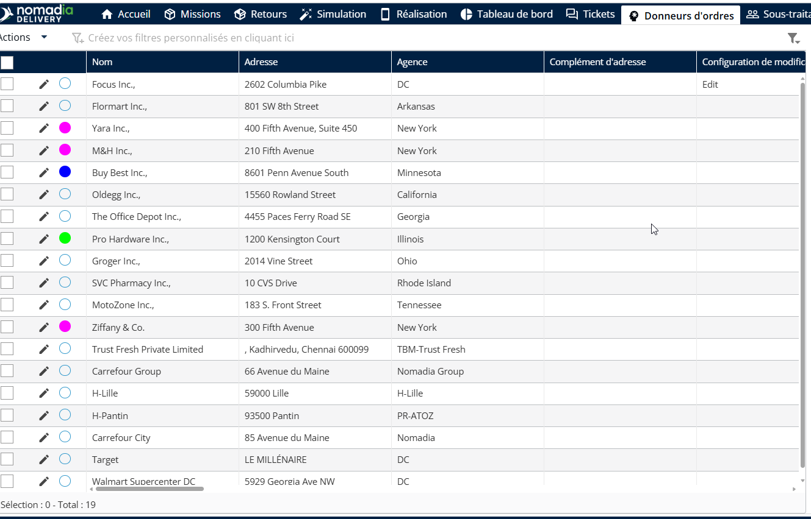<figcaption></figcaption></figure>

3. Cliquez sur l’icône Crayon pour modifier les détails du sous-traitant.

<figure>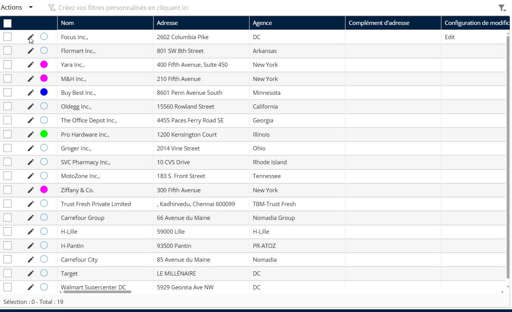<figcaption></figcaption></figure>

Dans la section Missions, plusieurs restrictions peuvent être appliquées aux sous-traitants.

La liste déroulante Modèle d’extraction de mission permet aux utilisateurs de sélectionner uniquement les modèles d’extraction de mission applicables au sous-traitant.

La liste déroulante Modèle d’étiquette permet aux utilisateurs de sélectionner uniquement les modèles d’étiquette applicables au sous-traitant.

La liste déroulante Édition groupée permet aux utilisateurs de sélectionner uniquement les configurations de modification applicables au sous-traitant.

4. Après avoir effectué les sélections, cliquez sur Enregistrer pour appliquer les restrictions au sous-traitant sélectionné.

<figure>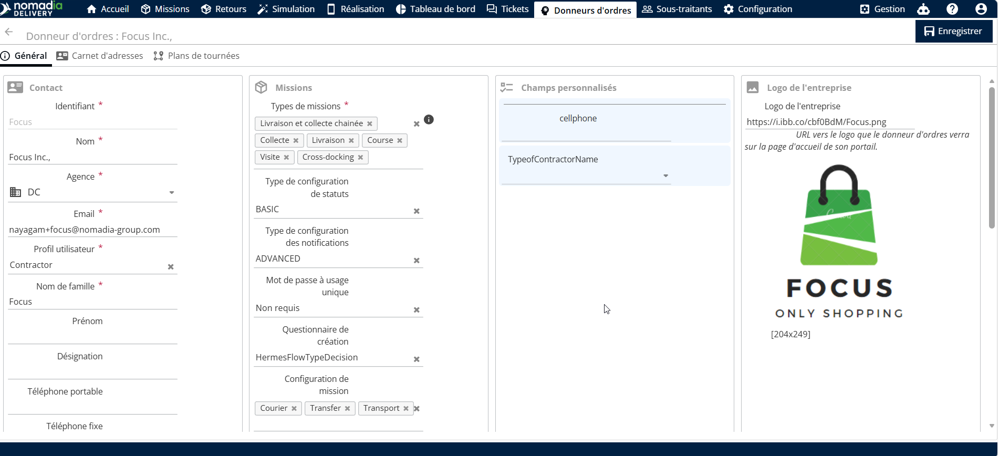<figcaption></figcaption></figure>

Pour empêcher les sous-traitants de modifier les missions après impression, suivez les étapes ci-dessous.

1. Ouvrez l’application Nomadia Delivery et accédez à l’onglet Configuration.
2. Sélectionnez Gérer les utilisateurs dans la liste.

<figure>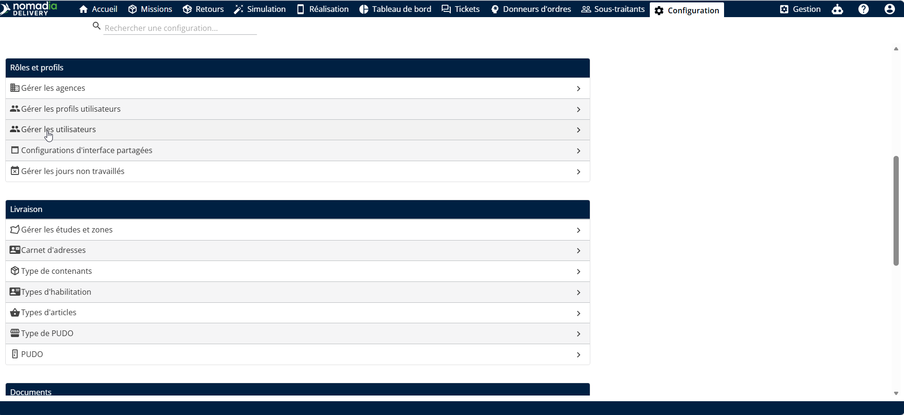<figcaption></figcaption></figure>

3. Cliquez sur l’icône Crayon pour modifier un utilisateur sous-traitant.

<figure>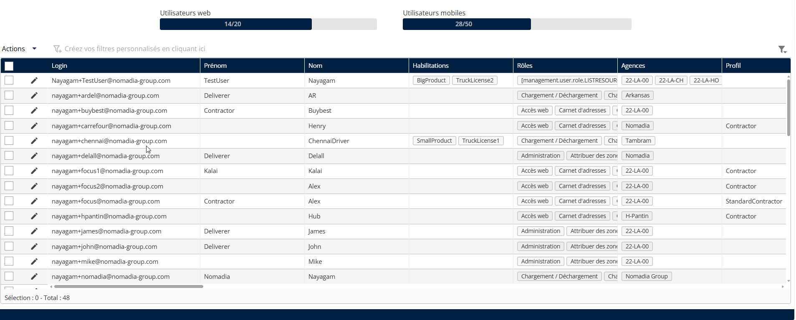<figcaption></figcaption></figure>

4. Cliquez sur l’onglet Rôles et droits.
5. Dans la section Missions, désactivez le droit Modifier la mission après impression.
6. Cliquez sur Enregistrer pour appliquer les modifications

<figure><figcaption></figcaption></figure>

7. Accédez à l’onglet Missions et sélectionnez une mission en attente.

<figure>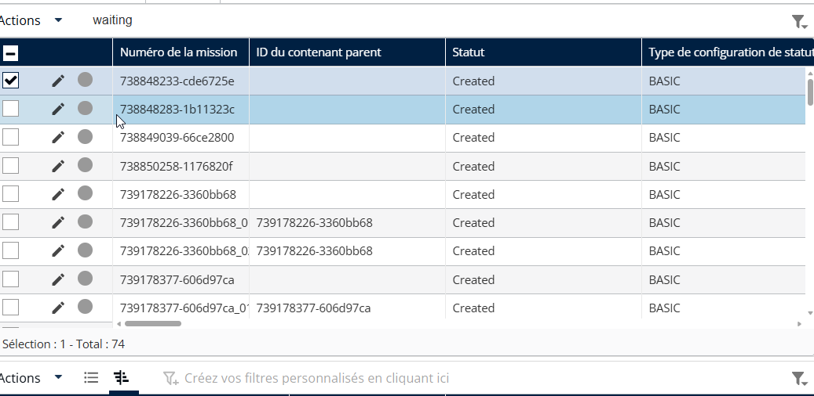<figcaption></figcaption></figure>

8. Cliquez sur le menu Actions et sélectionnez Générer des étiquettes autocollantes.

<figure>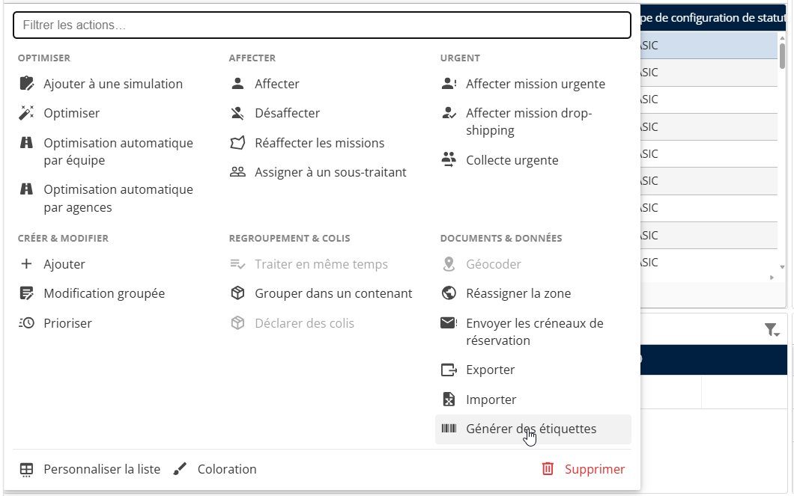<figcaption></figcaption></figure>

9. Cliquez sur le bouton Imprimer pour générer l’étiquette

<figure>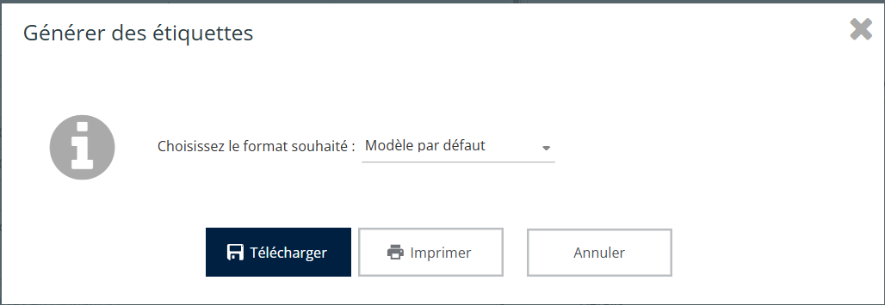<figcaption></figcaption></figure>

10. Après impression, cliquez sur l’icône Crayon pour modifier la mission.

<figure>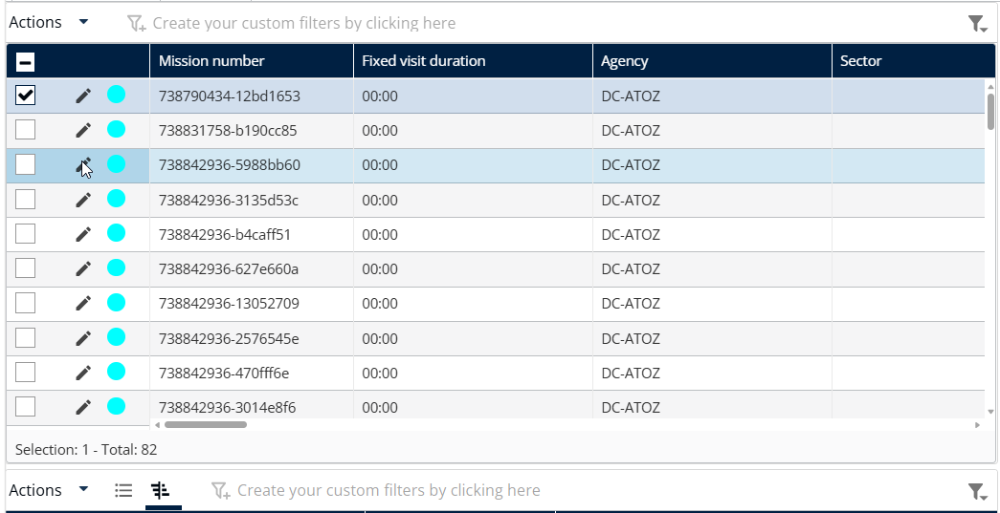<figcaption></figcaption></figure>

Un avertissement apparaît dans l’éditeur de mission, et la modification de la mission est bloquée car l’utilisateur n’a pas l’autorisation de la modifier après l’impression des étiquettes autocollantes.

<figure>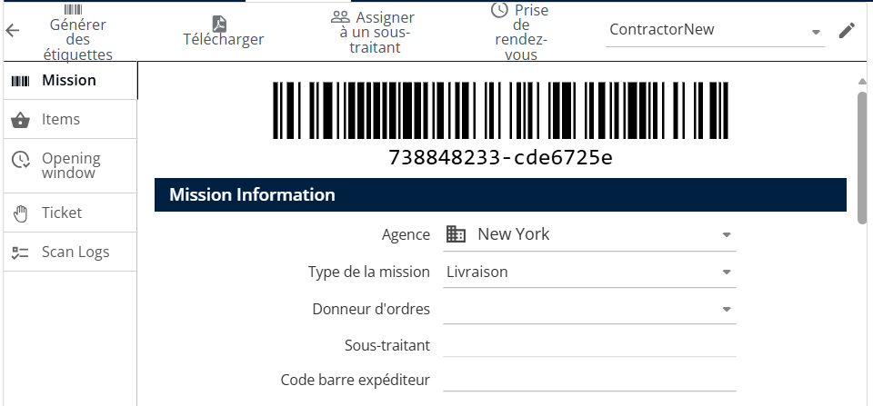<figcaption></figcaption></figure>

Cela garantit une meilleure traçabilité et protège les données de mission une fois les documents générés.
