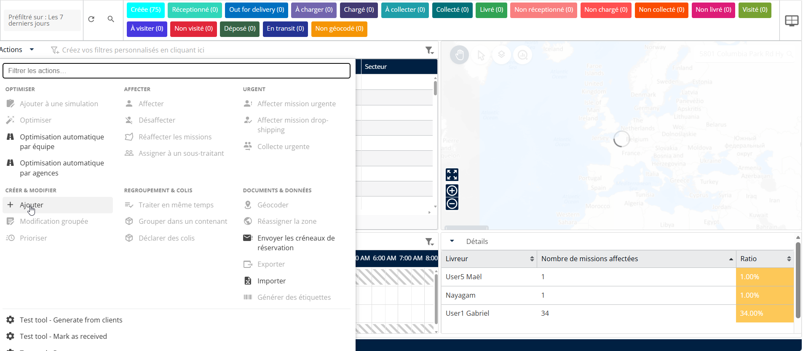
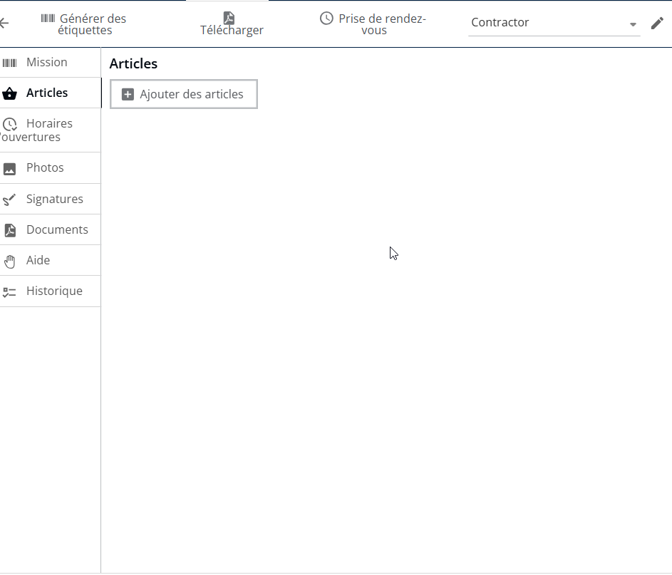
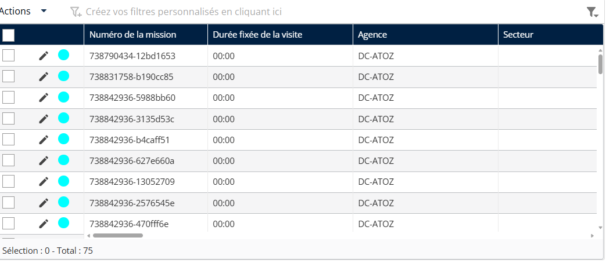

# Ajouter des articles à une mission

#### Ajouter des articles à une mission

Depuis la page Mission

1. Cliquez sur **Actions**
2. Sélectionnez **Ajouter** dans le menu déroulant.

<figure><figcaption></figcaption></figure>

3. Cliquez sur **Articles**
4. Cliquez sur **Ajouter des articles**

<figure><figcaption></figcaption></figure>

5. Saisissez les informations requises, y compris le **Nom de l’article** et **Quantité prévue**
6. Cliquez sur **Enregistrer**

<figure><figcaption></figcaption></figure>

Les articles seront ajoutés avec succès.

<figure><figcaption></figcaption></figure>
