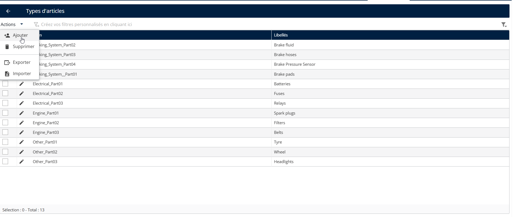
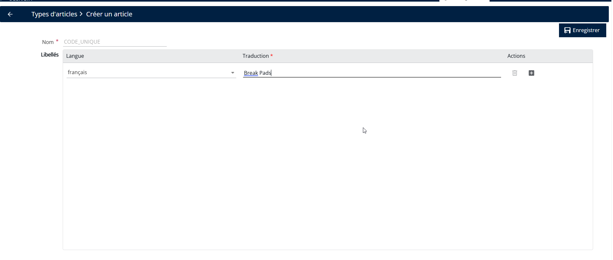
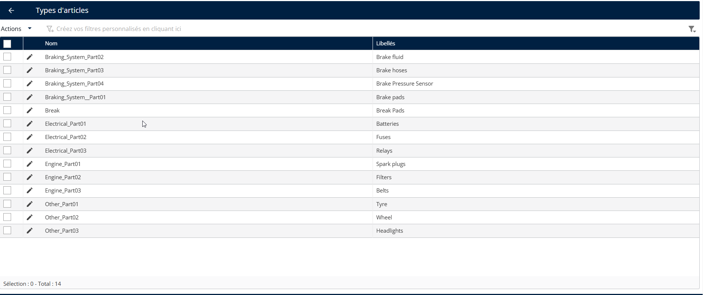

# Créer un article

#### Créer un type d’article

1. Aller à **Configuration**.
2. Cliquez sur **Configuration** Menu
3. Sous Personnalisation, cliquez sur **Types d’articles.**
4. Cliquez sur le **Actions** menu déroulant
5. Cliquez sur **Ajouter**

<figure><figcaption></figcaption></figure>

6. Saisissez le **Nom** et **Traduction**
7. Cliquez sur **Enregistrer**

<figure><figcaption></figcaption></figure>

Le type d’article a été créé avec succès

<figure><figcaption></figcaption></figure>
