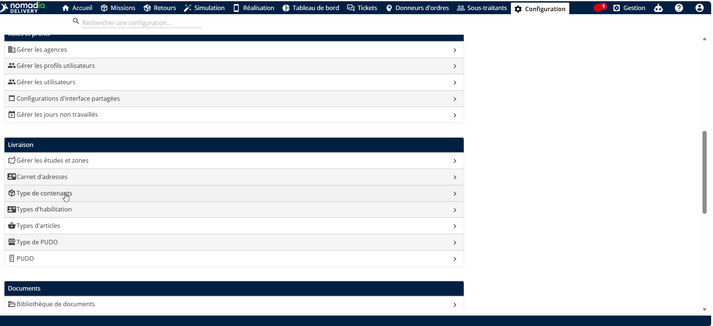
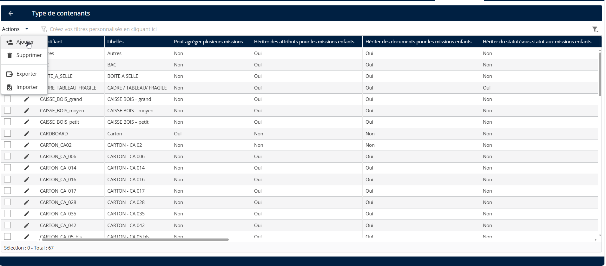
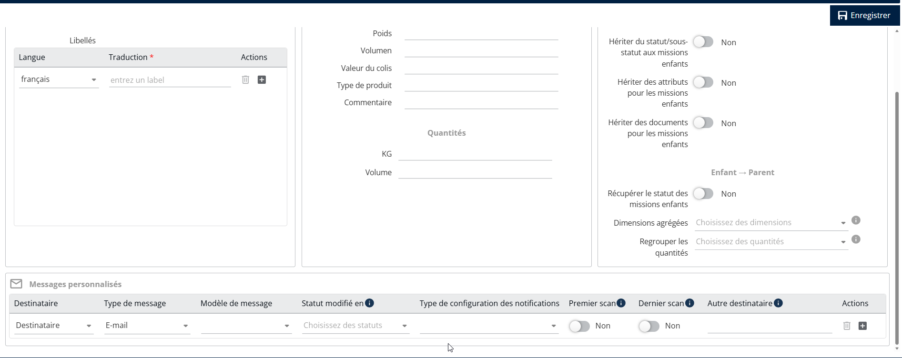
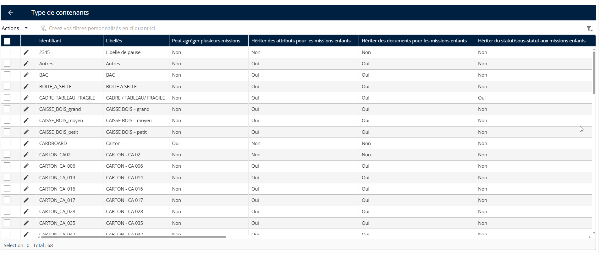
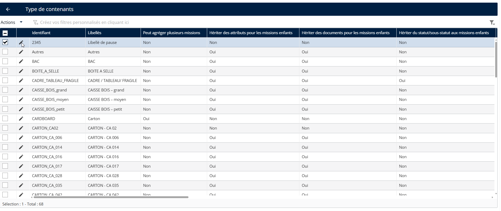
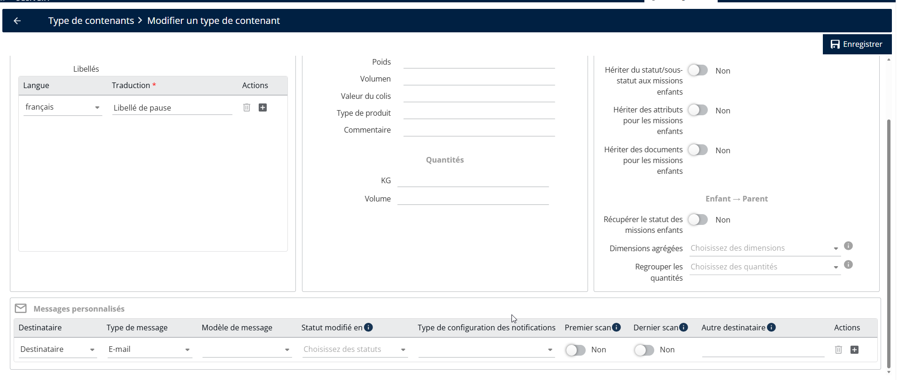
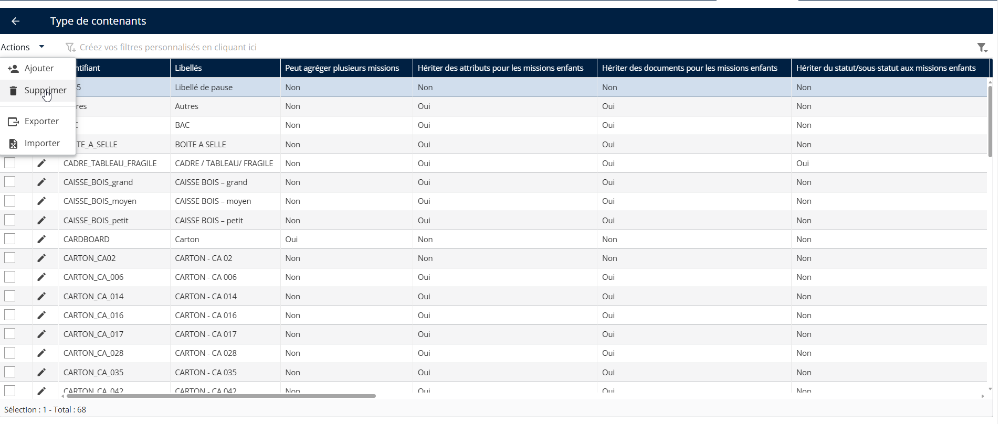
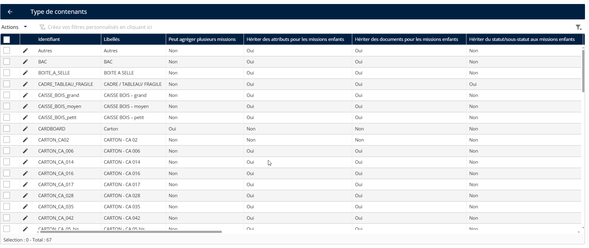

# Gérer les types de conteneurs

### Gérer les types de conteneurs

La fonctionnalité Gérer les types de conteneurs permet aux responsables logistiques et aux répartiteurs de définir, configurer et gérer les différents types de conteneurs ou d’unités d’emballage utilisés dans les opérations de livraison. Cela aide à optimiser la planification de l’espace, à améliorer le suivi et à garantir une manipulation précise des marchandises pendant le transport.

Le système prend en charge trois types de conteneurs par défaut : Carton, Palette et Colis.

Vous pouvez regrouper plusieurs conteneurs et suivre la quantité de chaque type de conteneur sur les sites clients afin d’améliorer la gestion des stocks et de la logistique.

#### Créer un type de conteneur

1. Allez dans Configuration.
2. Cliquez sur le menu Configuration
3. Sous Personnalisation, cliquez sur Types de conteneurs

<figure><figcaption></figcaption></figure>

4. Cliquez sur le menu déroulant Actions
5. Cliquez sur Ajouter

<figure><figcaption></figcaption></figure>

6. Saisissez le code et la traduction
7. Cliquez sur Enregistrer

<figure><figcaption></figcaption></figure>

Le type de conteneur a été créé avec succès.

<figure><figcaption></figcaption></figure>

#### Modifier un type de conteneur

1. Allez dans Configuration.
2. Cliquez sur le menu Configuration
3. Sous Personnalisation, cliquez sur Types de conteneurs
4. Cliquez sur l’icône crayon du type de conteneur choisi
5. Modifiez les informations selon les besoins

<figure><figcaption></figcaption></figure>

6. Cliquez sur Enregistrer

<figure><figcaption></figcaption></figure>

**Supprimer un type de conteneur**

1. Allez dans Configuration.
2. Cliquez sur le menu Configuration
3. Sous Personnalisation, cliquez sur Types de conteneurs
4. Sélectionnez les types de conteneurs
5. Cliquez sur Actions
6. Cliquez sur Supprimer

<figure><figcaption></figcaption></figure>

Le type de conteneur a été supprimé avec succès

<figure><figcaption></figcaption></figure>
