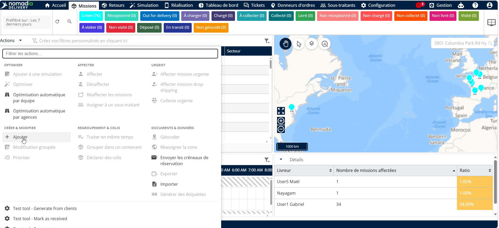
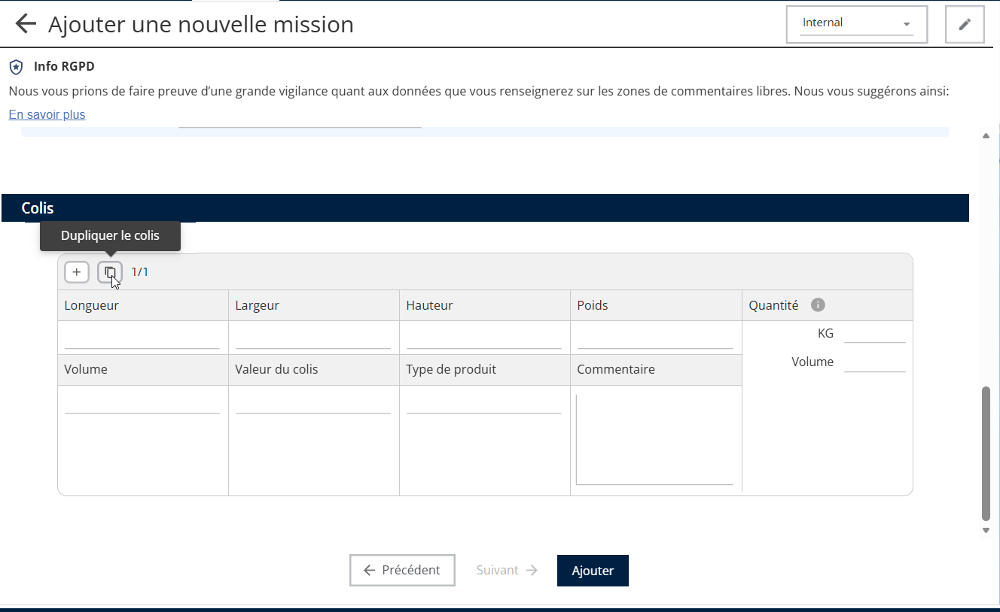
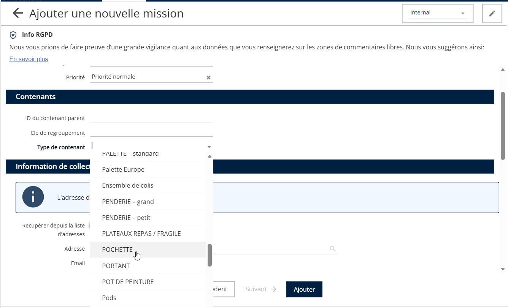
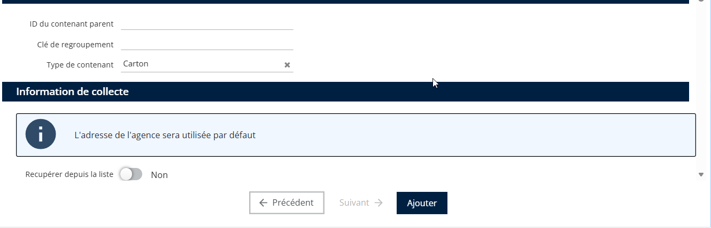
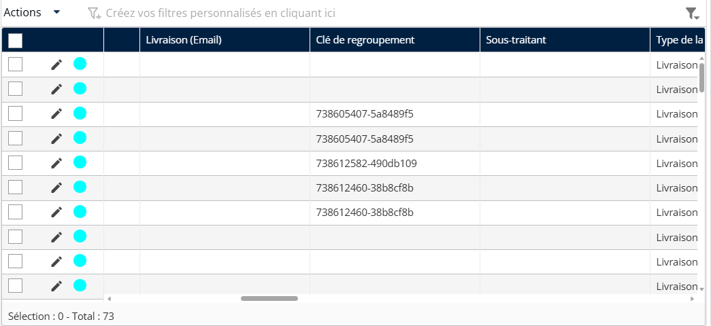

# Grouper les missions lors de la création

### Regrouper des missions dans un seul conteneur

Cette fonctionnalité permet de regrouper plusieurs missions dans un seul conteneur parent, tel qu’une palette, une boîte ou un conteneur en carton. Le regroupement facilite la gestion des commandes en gros pour un même client ou site, en permettant au système de traiter plusieurs missions enfants comme faisant partie d’une seule entité parent.

**Regroupement via la duplication de mission**

1. Accédez à l’onglet Mission.
2. Créez une nouvelle mission depuis le menu Actions

<figure><figcaption></figcaption></figure>

3. Sélectionnez la mission et utilisez la fonctionnalité Dupliquer. La duplication peut être effectuée dans la section Colis. Si les détails du colis ne sont pas visibles, veuillez activer la section Colis dans la configuration de la mission.

<figure><figcaption></figcaption></figure>

4. Sélectionnez le type de conteneur souhaité (par exemple, palette, boîte) dans le menu déroulant.

<figure><figcaption></figcaption></figure>

5. Lorsque le système affiche « Regrouper dans un conteneur ? », sélectionnez Oui.

<figure><figcaption></figcaption></figure>

5. Les conteneurs parent et les missions enfants ont été créés.

<figure><figcaption></figcaption></figure>

Cette option est disponible dans la configuration du sous-statut. 
