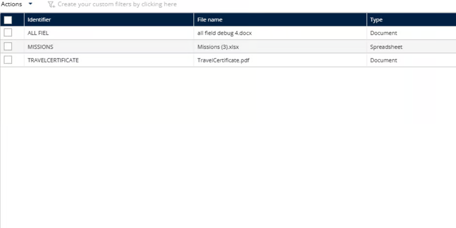

# Gérer la bibliothèque de documents

La fonctionnalité Gérer la bibliothèque de documents fournit un référentiel centralisé pour stocker, organiser et distribuer les documents couramment utilisés au sein de l’organisation de livraison. Elle garantit un accès rapide aux documents de référence tels que les consignes de sécurité, les directives de conformité, les procédures d’exploitation et les manuels de formation, tant pour le personnel administratif que pour les agents sur le terrain.

Assurez-vous que votre fichier est dans l’un de ces formats pris en charge avant de continuer : XLSX, DOCX, PDF, JPG ou PNG

1. Allez dans Configuration.
2. Cliquez sur le menu Configuration
3. Sous Mes données, cliquez sur Bibliothèque de documents

<figure><figcaption></figcaption></figure>

4. Cliquez sur Parcourir l’ordinateur pour téléverser le fichier

<figure><figcaption></figcaption></figure>

 

5. Sélectionnez un fichier valide depuis un système local.
6. Les documents seront importés avec succès.

<figure><figcaption></figcaption></figure>

\
 
