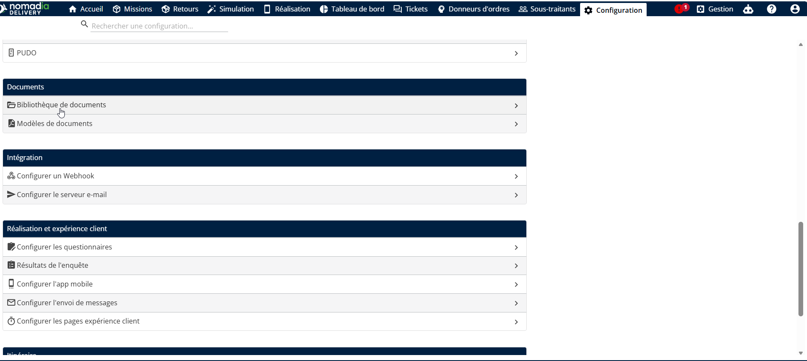
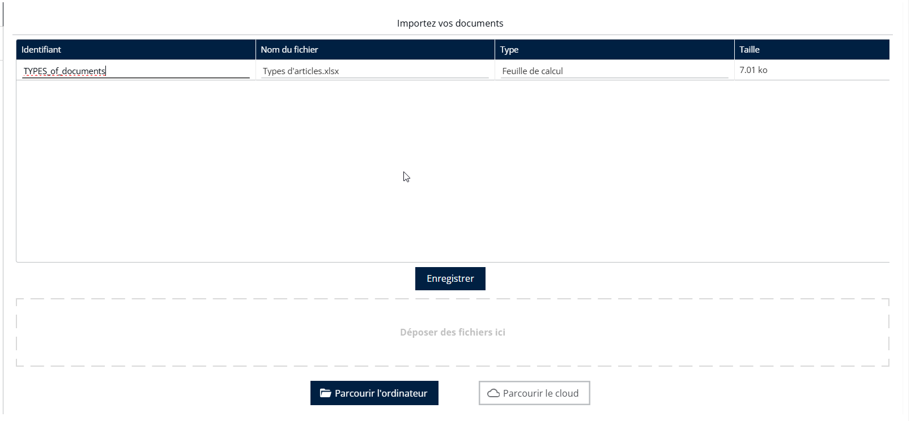
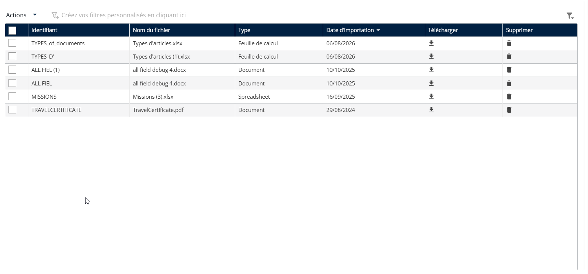
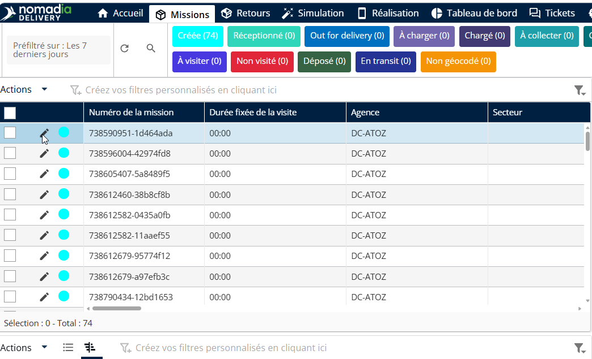
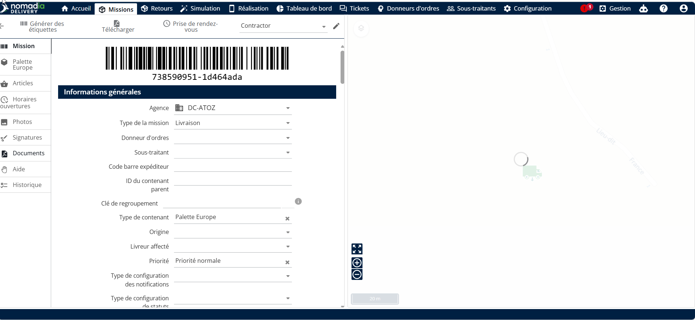
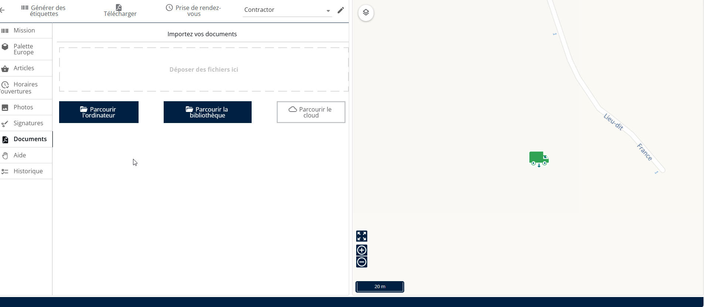
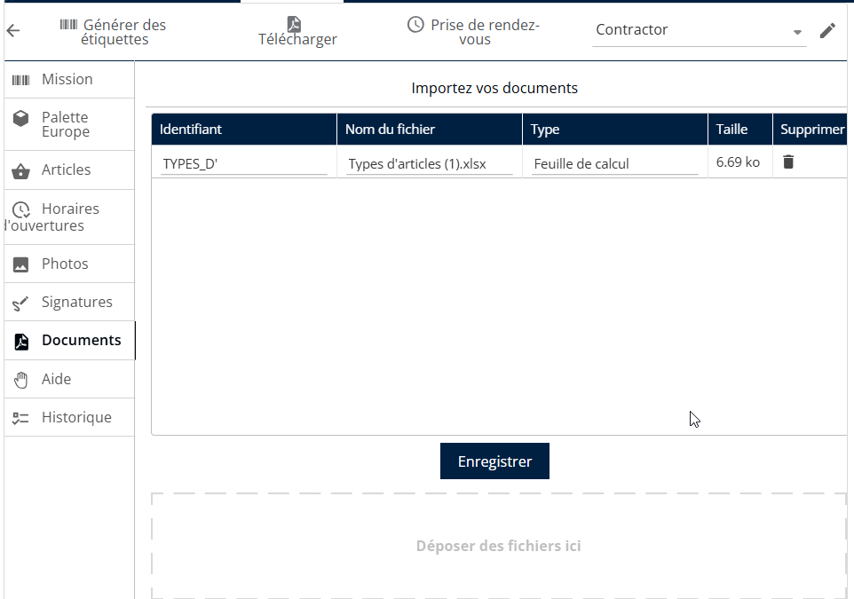
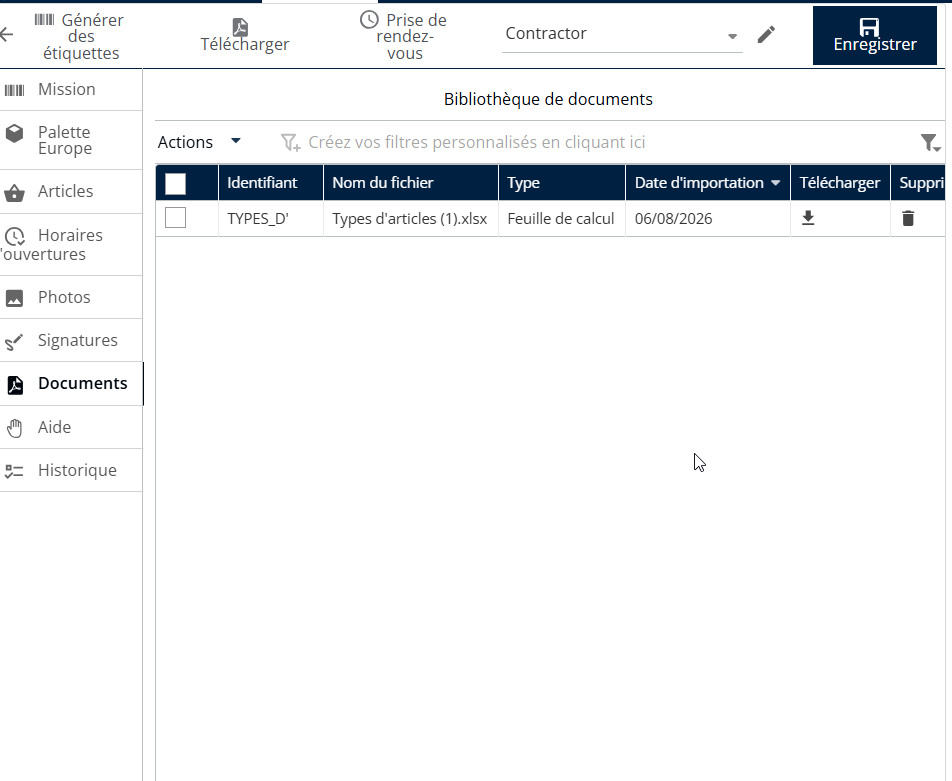

# Ajout de documents à la mission

Nomadia Delivery inclut désormais une fonctionnalité qui permet aux transporteurs et aux sous-traitants de téléverser et de lier directement des documents essentiels aux missions. Cela garantit une meilleure conformité et une meilleure sécurité tout au long du processus de transport.

Pour créer et gérer une bibliothèque de documents dans Nomadia Delivery, suivez ces étapes :

1. Ouvrez l’application Nomadia Delivery et accédez à l’onglet Configuration.
2. Dans le menu déroulant, sélectionnez Bibliothèque de documents.

<figure><figcaption></figcaption></figure>

3. Cliquez sur le bouton Actions et choisissez Importer pour téléverser un document depuis votre ordinateur.
4. Saisissez un identifiant clair et pertinent pour vous aider à reconnaître le document plus tard.
5. Cliquez sur Enregistrer pour stocker le document dans la Bibliothèque de documents.

<figure><figcaption></figcaption></figure>

6. Le document téléversé sera désormais disponible dans la section Bibliothèque de documents.

<figure><figcaption></figcaption></figure>

Étapes pour joindre un document à une mission :

1. Ouvrez l’application Nomadia Delivery et accédez à l’onglet Missions
2. Sélectionnez la mission que vous souhaitez mettre à jour et cliquez sur l’icône crayon pour la modifier.

<figure><figcaption></figcaption></figure>

3. Accédez à l’onglet Documents.

<figure><figcaption></figcaption></figure>

4. Choisissez la source du document que vous souhaitez téléverser :

* La Bibliothèque de documents par défaut dans Nomadia Delivery
* Votre ordinateur local
* Services de stockage cloud

5. Sélectionnez la source et suivez les instructions à l’écran pour terminer le téléversement.
6. Si vous téléversez depuis la Bibliothèque de documents, cliquez sur Parcourir la bibliothèque, puis choisissez le ou les documents que vous souhaitez joindre.
7. Cliquez sur Importer.

<figure><figcaption></figcaption></figure>

8. Cliquez sur Enregistrer.

<figure><figcaption></figcaption></figure>

9\. Le document est maintenant correctement joint à la mission

<figure><figcaption></figcaption></figure>

\
 
