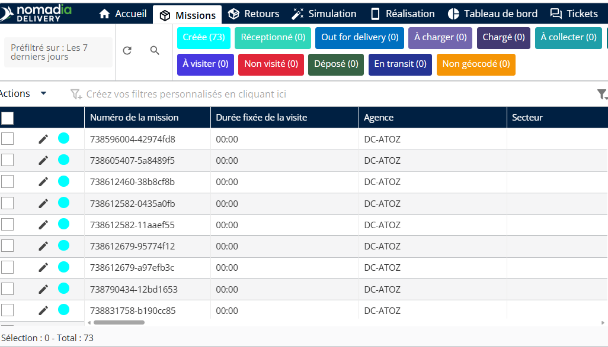
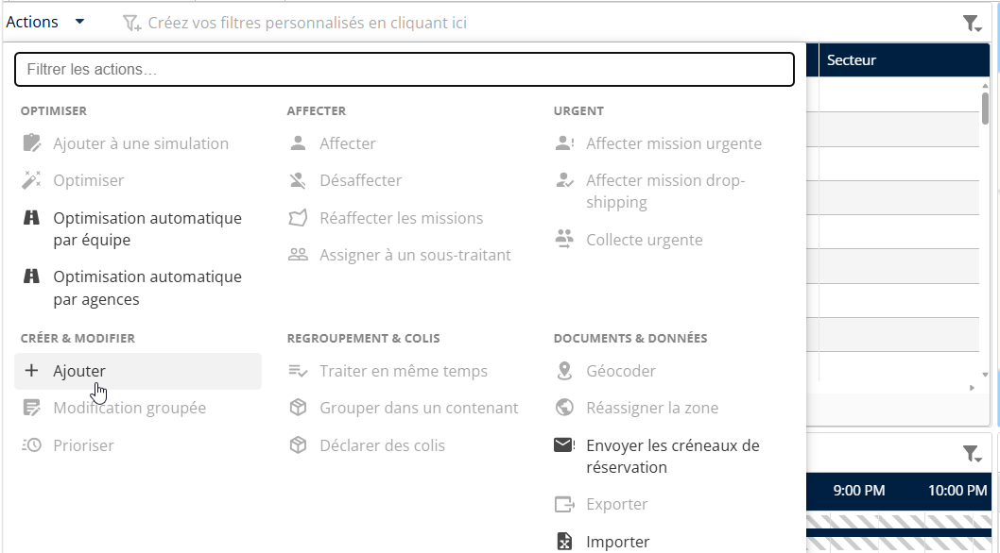
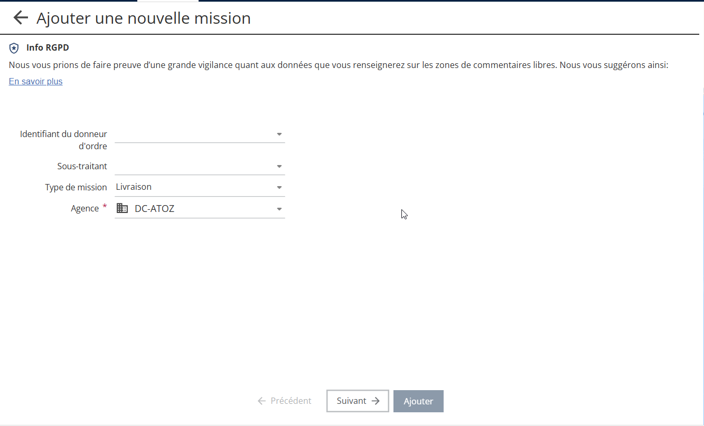
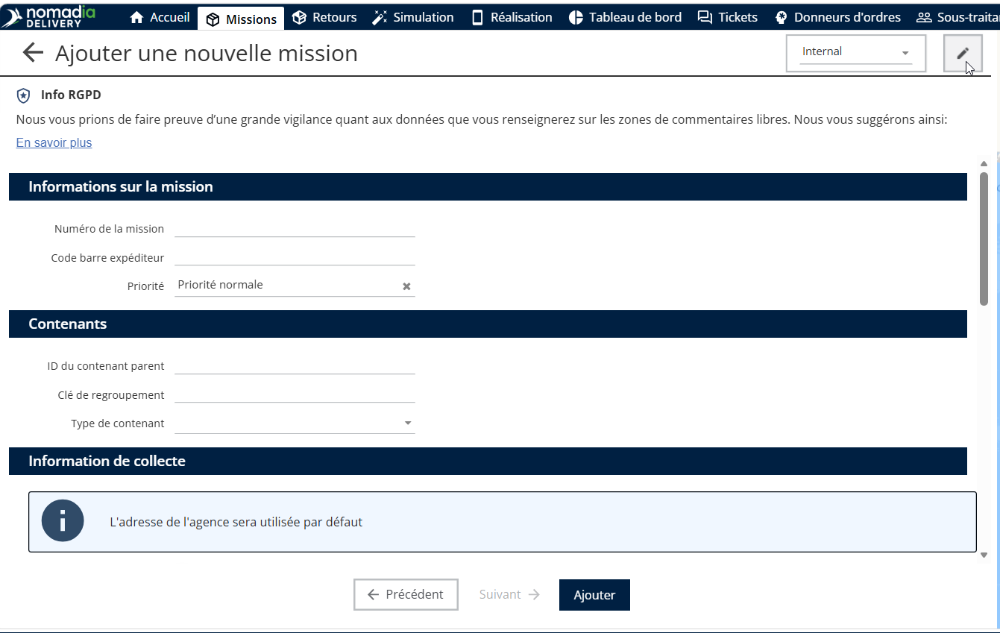
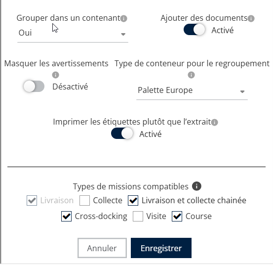
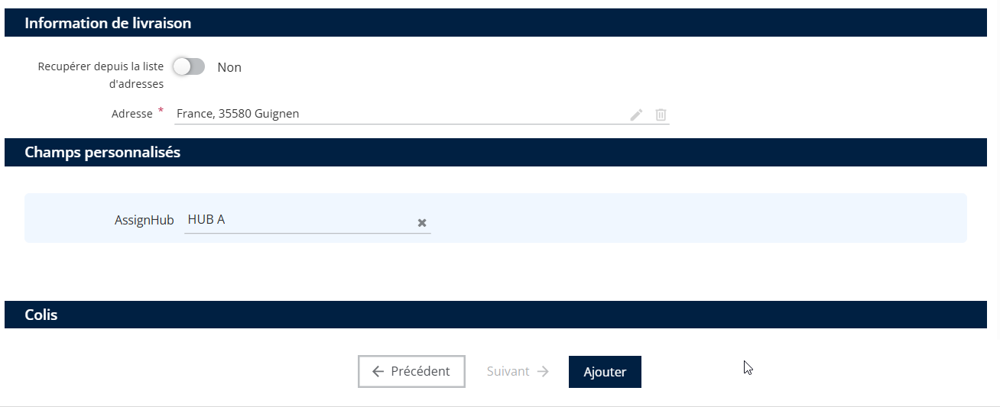
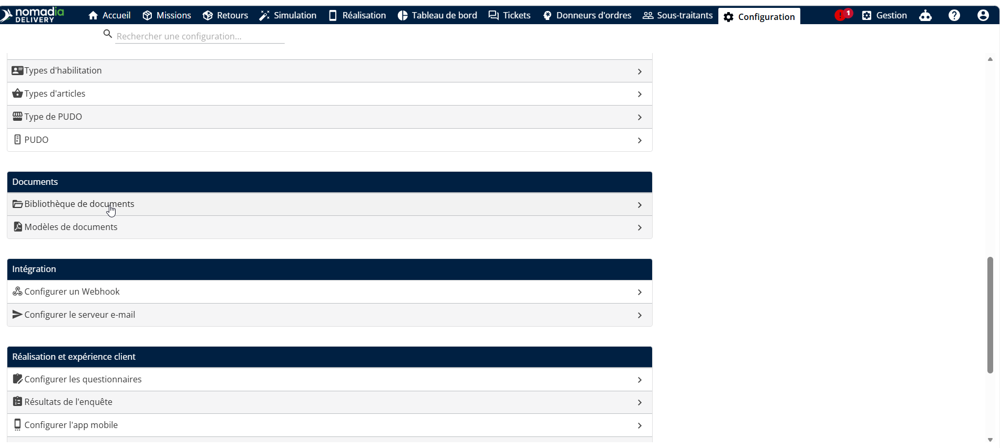
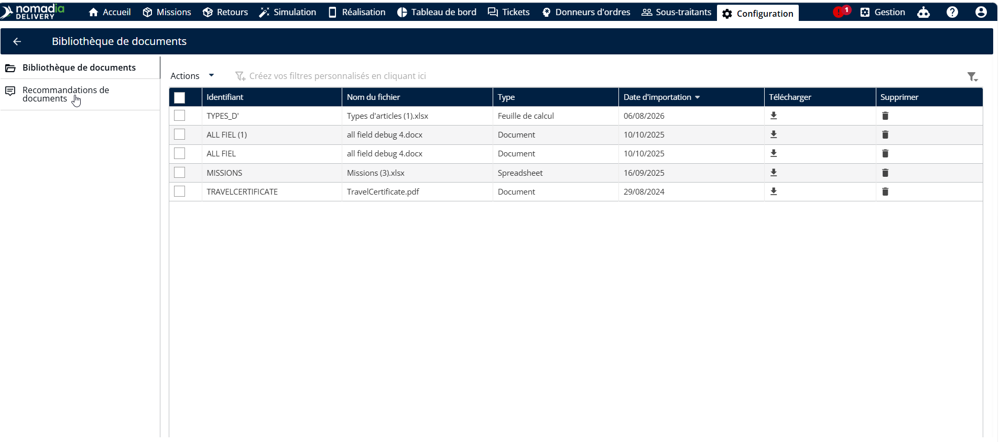
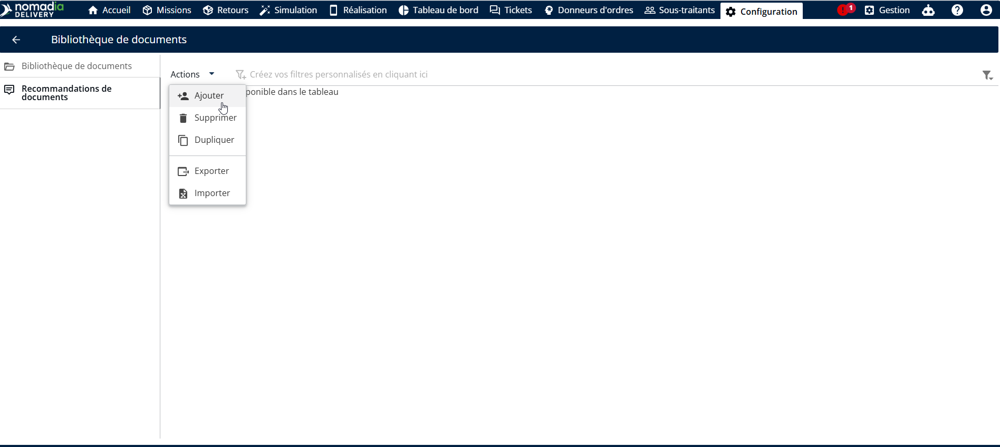
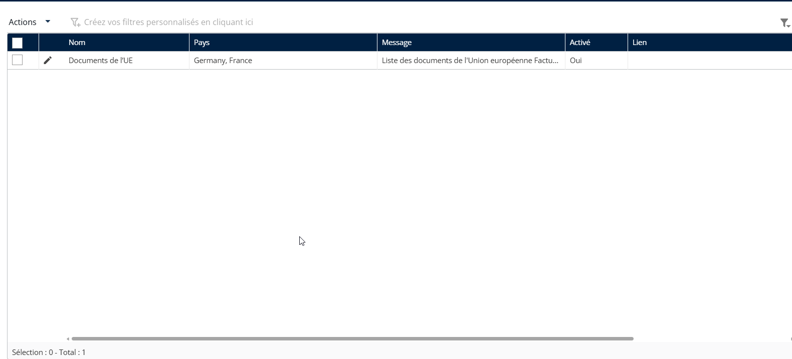

# Recommandations de documents

La fonctionnalité de recommandations de documents garantit que tous les documents requis sont disponibles pour chaque expédition internationale. Elle contribue à maintenir la conformité, évite les documents manquants et améliore la fiabilité globale du processus.

#### Recommandations lors de l’ajout du document

1. Ouvrez l’application Nomadia Delivery et accédez à l’onglet Missions

<figure><figcaption></figcaption></figure>

2. Cliquez sur Actions et sélectionnez Ajouter (Beta).

<figure><figcaption></figcaption></figure>

3. Saisissez le nom de l’agence.

<figure><figcaption></figcaption></figure>

3. Cliquez sur l’icône en forme de crayon en haut à droite.

<figure><figcaption></figcaption></figure>

4. Activez le bouton Ajouter des documents et cliquez sur Enregistrer.

<figure><figcaption></figcaption></figure>

5. Saisissez l’adresse de livraison.
6. Cliquez sur Ajouter.

<figure><figcaption></figcaption></figure>

Une fois l’adresse de livraison ajoutée, la liste des recommandations de documents s’affiche automatiquement en fonction du pays du destinataire (pays de livraison). Cela aide les utilisateurs à identifier les documents obligatoires qui doivent être téléversés afin de respecter les exigences légales lors du transport de missions entre pays.

#### Recommandations lors de la modification du document

Pour configurer des recommandations pour Nomadia Delivery, suivez les étapes ci-dessous.

1. Ouvrez l’application Nomadia Delivery et accédez à l’onglet Configuration.
2. Sélectionnez Bibliothèque de documents dans la liste.

<figure><figcaption></figcaption></figure>

3. Sélectionnez l’onglet Recommandations de documents.

<figure><figcaption></figcaption></figure>

4. Autrement, les utilisateurs peuvent importer la liste des recommandations de documents à l’aide d’un fichier Excel depuis le même menu Actions.
5. Cliquez sur le menu Actions, puis sélectionnez Ajouter pour créer une nouvelle recommandation de document.

<figure><figcaption></figcaption></figure>

6. Une liste de recommandations peut être appliquée simultanément à plusieurs pays.

* Un pays peut disposer à la fois d’une liste de recommandations générale et d’une liste de recommandations spécifique au pays. Dans ce cas, les deux listes sont fusionnées et affichées lors de la création ou de la modification d’une mission.
* Des liens peuvent être ajoutés à la liste de recommandations, permettant aux utilisateurs d’accéder à des documents en ligne ou hébergés dans le cloud, tels que SharePoint.

4. Activez le bouton pour activer la liste de recommandations.
5. Cliquez sur Ajouter pour créer la liste de recommandations de documents.

Les listes de recommandations de documents s’affichent dans le tableau.

<figure><figcaption></figcaption></figure>

Lors de la création ou de la modification d’une mission, la liste de recommandations de documents s’affiche en fonction du pays du destinataire (pays de livraison). Cela aide les utilisateurs à identifier les documents qui doivent être téléversés afin de respecter les exigences légales lors du transport de missions d’un pays à un autre.

<figure><figcaption></figcaption></figure>
