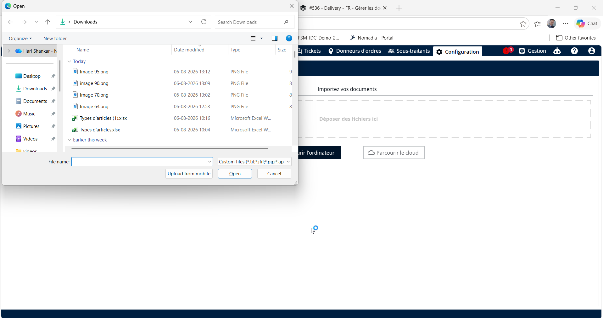
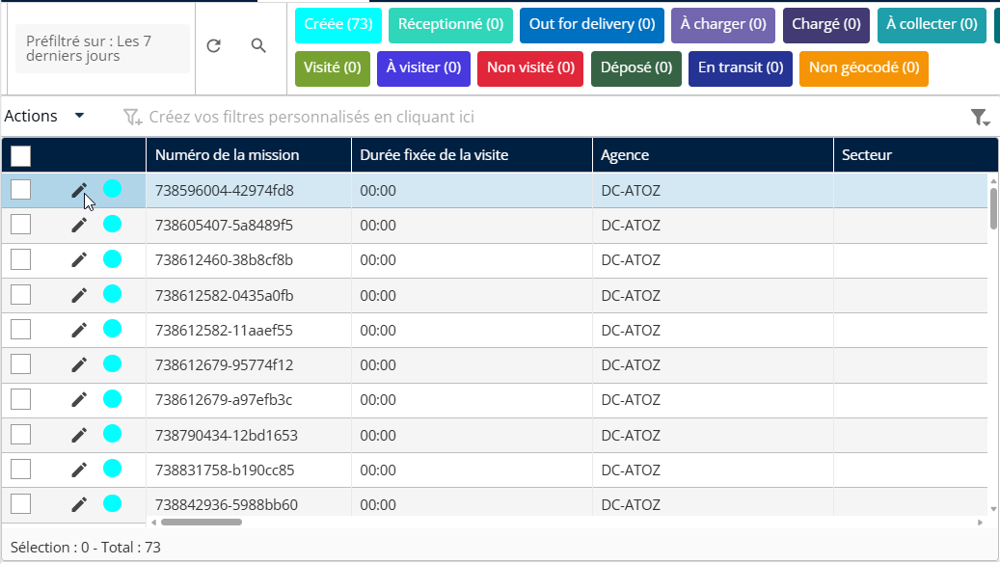
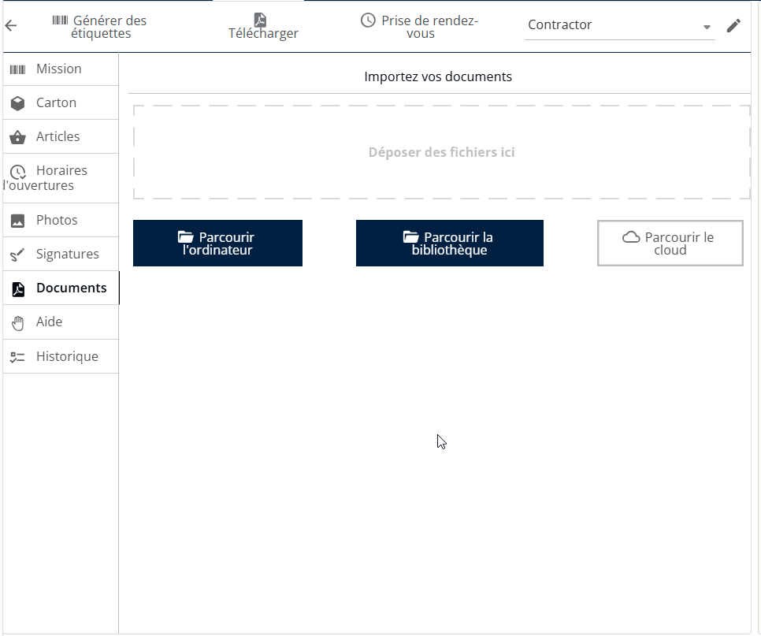
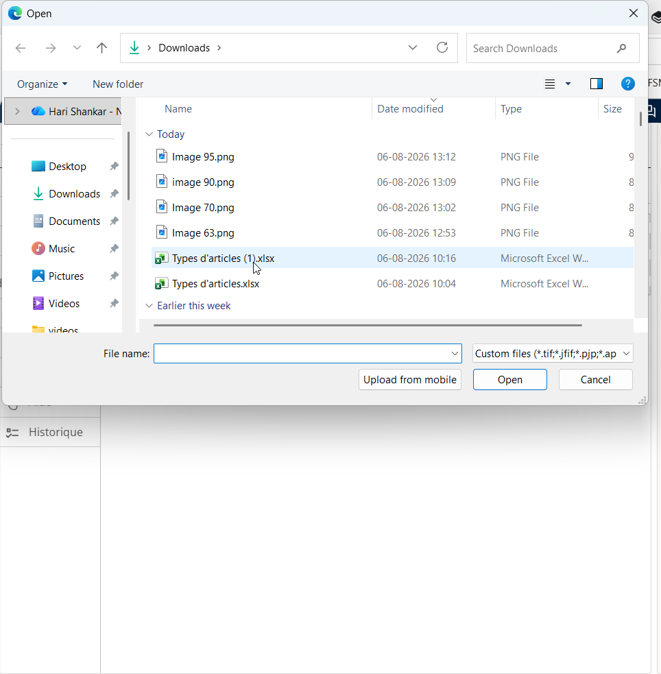
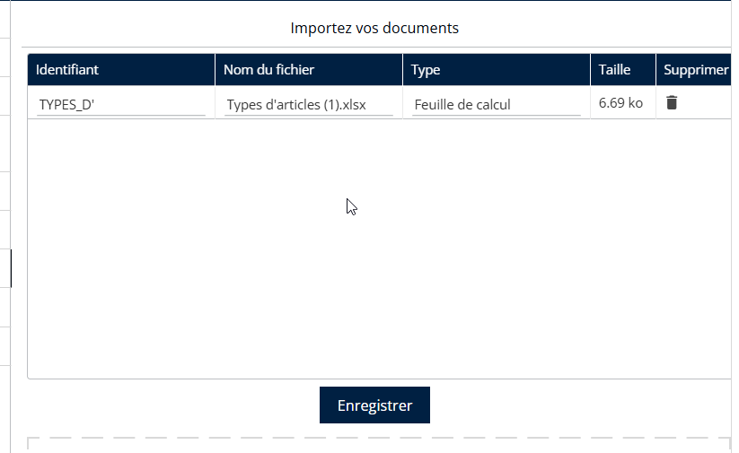
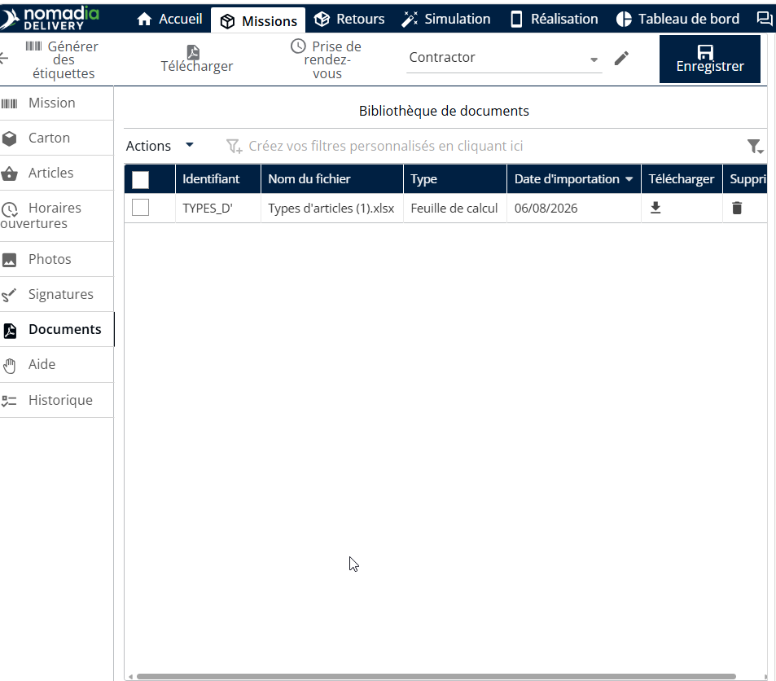
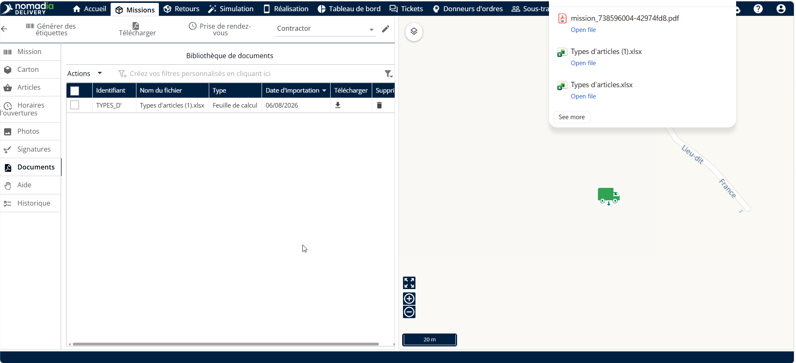
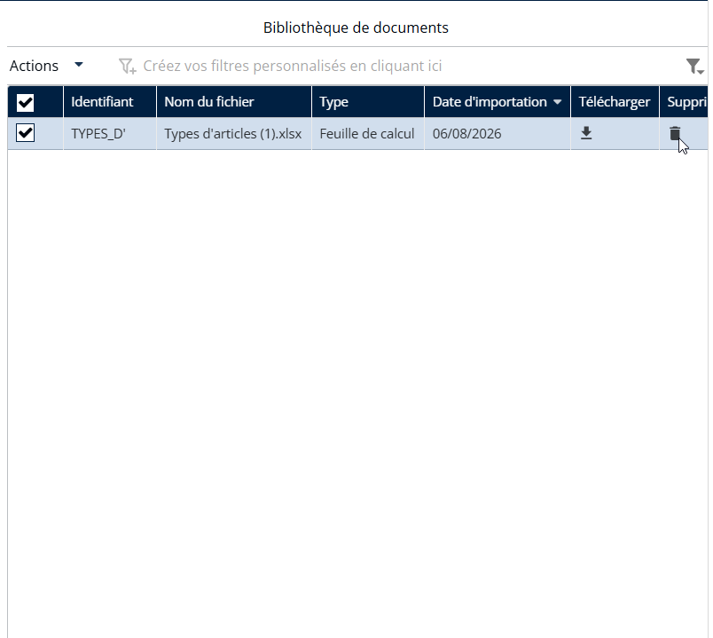
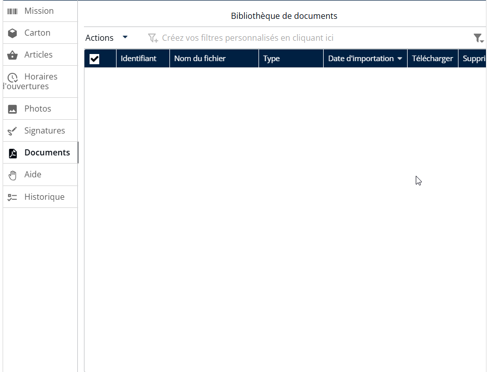

# Gérer les documents de mission

Les documents « Gérer les missions » font spécifiquement référence aux guides et à la documentation qui aident les utilisateurs à superviser et à gérer les missions liées aux livraisons dans les flux de travail logistiques et d’exécution sur le terrain.

#### Importer un document depuis la bibliothèque de documents

1. Allez dans Configuration.
2. Cliquez sur le menu Configuration
3. Cliquez sur Bibliothèque de documents
4. Cliquez sur Actions
5. Cliquez sur Importer
6. Cliquez sur Parcourir l’ordinateur

<figure><figcaption></figcaption></figure>

7. Sélectionnez un fichier valide pour importer un document

<figure><figcaption></figcaption></figure>

Les documents de mission seront importés avec succès

**Téléverser un document**

1. Accédez à l’onglet Missions.
2. Repérez la mission souhaitée et cliquez sur l’icône en forme de crayon pour l’ouvrir en mode édition.

<figure><figcaption></figcaption></figure>

3. Dans le menu de gauche, sélectionnez Documents.
4. Cliquez sur Parcourir l’ordinateur pour ouvrir votre explorateur de fichiers.

<figure><figcaption></figcaption></figure>

5. Sélectionnez un document valide depuis votre système local à téléverser.

<figure><figcaption></figcaption></figure>

5. Les documents de mission seront téléversés avec succès.

<figure><figcaption></figcaption></figure>

**Télécharger un document**

1. Accédez à la section Missions.
2. Repérez la mission souhaitée et cliquez sur l’icône en forme de crayon pour l’ouvrir en mode édition.
3. Dans le menu de gauche, sélectionnez Documents.
4. Cliquez sur Télécharger

<figure><figcaption></figcaption></figure>

5. Les documents de mission seront téléchargés avec succès.

<figure><figcaption></figcaption></figure>

**Supprimer un document**

1. Accédez à la section Missions.
2. Repérez la mission souhaitée et cliquez sur l’icône en forme de crayon pour l’ouvrir en mode édition.
3. Dans le menu de gauche, sélectionnez Documents.
4. Cliquez sur l’icône de la corbeille du document choisi

<figure><figcaption></figcaption></figure>

5\. Les documents de mission seront supprimés avec succès.

<figure><figcaption></figcaption></figure>

\
\
\
 
