# Gérer les modèles de documents

**Gérer les modèles pour les documents de mission**

La fonctionnalité Gérer les modèles de documents permet aux administrateurs et aux utilisateurs de back-office de créer, configurer et maintenir des modèles réutilisables pour des documents tels que les bordereaux de livraison, les factures, les preuves de livraison et les rapports de tâche. Ces modèles standardisent la documentation dans l’ensemble des opérations et garantissent la cohérence de l’image de marque, de la structure et des informations requises.

Vous pouvez concevoir vos propres modèles pour remplacer le modèle par défaut.

| Modèles                       | Variables associées                                                                                                  |
| ----------------------------- | -------------------------------------------------------------------------------------------------------------------- |
| Feuille de route              | Mission, Itinéraire                                                                                                  |
| Feuille de chargement         | Mission, Itinéraire                                                                                                  |
| Feuille de mission            | Mission                                                                                                              |
| Feuille d’étiquettes          | Mission                                                                                                              |
| Bons de transport             | Mission, Agence, Sous-traitant, Société, Véhicule, Livreur, Données personnalisées, Documents, Changements de statut |
| Rapport de visite             | Commande ouverte de mission                                                                                          |
| Feuille de petites étiquettes | Mission                                                                                                              |

#### Télécharger un modèle de document

1. Allez dans Configuration.
2. Cliquez sur le menu Configuration
3. Dans Personnalisation, cliquez sur Modèles de documents
4. Sélectionnez le document souhaité dans la liste

<figure>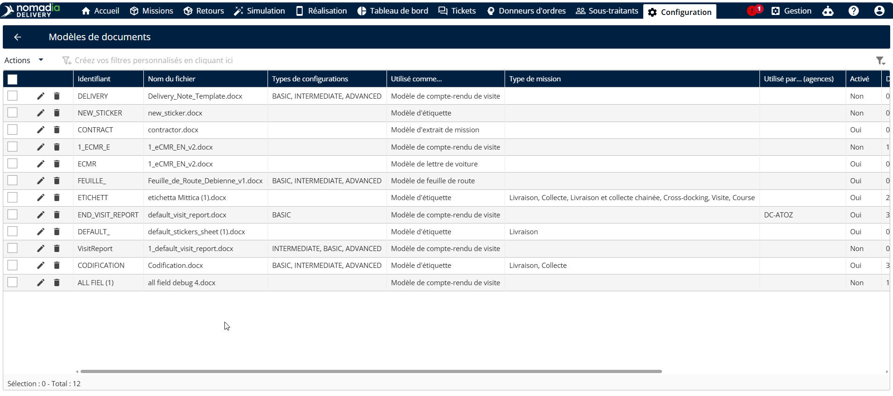<figcaption></figcaption></figure>

5. Cliquez sur le menu déroulant Actions
6. Cliquez sur Télécharger

<figure><figcaption></figcaption></figure>

Les modèles de documents seront téléchargés avec succès.

<figure>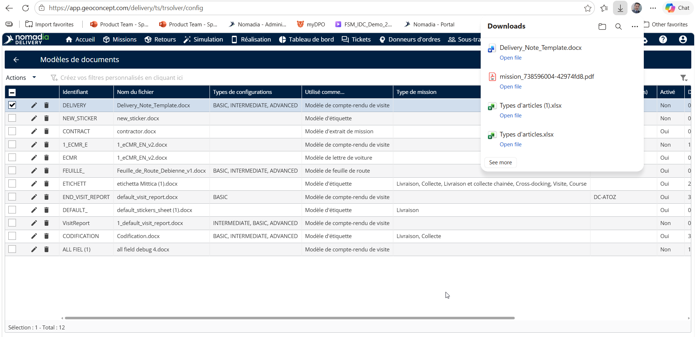<figcaption></figcaption></figure>

#### Modifier un modèle de document

1. Allez dans Configuration.
2. Cliquez sur le menu Configuration
3. Dans Personnalisation, cliquez sur Modèles de documents
4. Sélectionnez le document souhaité dans la liste
5. Cliquez sur le menu déroulant Actions
6. Cliquez sur Modifier

<figure>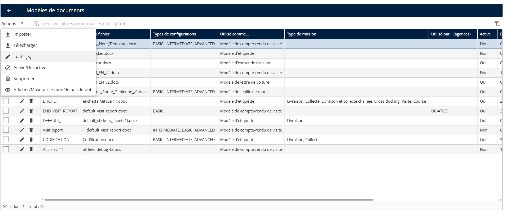<figcaption></figcaption></figure>

7. Modifiez les informations selon les besoins
8. Cliquez sur Enregistrer

<figure>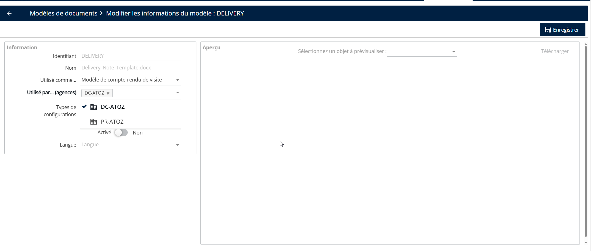<figcaption></figcaption></figure>

#### Importer un modèle de document

1. Allez dans Configuration.
2. Cliquez sur le menu Configuration
3. Dans Personnalisation, cliquez sur Modèles de documents
4. Cliquez sur le men
5. Cliquez sur Importer

<figure>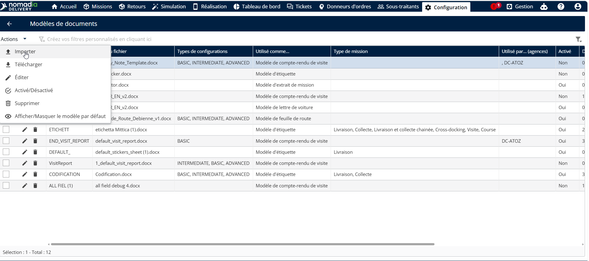<figcaption></figcaption></figure>

6. Cliquez sur Parcourir l’ordinateur pour téléverser le fichier.
7. Sélectionnez un fichier valide sur un système local

<figure>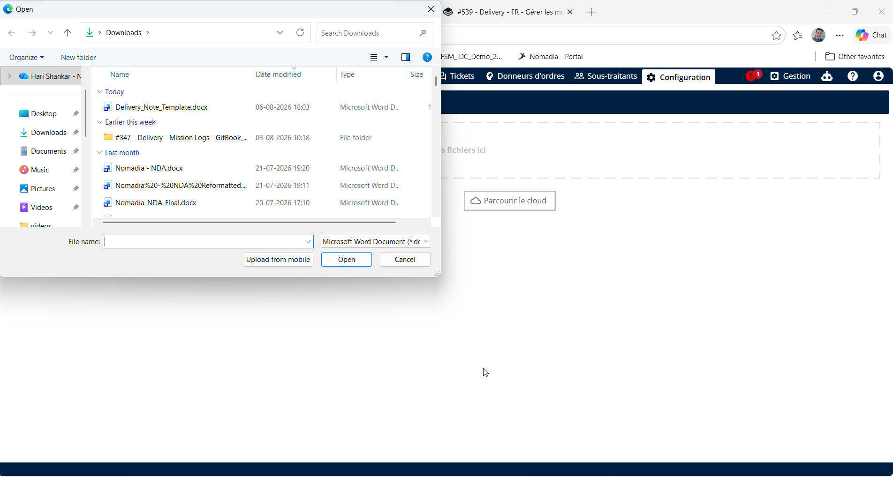<figcaption></figcaption></figure>

Les modèles de documents seront importés avec succès.

<figure>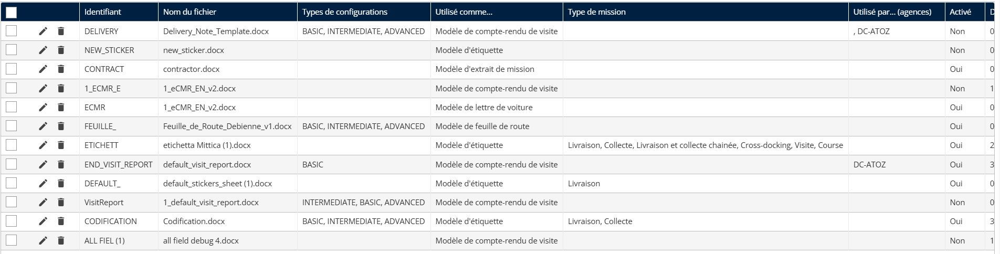<figcaption></figcaption></figure>

#### Activer/Désactiver un modèle de document

1. Allez dans Configuration.
2. Cliquez sur le menu Configuration
3. Dans Personnalisation, cliquez sur Modèles de documents
4. Sélectionnez le document souhaité dans la liste
5. Cliquez sur le menu déroulant Actions
6. Cliquez sur Activer/Désactiver

<figure>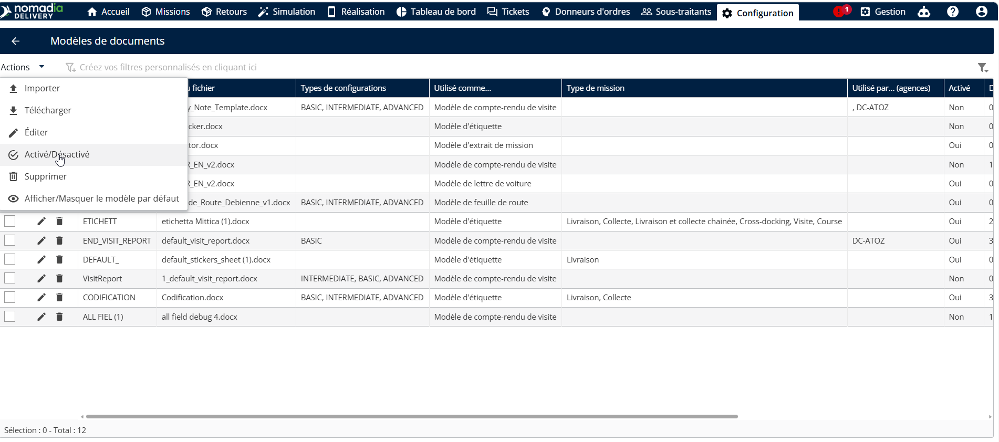<figcaption></figcaption></figure>

7. Les modèles de documents seront activés / désactivés avec succès.

#### Supprimer un modèle de document

1. Allez dans Configuration.
2. Cliquez sur le menu Configuration
3. Dans Personnalisation, cliquez sur Modèles de documents
4. Sélectionnez le document souhaité dans la liste
5. Cliquez sur le menu déroulant Actions
6. Cliquez sur Supprimer

<figure>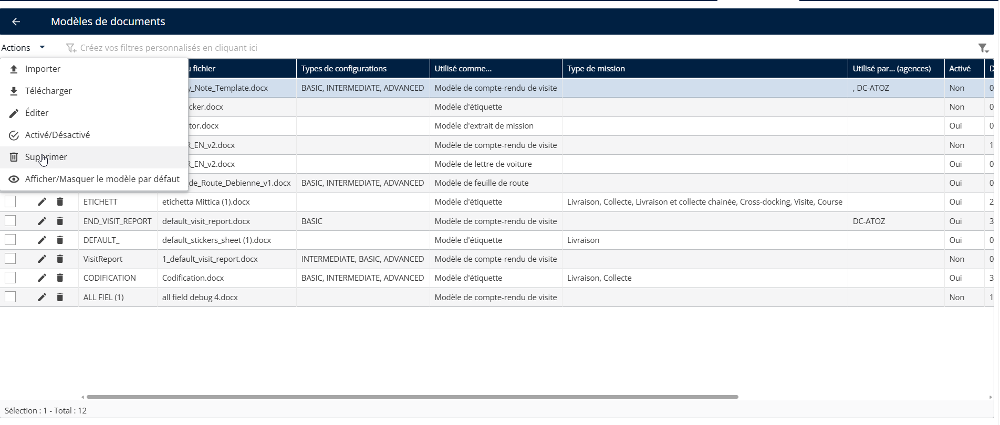<figcaption></figcaption></figure>

7. Les modèles de documents seront supprimés avec succès.

<figure>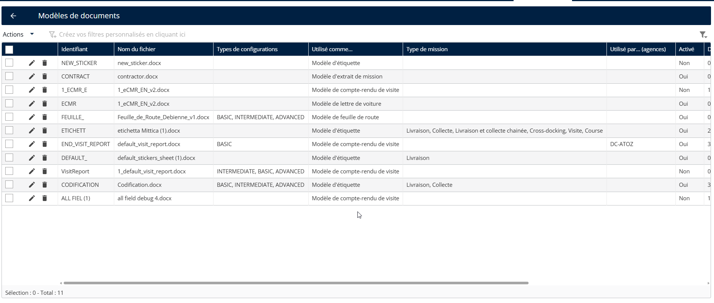<figcaption></figcaption></figure>

**Afficher/Masquer les modèles par défaut**

1. Allez dans Configuration.
2. Cliquez sur le menu Configuration
3. Dans Personnalisation, cliquez sur Modèles de documents
4. Sélectionnez le document souhaité dans la liste
5. Cliquez sur le menu déroulant Actions
6. Cliquez sur Afficher/Masquer le modèle par défaut

<figure>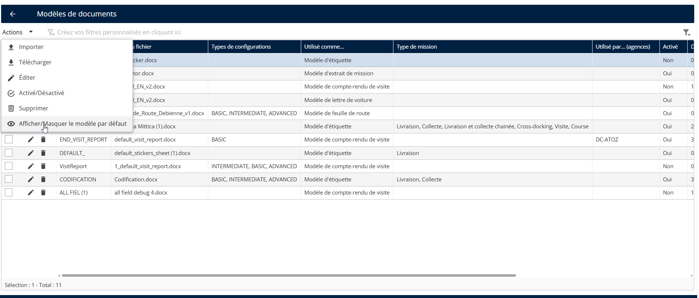<figcaption></figcaption></figure>

\
 
