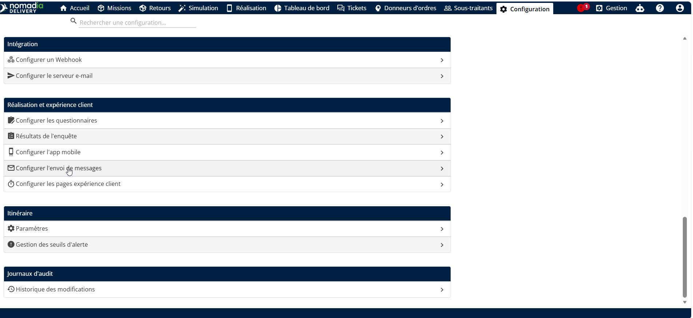
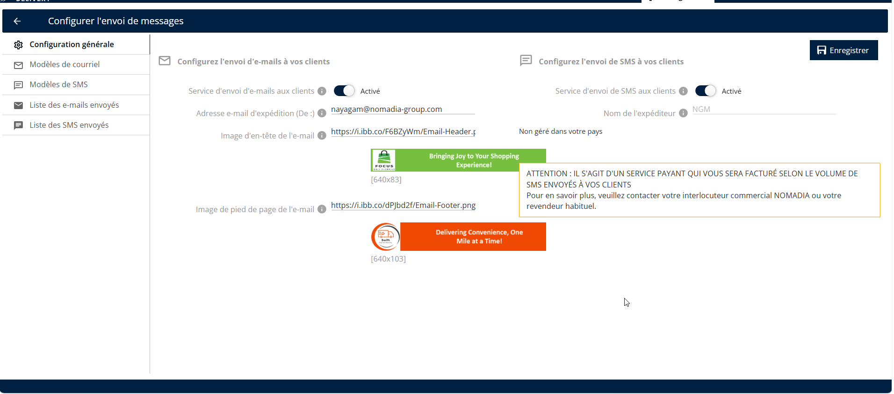

# E-mail

#### Activer la notification par e-mail

1. Allez dans Configuration.
2. Cliquez sur le menu Configuration
3. Sous Exécution et expérience client, cliquez sur Configurer les messages sortants

<figure><figcaption></figcaption></figure>

4. Sélectionnez la configuration générale
5. Sous Configurer les e-mails sortants vers les clients, activez le service d’e-mail sortant pour les clients
6. Cliquez sur Enregistrer

<figure><figcaption></figcaption></figure>

 
