# Gérer les zones postales

La fonctionnalité Gérer les zones postales permet aux administrateurs et aux responsables logistiques de définir et de gérer des zones de livraison géographiques en fonction des codes postaux. Ces zones sont essentielles pour organiser les livraisons, attribuer des ressources et optimiser les itinéraires dans des zones spécifiques

#### Importer des zones postales

1. Cliquez sur l’onglet Configuration
2. Sous Livraison, cliquez sur Gérer les études et les zones

<figure>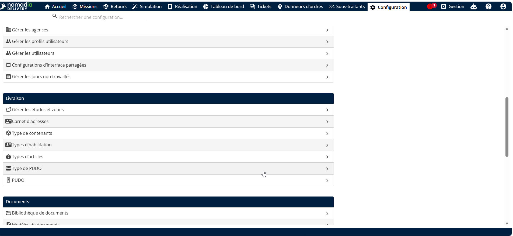<figcaption></figcaption></figure>

3. Cliquez sur le **crayon** icône à côté de l’étude pour ouvrir le tableau des zones.
4. Ouvrez le **Actions** menu déroulant
5. Cliquez sur **Importer**

<figure>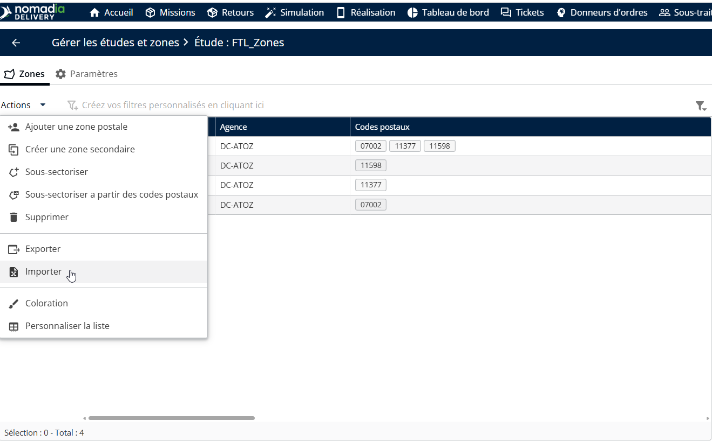<figcaption></figcaption></figure>

\
6\. Cliquez sur Parcourir le fichier pour téléverser le fichier contenant les données de la zone.

<figure>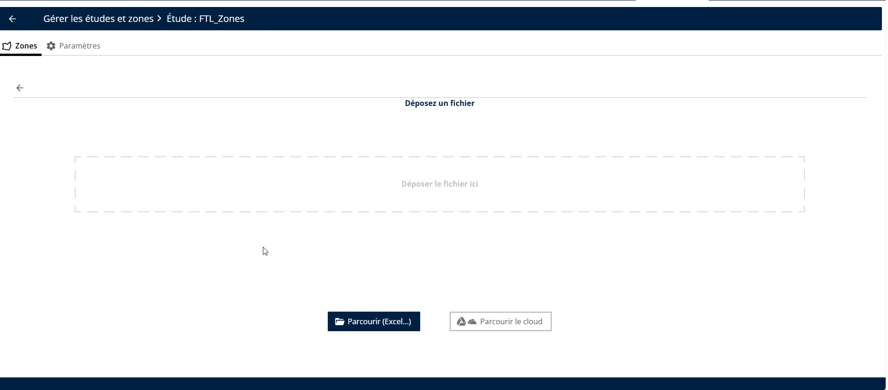<figcaption></figcaption></figure>

7. Sélectionnez un fichier de zone valide depuis votre système local.

<figure>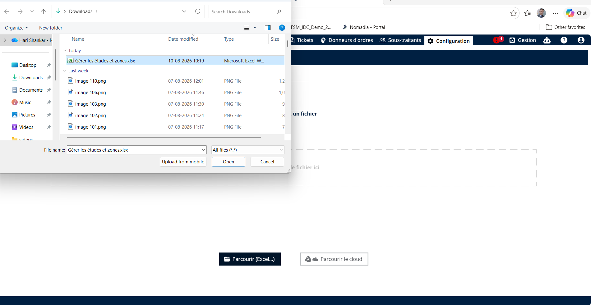<figcaption></figcaption></figure>

Les zones postales seront importées avec succès.

<figure>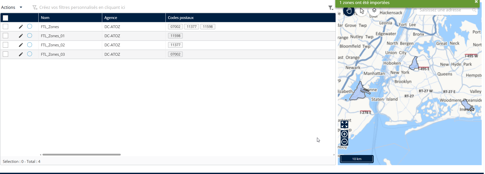<figcaption></figcaption></figure>

#### Ajouter une zone postale

1. Cliquez sur l’onglet Configuration
2. Sous Livraison, cliquez sur Gérer les études et les zones
3. Cliquez sur le **crayon** icône à côté de l’étude pour ouvrir le tableau des zones.
4. Cliquez sur le menu déroulant Actions.
5. Cliquez sur Ajouter une zone postale.

<figure>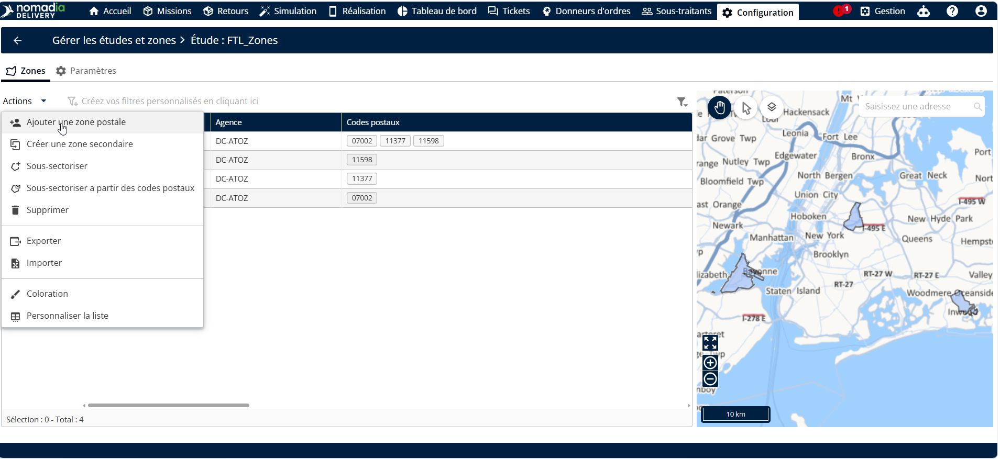<figcaption></figcaption></figure>

6. Renseignez les champs obligatoires : Code, Nom et Préfixe.

**Remarque**: Le préfixe est utilisé pour standardiser les codes postaux à une longueur fixe de 6 chiffres. Dans les régions où les codes postaux sont plus courts (par exemple, 5 chiffres dans certaines zones de France), le système ajoute automatiquement le préfixe défini pour atteindre la longueur requise.

7. Cliquez sur Enregistrer

<figure>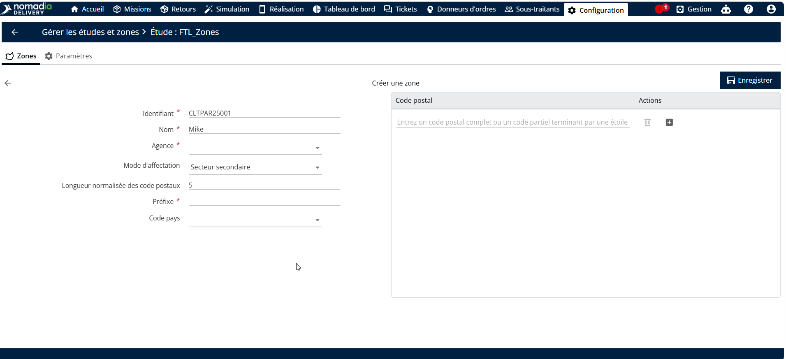<figcaption></figcaption></figure>

Les zones postales seront ajoutées avec succès

<figure>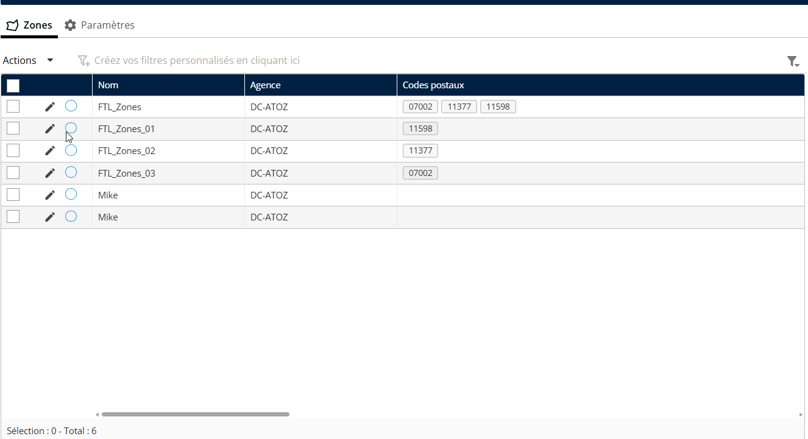<figcaption></figcaption></figure>

#### Supprimer une zone postale

1. Cliquez sur l’onglet Configuration
2. Sous Livraison, cliquez sur Gérer les études et les zones
3. Cliquez sur le **crayon** icône à côté de l’étude pour ouvrir le tableau des zones.
4. Sélectionnez une zone
5. Cliquez sur le menu déroulant Actions.
6. Cliquez sur Supprimer

<figure>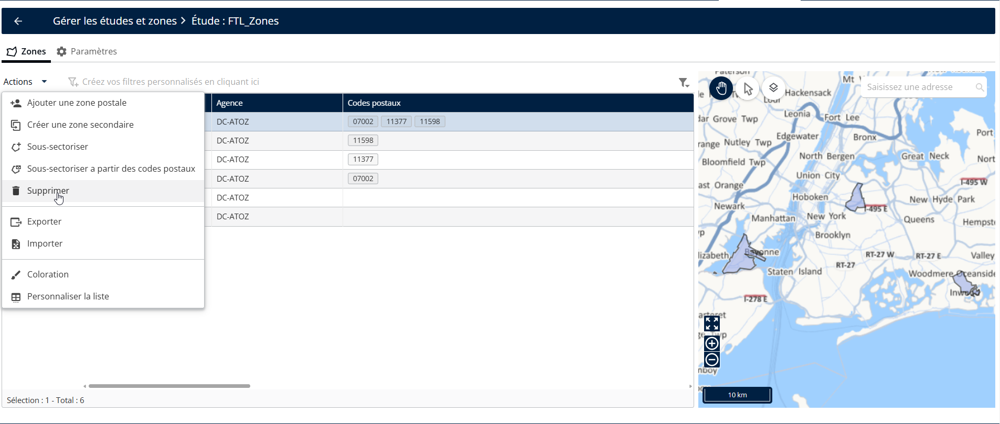<figcaption></figcaption></figure>

7. Vous verrez un message contextuel de confirmation indiquant : « Êtes-vous sûr de vouloir supprimer cette zone ? »
8. Cliquez sur Oui

<figure>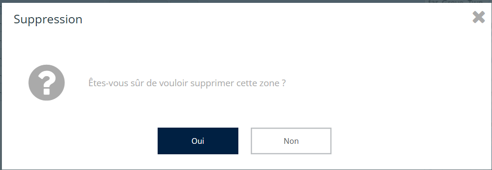<figcaption></figcaption></figure>

La zone postale sera supprimée avec succès

<figure>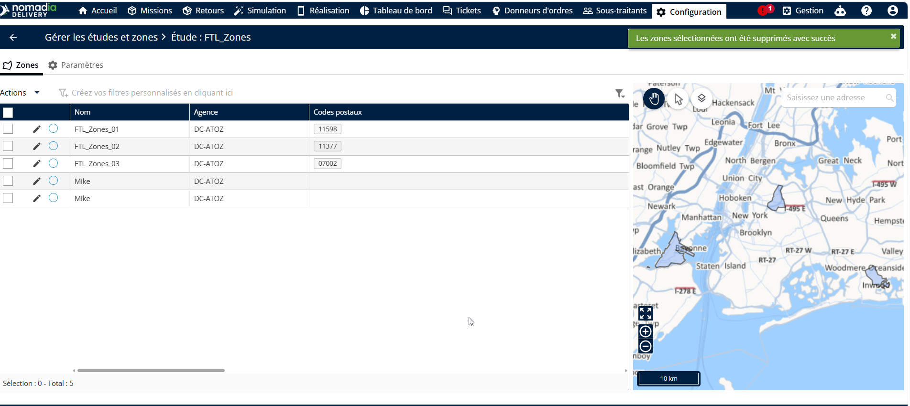<figcaption></figcaption></figure>

#### Exporter une zone postale

1. Cliquez sur l’onglet Configuration
2. Sous Livraison, cliquez sur Gérer les études et les zones
3. Sélectionnez une zone
4. Cliquez sur le menu déroulant Actions.
5. Cliquez sur Exporter

<figure>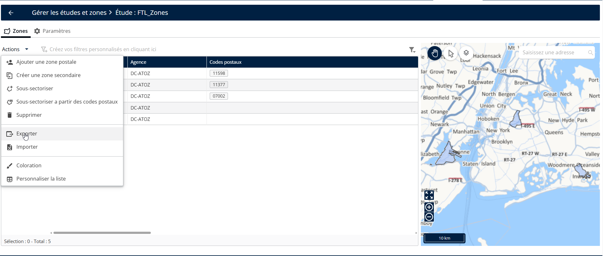<figcaption></figcaption></figure>

La zone postale sera exportée avec succès

<figure>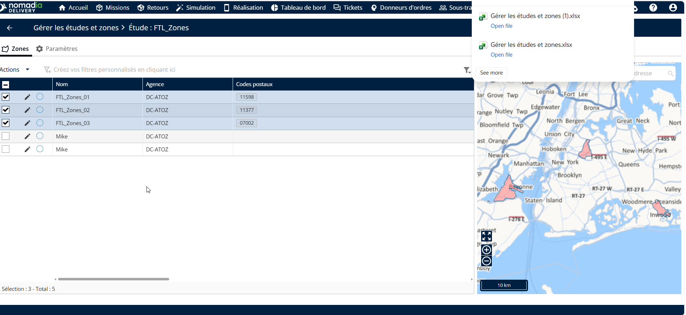<figcaption></figcaption></figure>

#### Colorer une zone postale

Appliquez des conditions basées sur les attributs de la zone, tels que le type de mission (Livraison, Retrait), la priorité de la zone, le livreur assigné, le préfixe du code postal, etc.

1. Cliquez sur l’onglet Configuration
2. Sous Livraison, cliquez sur Gérer les études et les zones
3. Sélectionnez une zone
4. Cliquez sur le menu déroulant Actions.
5. Cliquez sur Coloration

<figure>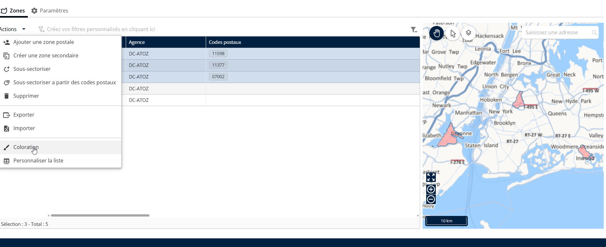<figcaption></figcaption></figure>

6. Choisissez une couleur
7. Cliquez sur Enregistrer

<figure>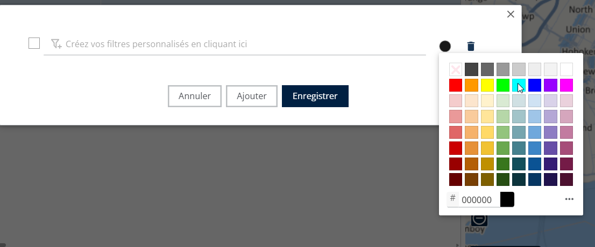<figcaption></figcaption></figure>

La couleur sélectionnée a été appliquée avec succès.

<figure>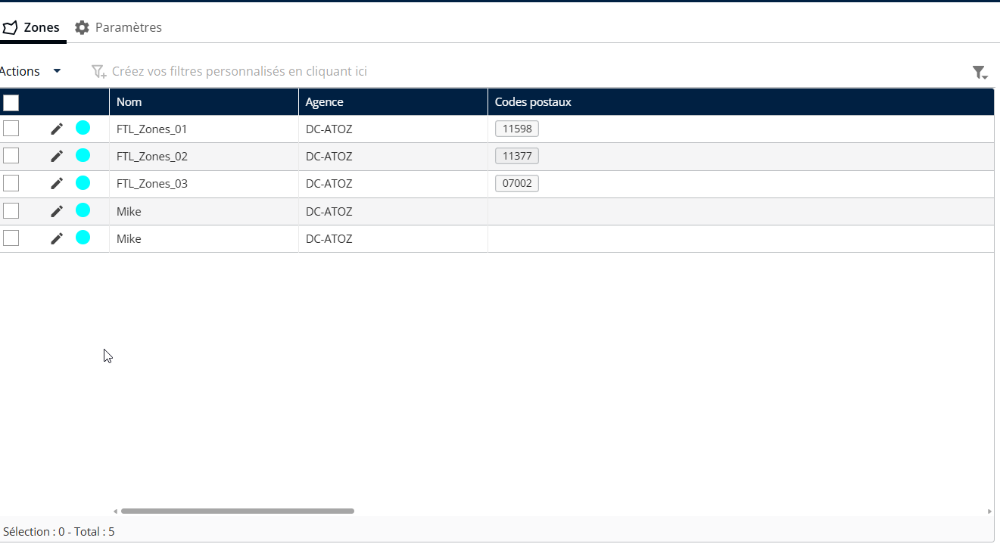<figcaption></figcaption></figure>
