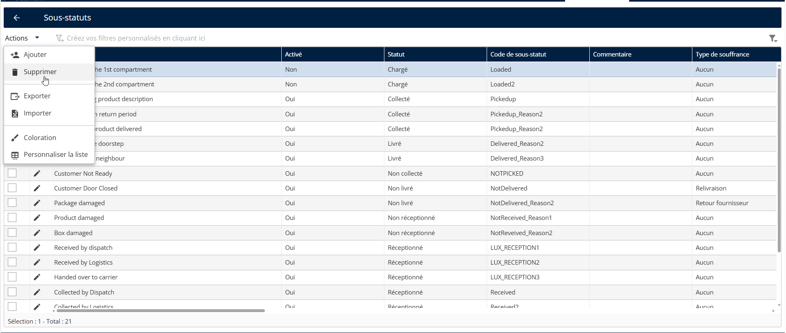
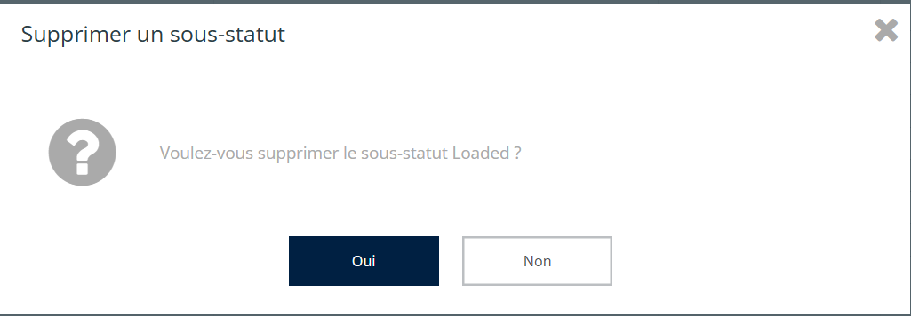
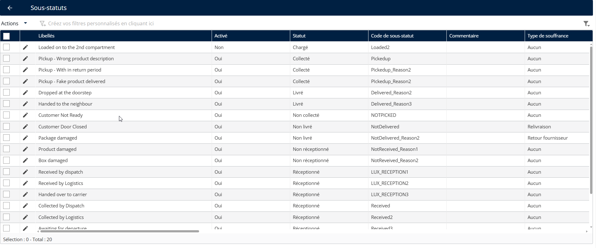
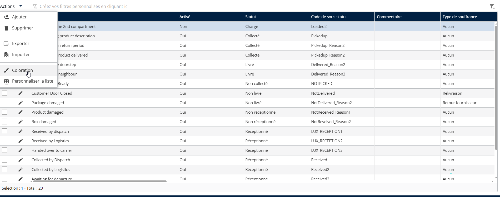
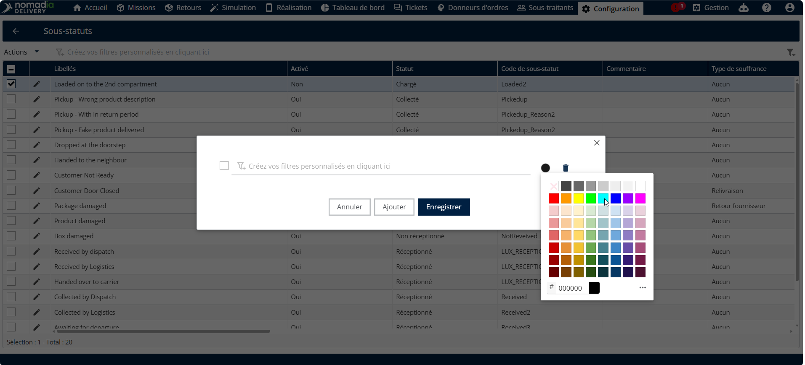
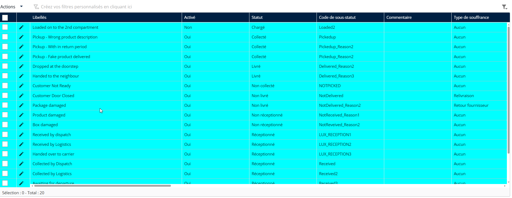

# Gérer les sous-statuts

La fonctionnalité Gérer les sous-statuts permet aux administrateurs de créer, modifier et attribuer des libellés de statut détaillés qui reflètent l’avancement en temps réel ou l’état d’une tâche de livraison. Ces sous-statuts offrent un mécanisme de suivi plus granulaire au sein de catégories de statut plus larges telles que « Enlèvement », « En attente » ou « Livré »

**Supprimer un sous-statut**

1. Aller à **Configuration**.
2. Cliquez sur **Configuration** Menu
3. Sous Mes données, cliquez sur **Sous-statuts.**
4. Sélectionnez un **Sous-statuts**
5. Cliquez sur le **Actions** menu déroulant
6. Cliquez sur **Supprimer**

<figure><figcaption></figcaption></figure>

Vous verrez un message de confirmation contextuel indiquant : « Voulez-vous supprimer le sous-statut ? »

7. Cliquez sur **Oui**

<figure><figcaption></figcaption></figure>

Le sous-statut a été supprimé avec succès

<figure><figcaption></figcaption></figure>

#### Coloration d’un sous-statut

Appliquez des conditions basées sur les attributs de la zone tels que le type de mission (Livraison, Enlèvement), la priorité de la zone, le livreur assigné, le préfixe du code postal, etc.

1. Aller à **Configuration**.
2. Cliquez sur **Configuration** Menu
3. Sous Mes données, cliquez sur **Sous-statuts**.
4. Sélectionnez un **Sous-statuts**
5. Cliquez sur le **Actions** menu déroulant
6. Cliquez sur **Coloration**

<figure><figcaption></figcaption></figure>

7. Choisissez un **Couleur**
8. Cliquez sur **Enregistrer**

<figure><figcaption></figcaption></figure>

La couleur sélectionnée a été appliquée avec succès.

<figure><figcaption></figcaption></figure>
