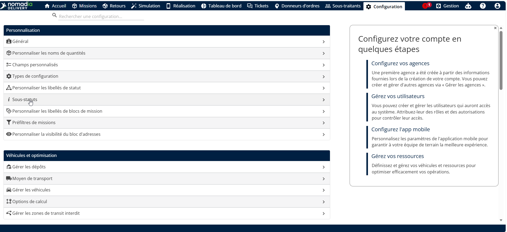
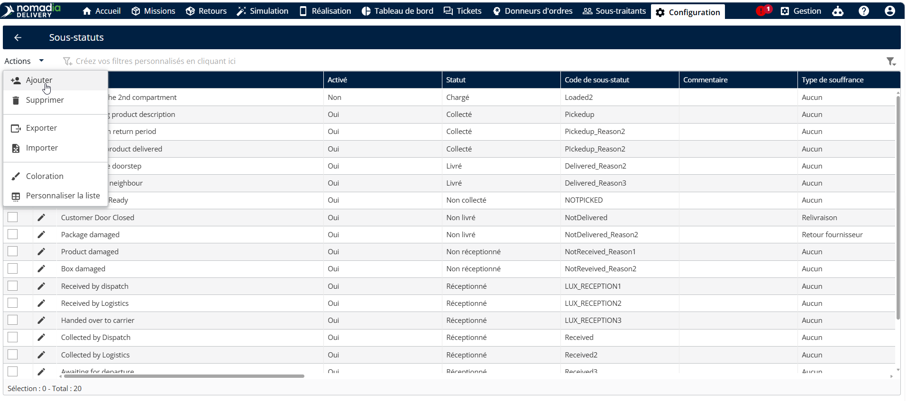
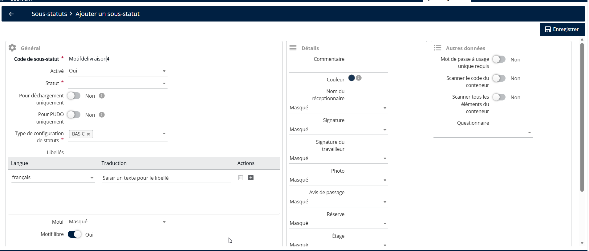
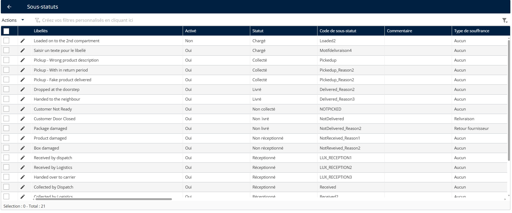

# Créer un sous-statut

1. Aller à **Configuration**.
2. Cliquez sur **Configuration** Menu
3. Sous Mes données, cliquez sur **Sous-statuts**.

<figure><figcaption></figcaption></figure>

4. Cliquez sur le **Actions** menu déroulant
5. Cliquez sur **Ajouter**

<figure><figcaption></figcaption></figure>

6. Saisissez le **Sous-statut** code
7. Sélectionnez le **Configuration du statut** type
8. Cliquez sur **Enregistrer**

<figure><figcaption></figcaption></figure>

Le sous-statut a été créé avec succès

<figure><figcaption></figcaption></figure>
