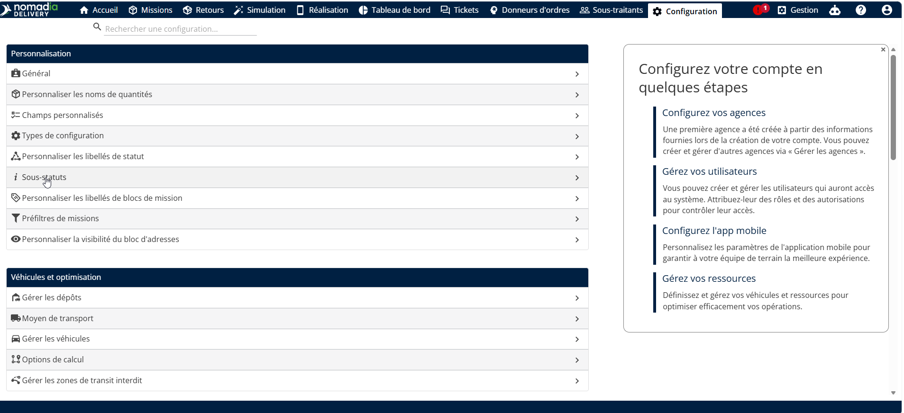
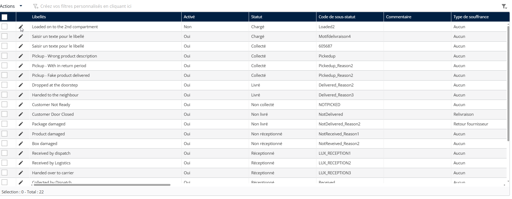
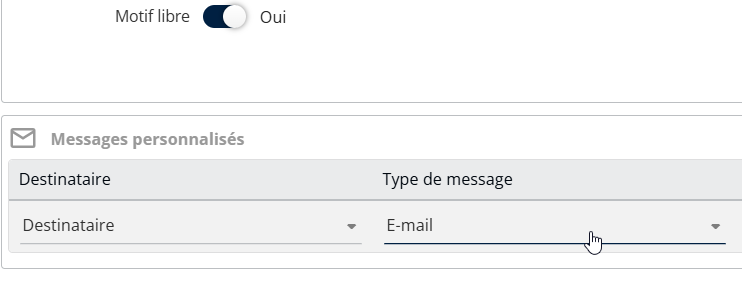
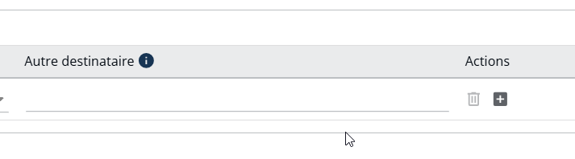
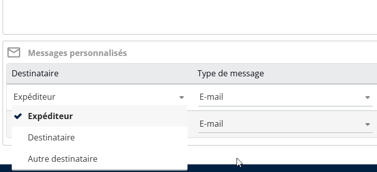
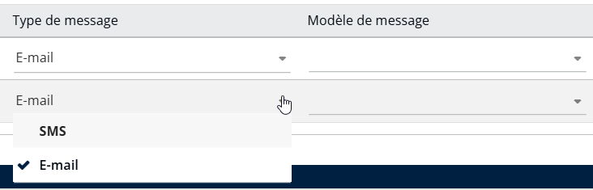
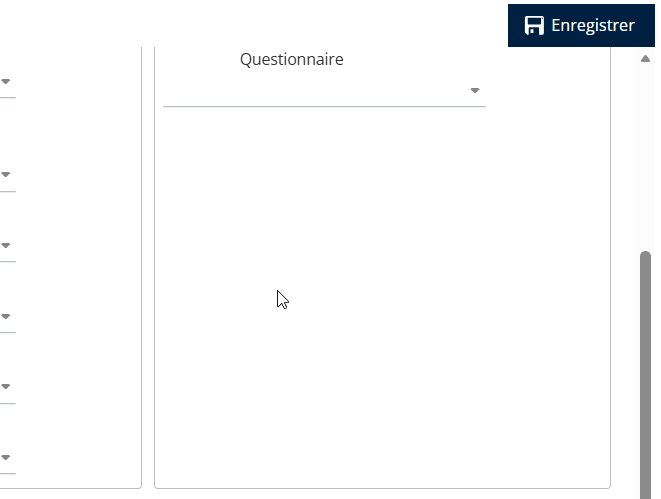

# Déclencher des notifications pour les changements de sous-statut

La fonctionnalité Déclencher des notifications pour les changements de sous-statut permet une communication précise et en temps réel avec toutes les parties prenantes impliquées dans le mouvement des colis. Elle améliore la transparence, la coordination et la qualité globale du service sur les opérations du premier kilomètre, du kilomètre intermédiaire et du dernier kilomètre.

Pour configurer les notifications liées aux changements de sous-statut, suivez les étapes ci-dessous

1. Ouvrez l'application Nomadia Delivery et accédez à l'onglet **Configuration.**
2. Sélectionnez **Sous-statuts** dans la liste.

<figure><figcaption></figcaption></figure>

3\. Cliquez sur l'icône **crayon** à côté du sous-statut existant pour le modifier.

<figure><figcaption></figcaption></figure>

4. La section Configuration des messages personnalisés s'affiche en bas de la page.

<figure><figcaption></figcaption></figure>

5. Cliquez sur l'icône **+** bouton pour ajouter la configuration de notification au sous-statut.

<figure><figcaption></figcaption></figure>

6. Les notifications peuvent être envoyées aux destinataires suivants :

* **Expéditeur** – L'expéditeur initial de la mission. Les notifications sont envoyées à l'adresse e-mail ou au numéro de mobile du prestataire enregistré dans les détails de la mission.
* **Destinataire** – Le destinataire initial de la mission (client). Les notifications sont envoyées à l'adresse e-mail de livraison ou au numéro de mobile enregistré dans les détails de la mission.
* **Autres destinataires** – Les parties prenantes internes telles que les équipes d'exploitation ou de logistique. Ce champ accepte plusieurs adresses e-mail ou numéros de téléphone, séparés par des virgules.

<figure><figcaption></figcaption></figure>

7\. Les notifications peuvent être envoyées par e-mail ou SMS.

* Pour créer une configuration de notification, sélectionnez un **destinataire**, **type de message**, et **modèle de message**.
* Seuls les **modèles de messages personnalisés** sont pris en charge dans ce cas.

<figure><figcaption></figcaption></figure>

8.  Le champ Autres destinataires vous permet de saisir plusieurs adresses e-mail ou numéros de téléphone, séparés par des virgules.

    * Ce champ est activé uniquement lorsque **Autres destinataires** est sélectionné dans la colonne **Destinataire.**&#x20;

    <figure><figcaption></figcaption></figure>

9. Une fois la configuration terminée, cliquez sur **Enregistrer** pour appliquer et enregistrer les modifications.

<figure><figcaption></figcaption></figure>

Lorsque l'utilisateur mobile déclenche un sous-statut, tous les destinataires configurés reçoivent automatiquement la mise à jour par e-mail ou SMS en même temps, fournissant des informations en temps réel sur le mouvement de la mission.

<figure><figcaption></figcaption></figure>
