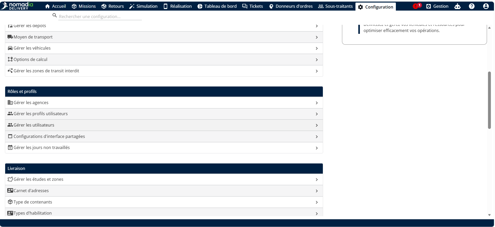
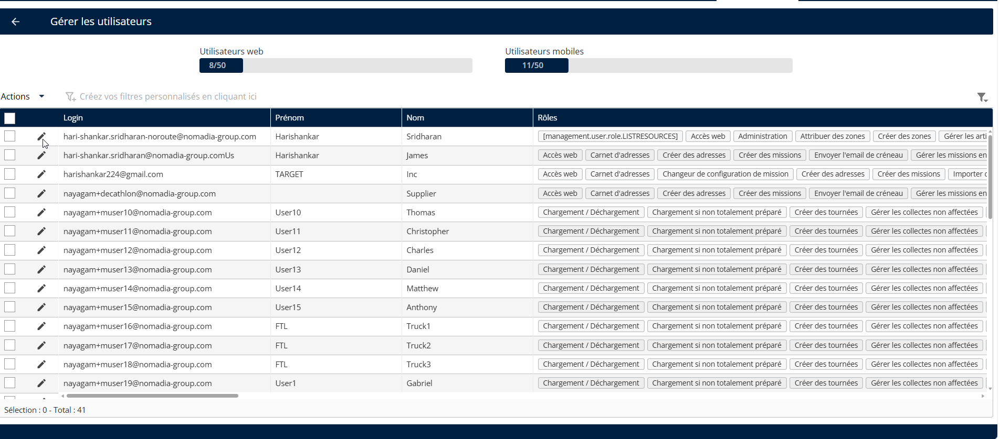
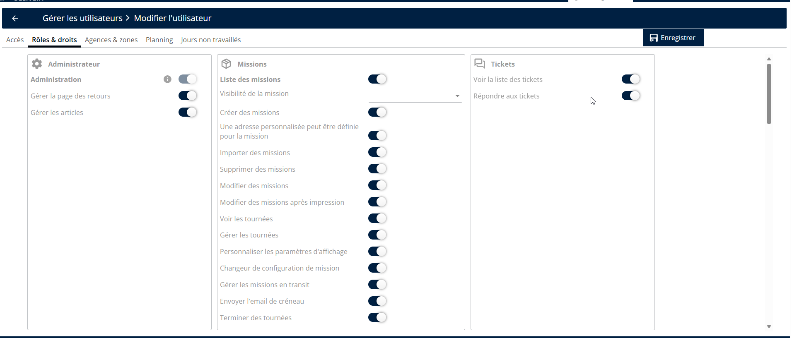

# Activation du module de tickets

1. Accédez à la configuration
2. Cliquez sur Gérer les utilisateurs

<figure><figcaption></figcaption></figure>

3. Cliquez sur le **crayon** icône à côté de l’utilisateur pour modifier un utilisateur.

<figure><figcaption></figcaption></figure>

4. Allez à l’onglet « **Rôles et droits »**.
5. Activez les droits nécessaires dans la section Tickets.
6. Cliquez sur « **Enregistrer** » pour enregistrer la configuration.

<figure><figcaption></figcaption></figure>

 
