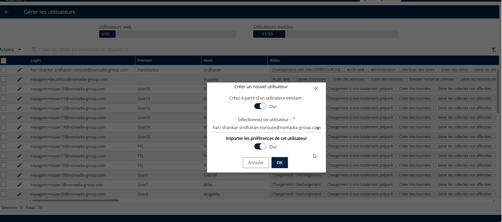
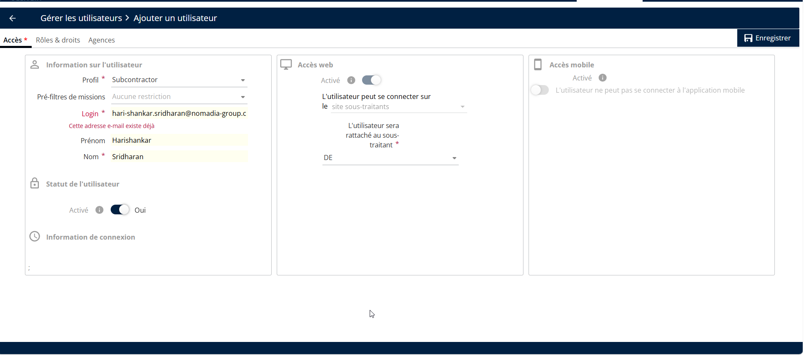

# Créer un utilisateur à partir d’un utilisateur existant

1. Dans Gérer les utilisateurs, cliquez sur le **menu déroulant Actions** et sélectionnez **Ajouter**.
2. Définissez Créer à partir d’un utilisateur existant sur **Oui**.
3. Sélectionnez l’utilisateur existant dans la liste.
4. Choisir **Oui** ou **Non** pour importer les préférences de l’utilisateur, si nécessaire.
5. Cliquez sur **OK**

<figure><figcaption></figcaption></figure>

6. Modifiez les détails de l’utilisateur si nécessaire.
7. Cliquez sur **Enregistrer** pour terminer le processus.

<figure><figcaption></figcaption></figure>
