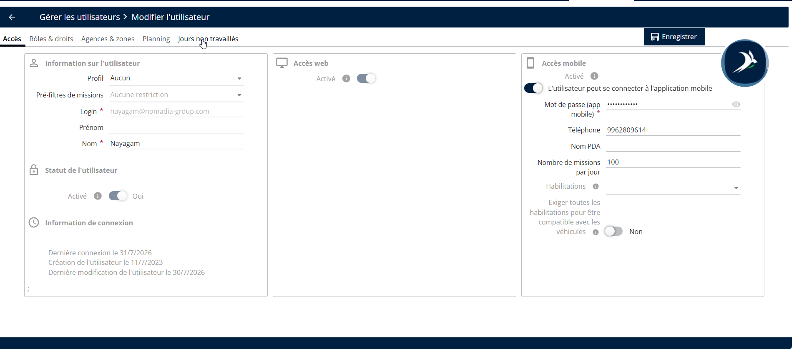
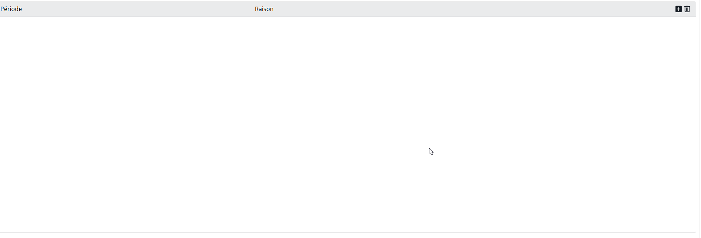
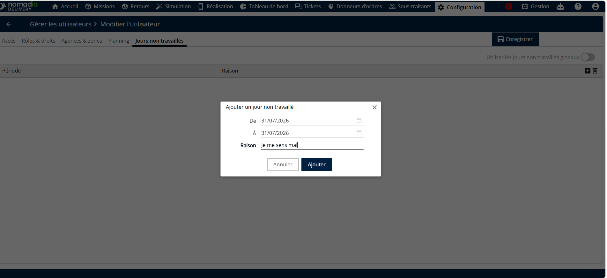
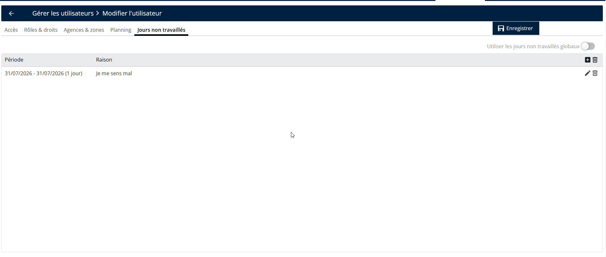

# Jours de congé

Si un utilisateur a prévu un congé ou des vacances, la section Jours d’absence peut être utilisée pour enregistrer les dates d’indisponibilité.Accédez à Jours d’absence.

1. Accédez à Jours d’absence.

<figure><figcaption></figcaption></figure>

2. Cliquez sur le **Icône + (Ajouter).**

<figure><figcaption></figcaption></figure>

3. Saisissez le Date de début, Date de fin, et spécifiez la raison.
4. Cliquez sur Ajouter.

<figure><figcaption></figcaption></figure>

5. Cliquez sur Enregistrer pour mettre à jour les détails

<figure><figcaption></figcaption></figure>

\
 
