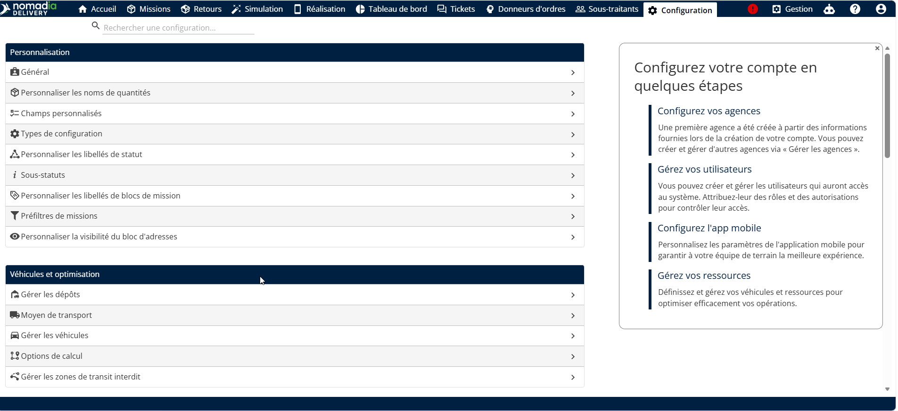
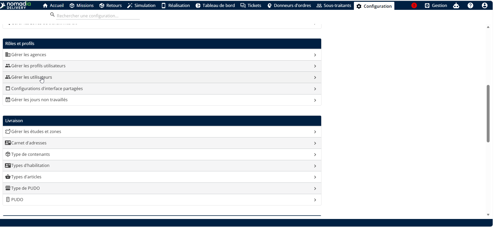
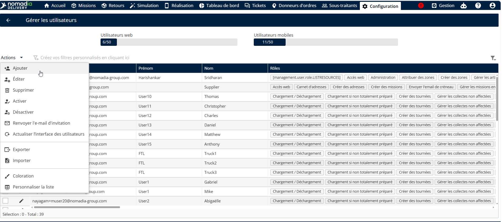
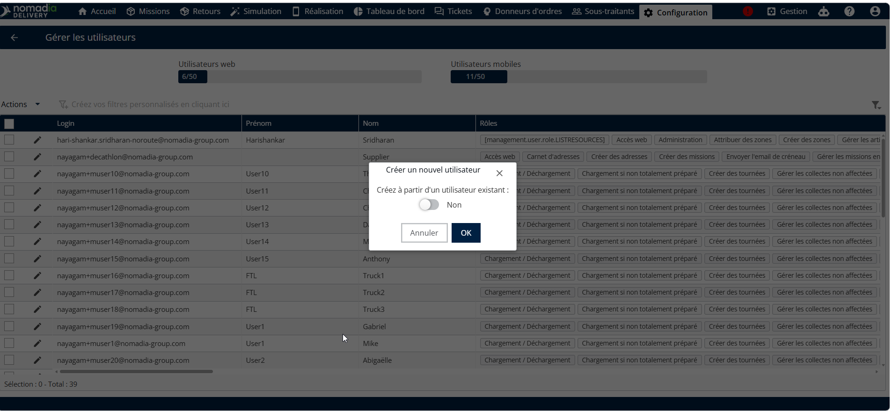
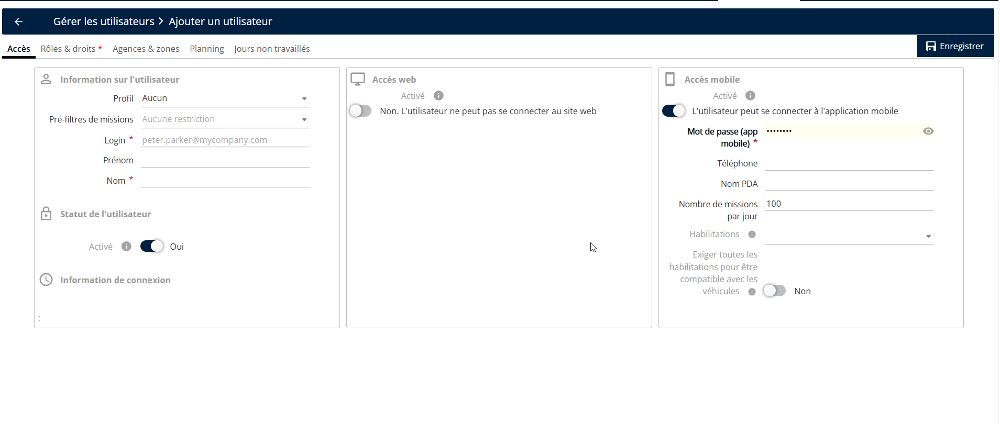
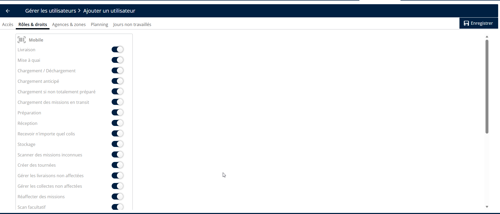
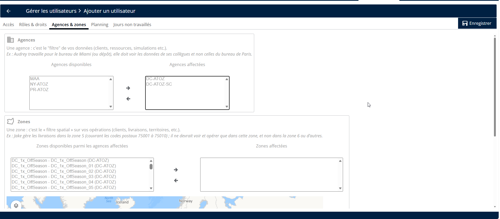

# Activation de l’accès mobile

1. Accédez à Configuration.

<figure><figcaption></figcaption></figure>

2. Dans la liste, sélectionnez **Gérer les utilisateurs.**

<figure><figcaption></figcaption></figure>

3. Cliquez sur la liste déroulante Actions et choisissez **Ajouter**.

<figure><figcaption></figcaption></figure>

4. Pour créer un nouvel utilisateur, définissez Créer à partir d’un utilisateur existant sur Non. Cliquez sur OK. Pour des instructions étape par étape, reportez-vous à la section Création d’un utilisateur à partir d’un utilisateur existant

<figure><figcaption></figcaption></figure>

* Sélectionnez le nom de profil approprié : **Planificateur (Standard), Entrepreneur ou Sous-traitant.**
* Si Planificateur (Standard) est sélectionné, l’accès peut être accordé à un transporteur.
* Si Entrepreneur est sélectionné, l’accès peut être accordé à un entrepreneur.
* Si Sous-traitant est sélectionné, l’accès peut être accordé à un sous-traitant
* Saisissez le **ID de connexion, Prénom**, et **Nom de famille**.
* L’ID de connexion doit être au format e-mail. Pour les utilisateurs mobiles, l’ID de connexion n’a pas besoin d’être une adresse e-mail valide.
* Définissez le statut de l’utilisateur sur **Oui** ou **Non**, selon les besoins.
* Lorsqu’un profil est sélectionné, tous les rôles et droits d’accès sont hérités automatiquement. Les rôles et droits ne peuvent pas être activés ou désactivés manuellement au niveau de l’utilisateur. Pour modifier des rôles ou des droits d’accès, les modifications doivent être effectuées dans la configuration du profil.
* Activez **l’accès mobile** et saisissez le **mot de passe de l’utilisateur**. Pour plus d’informations sur la politique de mot de passe, reportez-vous à « Politique de mot de passe pour l’accès mobile »

<figure><figcaption></figcaption></figure>

* Ouvrez Rôles et droits et activez les autorisations requises :

<figure><figcaption></figcaption></figure>

* Aller à **Agence**, sélectionnez l’agence disponible, puis cliquez sur la flèche vers la droite pour l’attribuer à l’utilisateur.

5. Après avoir renseigné tous les détails requis, cliquez sur Enregistrer pour créer l’utilisateur.

<figure><figcaption></figcaption></figure>
