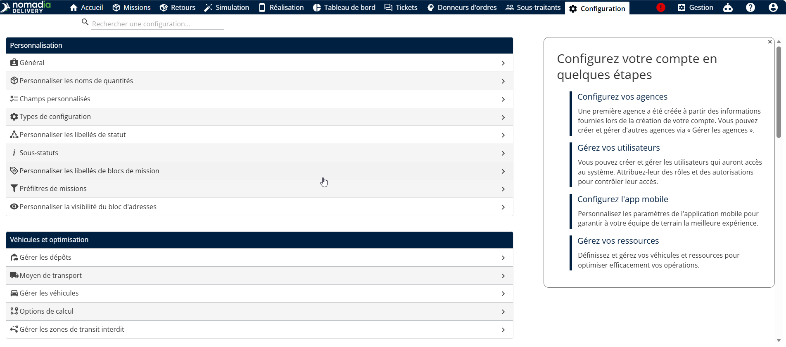
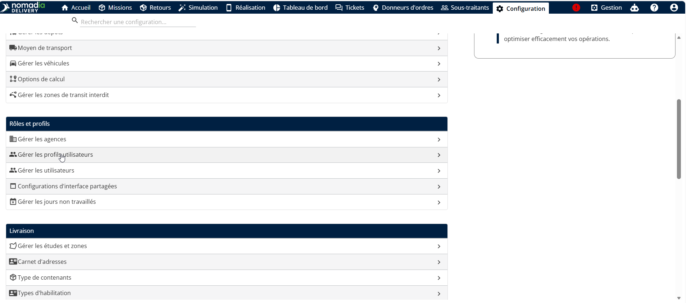
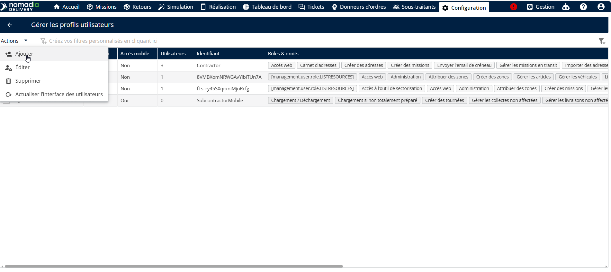
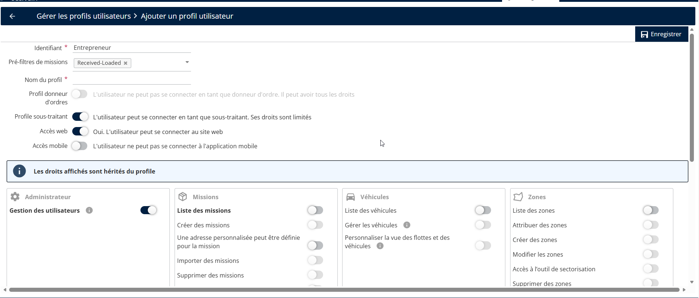
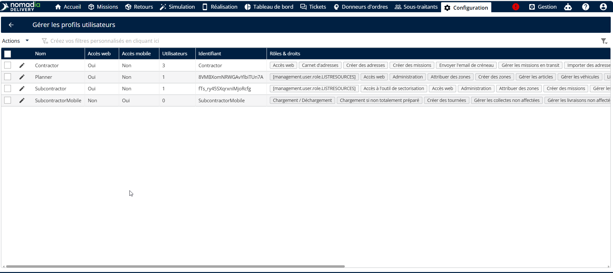

# Gérer le profil utilisateur

Les organisations comptant des centaines ou des milliers d’utilisateurs peuvent tirerparti de la fonctionnalité Profils d’utilisateur pour créer plusieurs profils avecdifférents droits d’accès, simplifiant ainsi la gestion des utilisateurs et desautorisations.

1. Accédez à Configuration

<figure><figcaption></figcaption></figure>

2. Dans la liste, sélectionnez Gérer les profils d’utilisateur.

<figure><figcaption></figcaption></figure>

3. Cliquez sur la liste déroulante Actions et choisissez Ajouter

<figure><figcaption></figcaption></figure>

* Saisissez le **Identifiant** et **Nom du profil.**
* Activez **profils de sous-traitant (accès Web)** pour les utilisateurs sous-traitants et **profils de sous-sous-traitant** pour (Web ou Mobile) les utilisateurs sous-sous-traitants.
* Activer les **Rôles** et **Droits**.

<figure><figcaption></figcaption></figure>

\
Un message de confirmation indique que le profil utilisateur a été créé avec succès.

<figure><figcaption></figcaption></figure>
