# Gérer les flottes de véhicules

### Gérer les flottes de véhicules

La gestion des flottes de véhicules dans Nomadia Delivery permet aux administrateurs et aux planificateurs de tenir un registre à jour des véhicules utilisés pour les opérations de livraison. Cela comprend l’ajout, la modification ou la désactivation de véhicules, l’attribution de caractéristiques spécifiques et la garantie que chaque véhicule est correctement configuré pour répondre aux besoins logistiques.

#### Importer des flottes de véhicules

1. Allez dans Configuration.
2. Cliquez sur le menu Configuration
3. Sous Mes données, cliquez sur Gérer les véhicules.

<figure>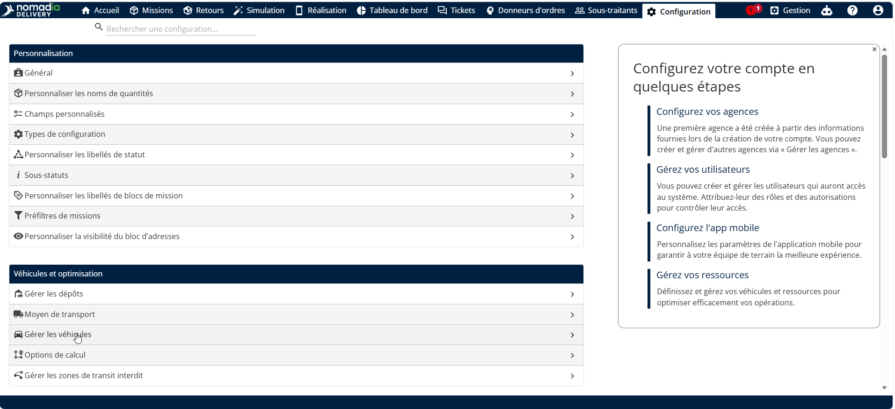<figcaption></figcaption></figure>

4. Sous Mes flottes, cliquez sur le menu déroulant Actions.
5. Cliquez sur Importer

<figure>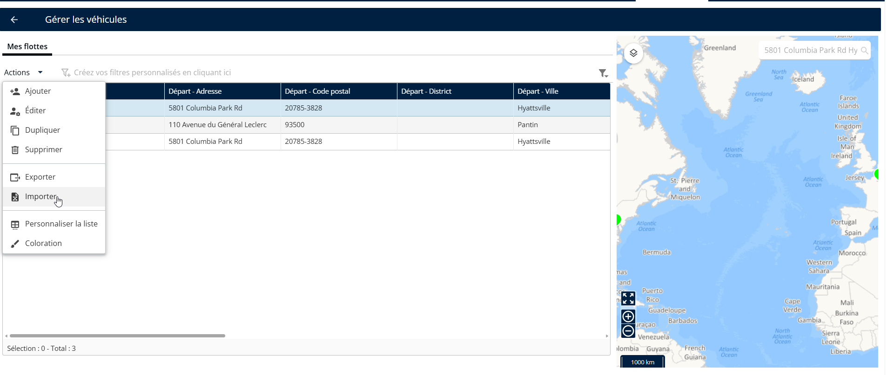<figcaption></figcaption></figure>

6. Cliquez sur Parcourir un fichier pour téléverser le fichier

<figure>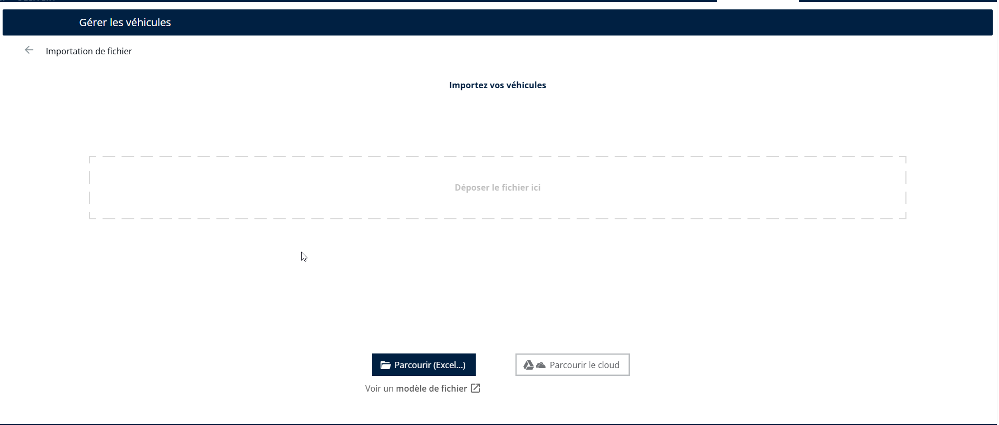<figcaption></figcaption></figure>

7. Sélectionnez un fichier valide depuis votre système local.

<figure>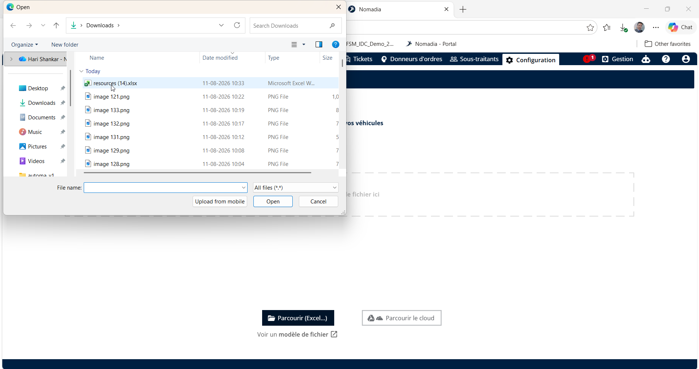<figcaption></figcaption></figure>

Les flottes de véhicules ont été importées avec succès.

<figure>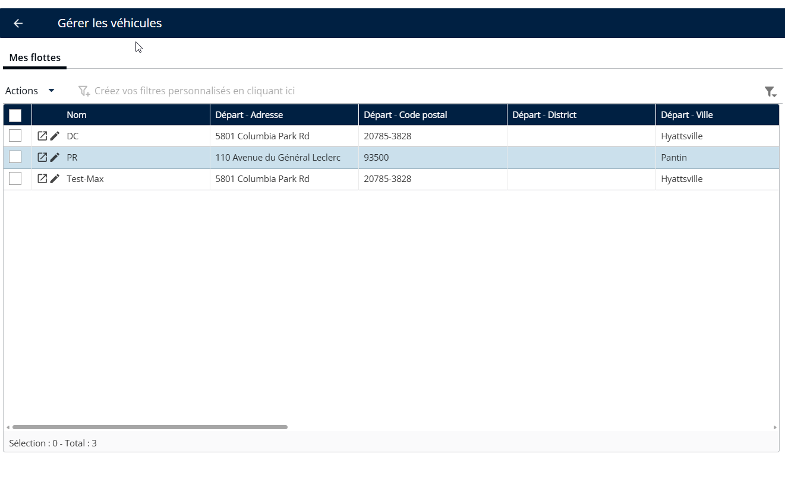<figcaption></figcaption></figure>

#### Ajouter une flotte de véhicules

1. Allez dans Configuration.
2. Cliquez sur le menu Configuration
3. Sous Mes données, cliquez sur Gérer les véhicules.
4. Sous Mes flottes, cliquez sur le menu déroulant Actions.
5. Cliquez sur Ajouter

<figure>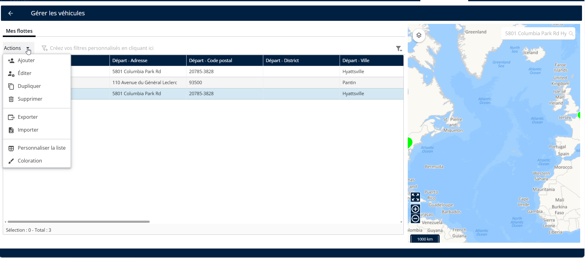<figcaption></figcaption></figure>

6. Saisissez le nom et le nom de l’agence
7. Cliquez sur Ajouter

<figure>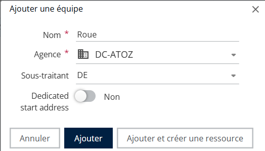<figcaption></figcaption></figure>

Les flottes de véhicules ont été ajoutées avec succès.

<figure>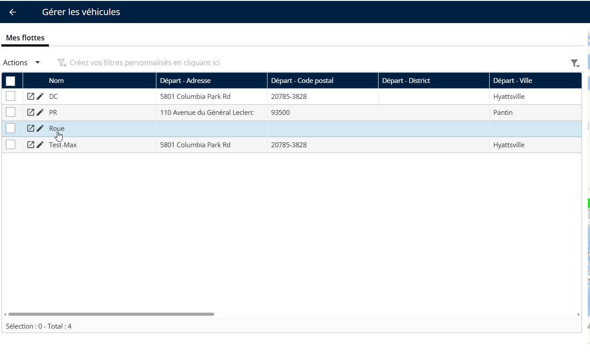<figcaption></figcaption></figure>

#### Supprimer une flotte de véhicules

1. Allez dans Configuration.
2. Cliquez sur le menu Configuration
3. Sous Mes données, cliquez sur Gérer les véhicules.
4. Sélectionnez une équipe
5. Sous Mes flottes, cliquez sur le menu déroulant Actions.
6. Cliquez sur Supprimer

<figure>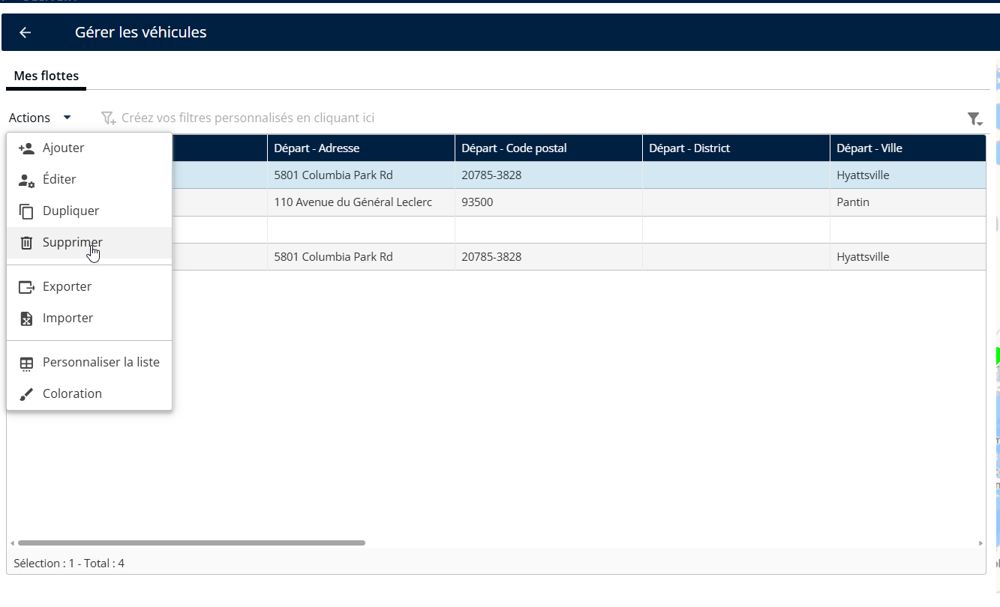<figcaption></figcaption></figure>

7. Vous verrez un message contextuel de confirmation indiquant : « Voulez-vous supprimer le véhicule ? »
8. Cliquez sur Supprimer

<figure>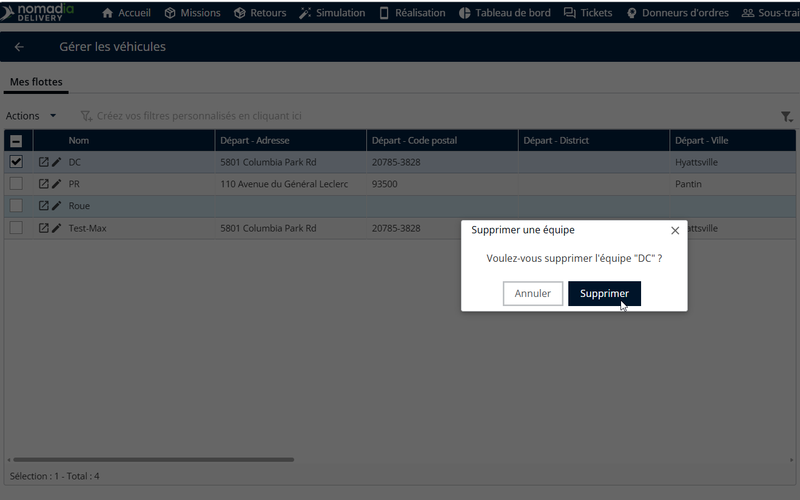<figcaption></figcaption></figure>

Les flottes de véhicules ont été supprimées avec succès.

<figure>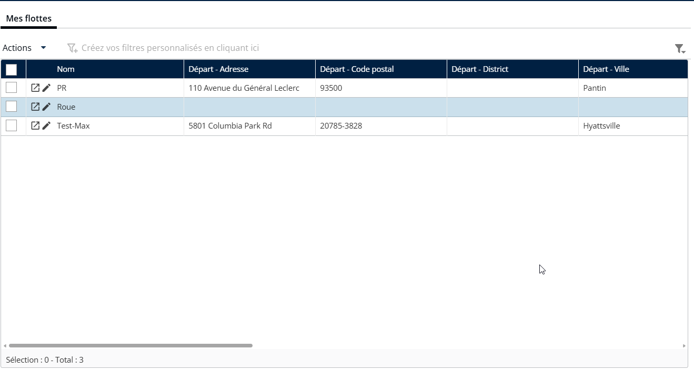<figcaption></figcaption></figure>
