# Gérer les véhicules d’une flotte

#### Ajouter un véhicule

1. Allez dans Configuration.
2. Cliquez sur le menu Configuration
3. Sous Mes données, cliquez sur Gérer les véhicules.
4. Cliquez sur le nom souhaité
5. Cliquez sur Actions
6. Cliquez sur Ajouter dans le menu déroulant

<figure>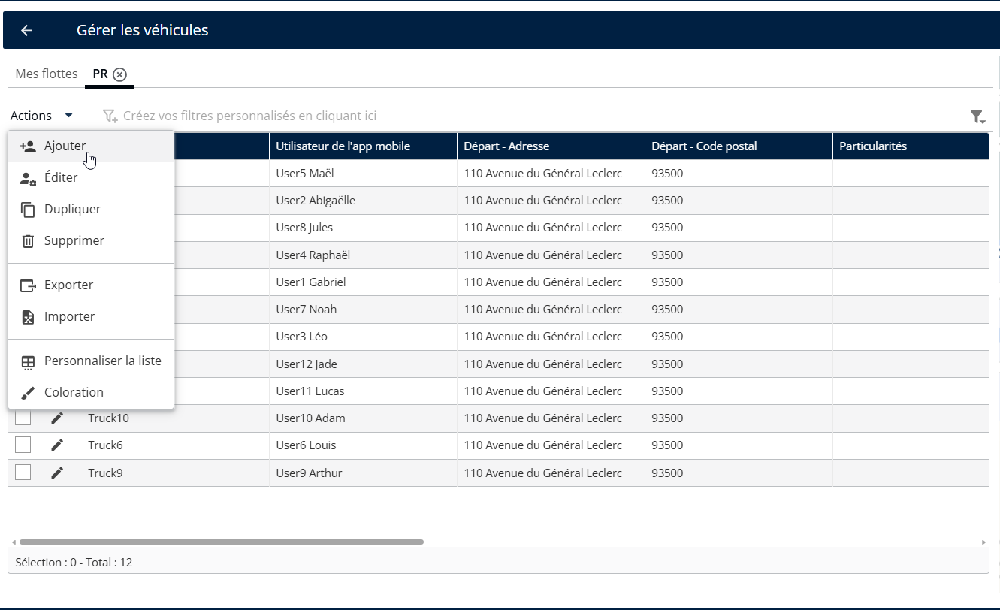<figcaption></figcaption></figure>

7. Saisissez le nom
8. Cliquez sur Ajouter

<figure>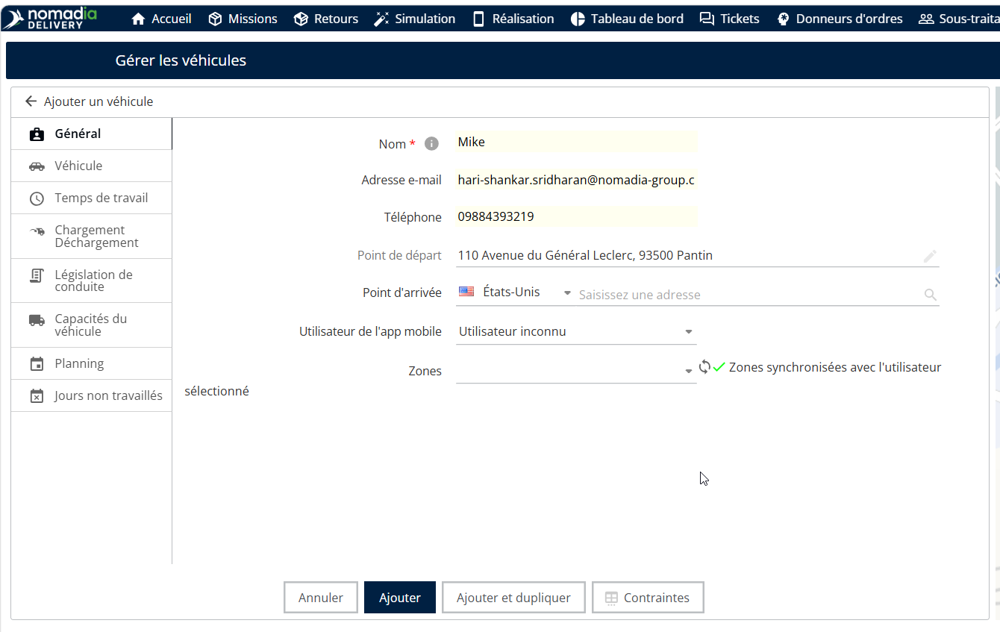<figcaption></figcaption></figure>

**Supprimer un véhicule**

1. Allez dans Configuration.
2. Cliquez sur le menu Configuration
3. Sous Mes données, cliquez sur Gérer les véhicules.
4. Cliquez sur le nom souhaité
5. Cliquez sur Actions
6. Cliquez sur Supprimer dans le menu déroulant

<figure>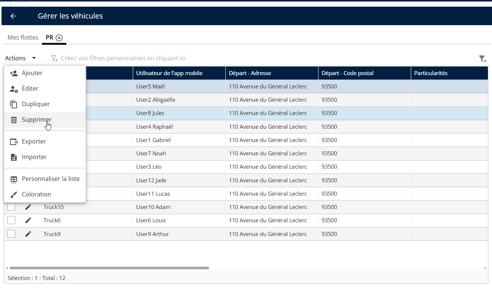<figcaption></figcaption></figure>

7. Vous verrez un message contextuel de confirmation indiquant : « Voulez-vous supprimer le véhicule ? »
8. Cliquez sur Supprimer.

<figure>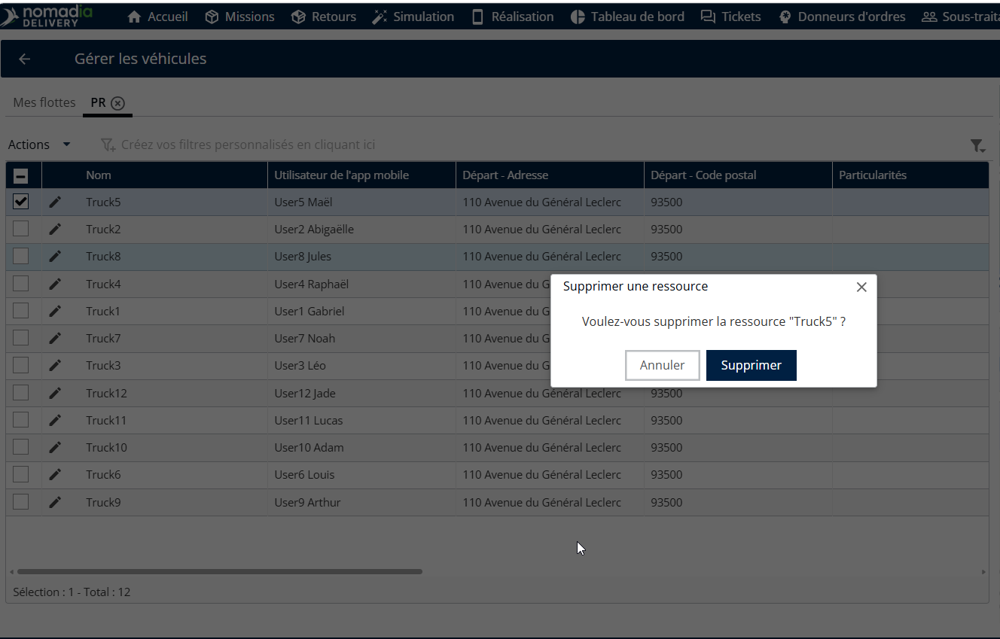<figcaption></figcaption></figure>

Les véhicules ont été supprimés avec succès

<figure>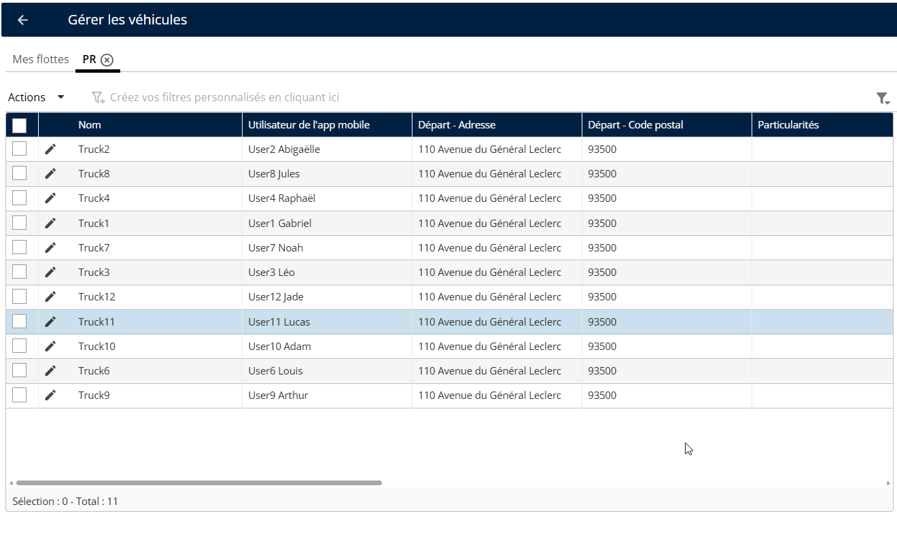<figcaption></figcaption></figure>

#### Exporter un véhicule

1. Allez dans Configuration.
2. Cliquez sur le menu Configuration
3. Sous Mes données, cliquez sur Gérer les véhicules.
4. Cliquez sur le nom souhaité
5. Cliquez sur Actions
6. Cliquez sur Exporter dans le menu déroulant

<figure>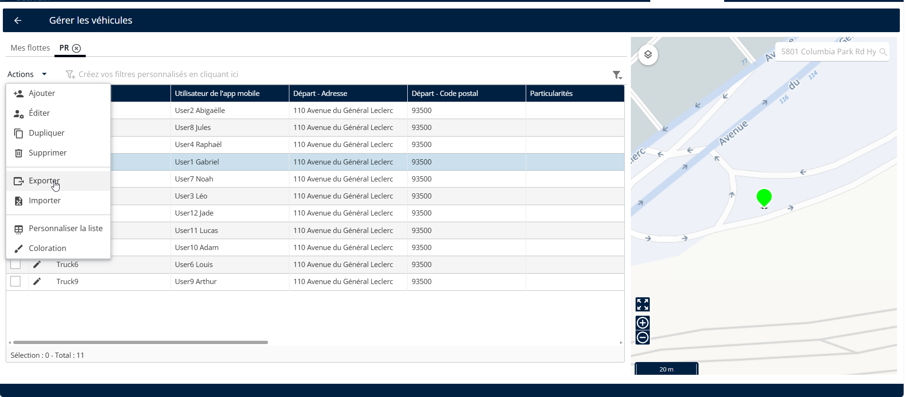<figcaption></figcaption></figure>

Les véhicules ont été exportés avec succès.

<figure>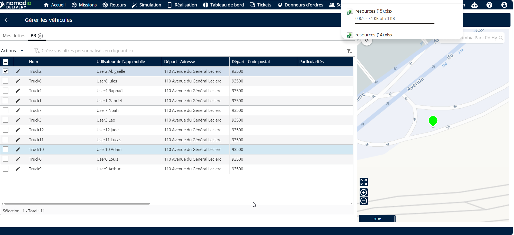<figcaption></figcaption></figure>

#### Colorer un véhicule

1. Allez dans Configuration.
2. Cliquez sur le menu Configuration
3. Sous Mes données, cliquez sur Gérer les véhicules.
4. Cliquez sur le nom souhaité
5. Cliquez sur Actions
6. Cliquez sur Coloration dans le menu déroulant

<figure>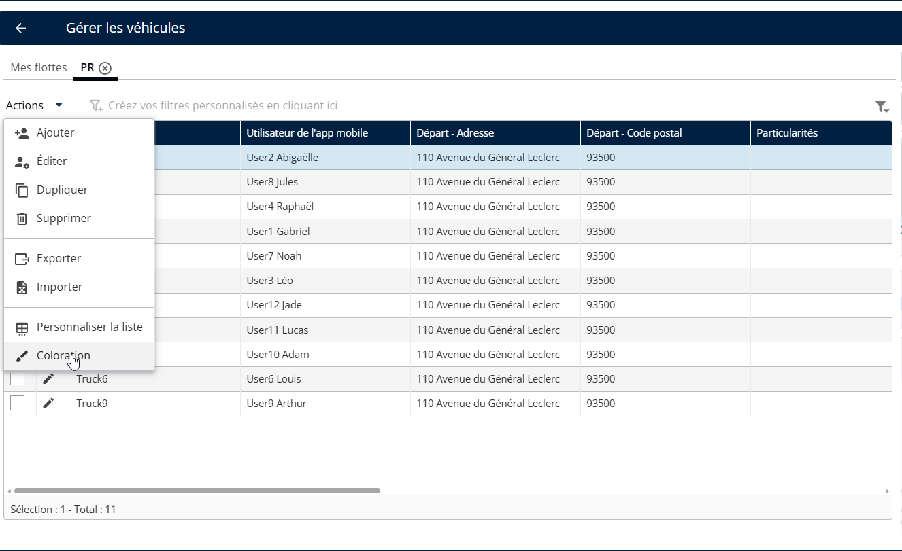<figcaption></figcaption></figure>

7. Choisissez une couleur
8. Cliquez sur Enregistrer

<figure>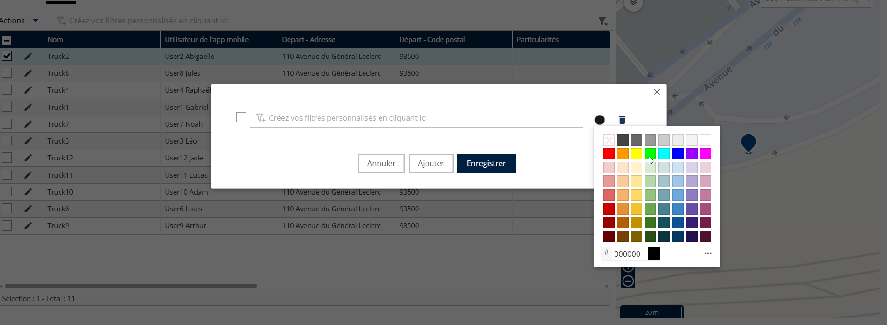<figcaption></figcaption></figure>

La couleur a été appliquée avec succès.

<figure>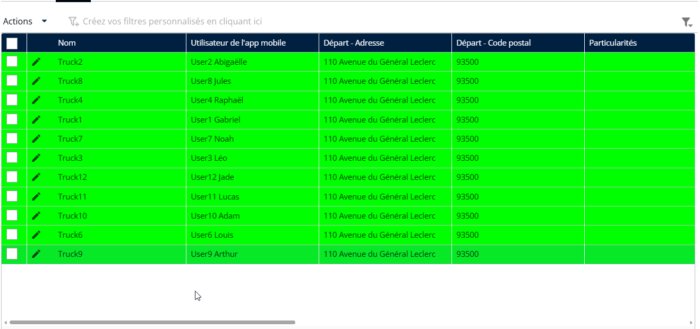<figcaption></figcaption></figure>

#### Personnaliser le tableau des véhicules

1. Allez dans Configuration.
2. Cliquez sur le menu Configuration
3. Sous Mes données, cliquez sur Gérer les véhicules.
4. Cliquez sur le nom souhaité
5. Cliquez sur Actions
6. Cliquez sur Personnaliser la liste dans le menu déroulant

<figure>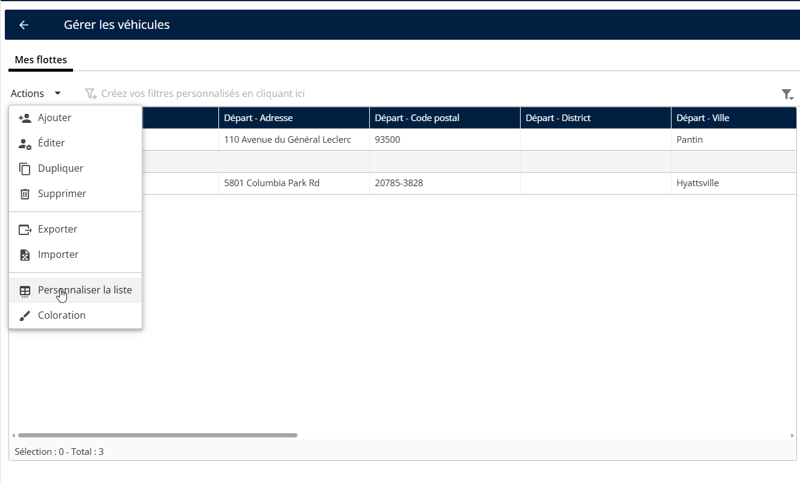<figcaption></figcaption></figure>

7. Choisissez les champs que vous souhaitez afficher dans le tableau.

**Remarque**: Évitez de sélectionner trop de champs à la fois, car il peut devenir difficile de lire ounaviguer.

8. Cliquez sur Enregistrer

<figure>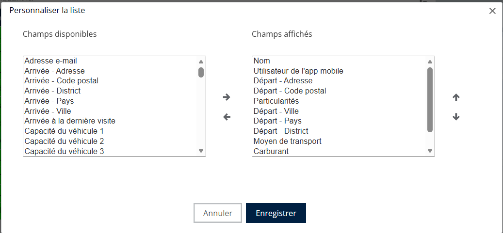<figcaption></figcaption></figure>

Les champs sélectionnés seront affichés avec succès dans le tableau

<figure>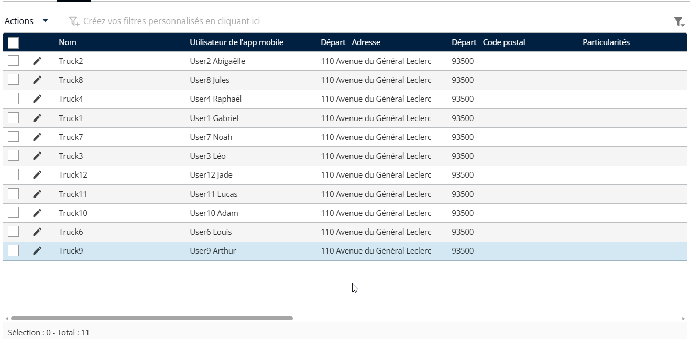<figcaption></figcaption></figure>

#### Personnaliser le tableau des flottes de véhicules

1. Allez dans Configuration.
2. Cliquez sur le menu Configuration
3. Sous Mes données, cliquez sur Gérer les véhicules.
4. Sélectionnez une équipe
5. Sous Mes flottes, cliquez sur le menu déroulant Actions.
6. Cliquez sur Personnaliser la liste

<figure><figcaption></figcaption></figure>

7. Choisissez les champs que vous souhaitez afficher dans le tableau.

**Remarque**: Évitez de sélectionner trop de champs à la fois, car cela pourrait rendre la lecture ou la navigation difficile.

8. Cliquez sur Enregistrer

<figure><figcaption></figcaption></figure>

Les champs sélectionnés ont été affichés avec succès dans le tableau

<figure><figcaption></figcaption></figure>
