# Ajout d'une mission

1. L’interface Ajouter introduit une expérience simplifiée de création de mission en une seule page dans Nomadia Delivery. Conçue pour réduire les étapes répétitives et améliorer la clarté, cette interface remplace l’assistant traditionnel en plusieurs étapes par une vue unifiée qui rassemble en un seul endroit tous les paramètres, contraintes et dépendances de la mission.
   * **Regroupement des champs personnalisés**: Les champs personnalisés peuvent désormais être regroupés sous un nom de groupe défini. Lors de la création d’une mission, ces champs sont affichés ensemble sous leur groupe respectif.
   * **Ordonnancement des groupes**: Les groupes de champs personnalisés peuvent être réorganisés par glisser-déposer lors de la création ou de la modification d’une configuration.
   * **Tri des champs au sein des groupes**: Les champs personnalisés peuvent être triés par Nom ou Identifiant pour un classement personnalisé.
   * **Champs personnalisés pour les colis**: Les champs personnalisés peuvent désormais être associés à des colis individuels lors de la duplication de missions.
   * **Grouper les missions dans un conteneur**: Les missions dupliquées peuvent être regroupées dans un conteneur parent.
   * **Ajout immédiat de document**: La page Ajouter un document apparaît immédiatement après la création de la mission afin d’y joindre des documents.

Pour organiser les groupes de champs personnalisés dans l’ordre souhaité :

*   **Ouvrez Nomadia Delivery → Accédez à Configuration**

    * Lancez l’application Nomadia Delivery.
    * Cliquez sur le **Configuration** onglet dans la barre de navigation supérieure.

    <figure>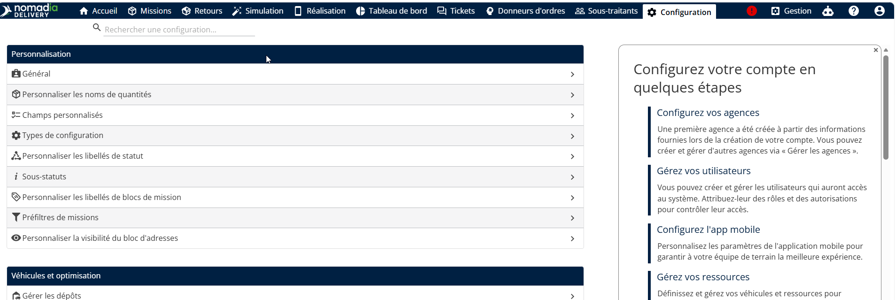<figcaption></figcaption></figure>

**Accédez à Missions**

* Dans Configuration, sélectionnez l’ **Missions** .
* Cette section affiche tous les paramètres liés aux missions.

<figure>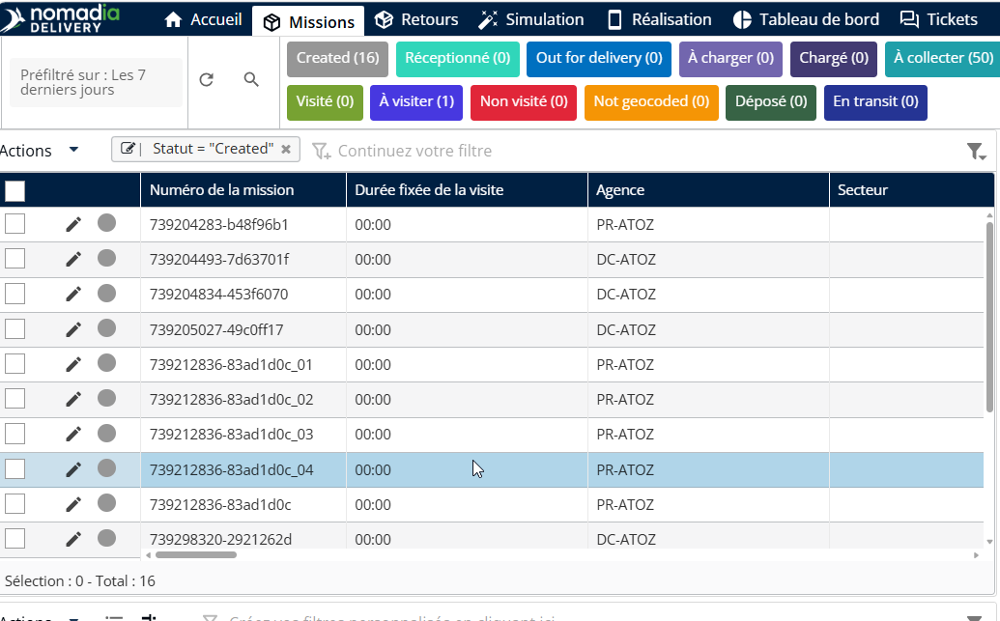<figcaption></figcaption></figure>

**Cliquez sur Actions → Ajouter**

* Cliquez sur le **Actions** bouton (en haut à droite ou dans la barre d’outils).
* Sélectionnez **Ajouter** pour créer une nouvelle configuration de mission.

<figure>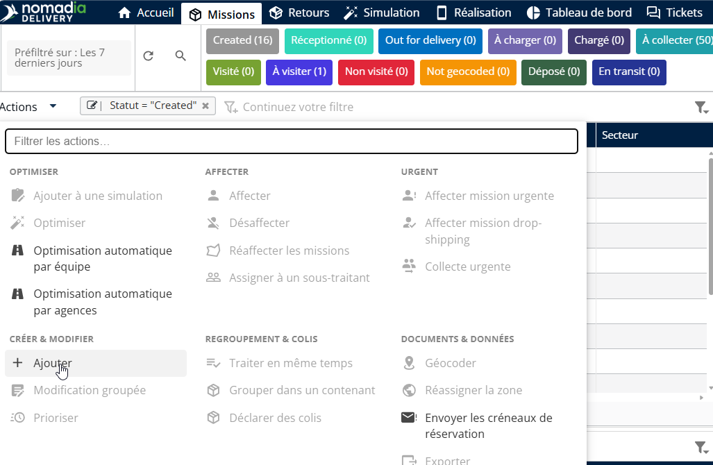<figcaption></figcaption></figure>

* Sélectionnez le **Type de mission** approprié dans la liste déroulante.
* Choisissez l’ **Agence** correspondante à laquelle la mission s’applique.

**Cliquez sur Suivant**

* Vérifiez les détails sélectionnés.
* Cliquez sur **Suivant** pour accéder aux paramètres de configuration.

<figure>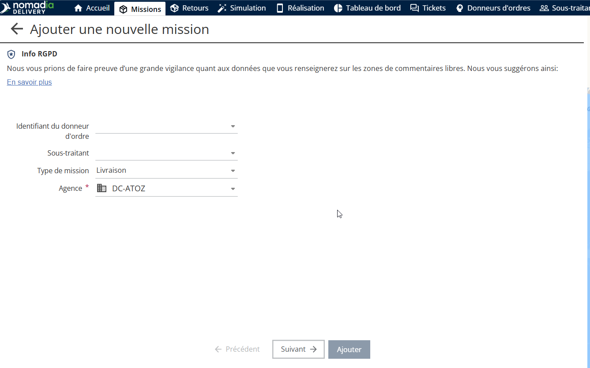<figcaption></figcaption></figure>

**Modifier la configuration de la mission**

* Cliquez sur le **icône Crayon (Modifier)** dans l’écran de configuration.
* Cela permet de modifier les champs et les paramètres d’affichage.

Développez l’ **Champs personnalisés** accordéon :

* Tous les groupes de champs personnalisés sont affichés sous forme d’accordéons séparés.
* Cliquez sur un groupe pour le développer.
* Les champs appartenant à ce groupe sont listés.

**Sélectionner les champs à afficher**

* Choisissez les champs requis (par ex., adresse, contact, consignes de livraison).

<figure>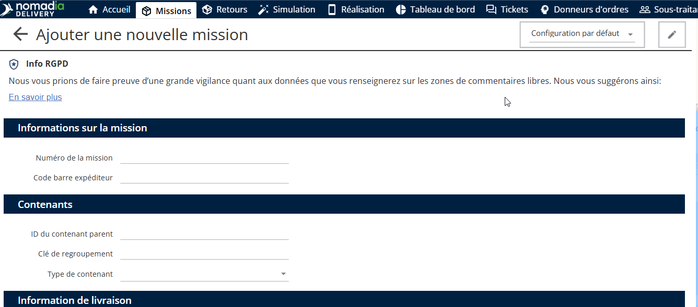<figcaption></figcaption></figure>

* Le formulaire de mission se met à jour automatiquement en fonction des champs sélectionnés.
*   Utilisez le glisser-déposer pour :

    * Réorganiser les groupes de champs personnalisés.
    * Contrôler leur affichage dans le formulaire de création de mission.

    <figure>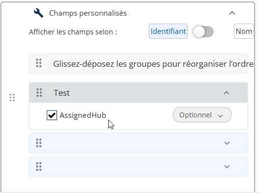<figcaption></figcaption></figure>
*   Pour modifier l’ordre des champs au sein d’un groupe :

    * Activez les champs à l’aide de l’identifiant ou du nom.

    <figure>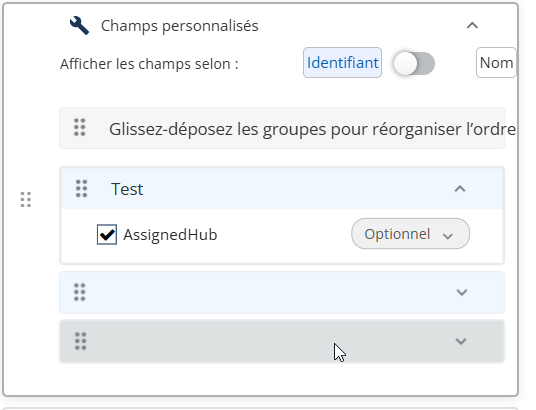<figcaption></figcaption></figure>

Configurer les champs obligatoires :

* Basculez les champs obligatoires selon les besoins.

<figure>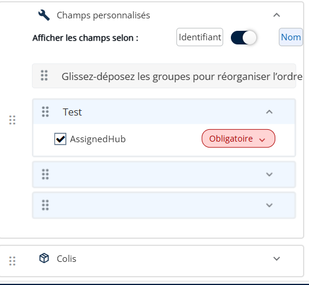<figcaption></figcaption></figure>

* Cliquez sur Enregistrer pour appliquer les modifications.

<figure>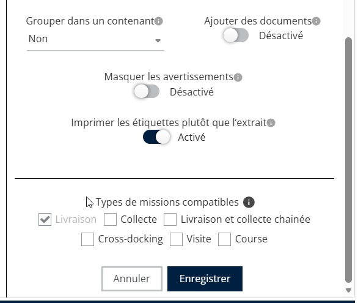<figcaption></figcaption></figure>

* La même procédure peut être utilisée pour activer des champs personnalisés pour les colis.

Pour regrouper les missions dans un conteneur :

* Ouvrez l’application Nomadia Delivery et accédez à l’onglet Configuration.
* Accédez à Missions .
* Cliquez sur Actions → Ajouter (bêta).
* Choisissez le type de mission et l’agence, puis cliquez sur Suivant.
* Cliquez sur le bouton icône Crayon pour modifier la configuration de la mission.
* À partir de Regrouper vos colis:
  * Oui: Regrouper automatiquement les missions lorsque plusieurs colis sont ajoutés.
  * Non: Ne pas regrouper les missions.
* Facultatif: Permettre à l’utilisateur de décider lors de la création de la mission.

Si Oui est sélectionné :

* Choisissez le type de conteneur par défaut.
* Seuls les conteneurs agrégables seront affichés

<figure>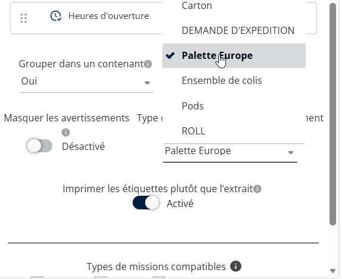<figcaption></figcaption></figure>

* Cliquez sur Enregistrer pour appliquer les modifications.

<figure>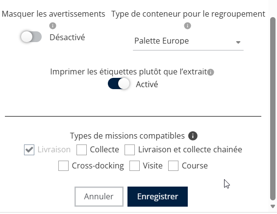<figcaption></figcaption></figure>

Pour ajouter des documents juste après la création de la mission :

* Ouvrez l’application Nomadia Delivery et accédez à l’onglet Configuration.
* Accédez à Missions .
* Cliquez sur Actions → Ajouter (bêta).
* Sélectionnez le type de mission et l’agence, puis cliquez sur Suivant.
* Cliquez sur le bouton icône Crayon pour modifier la configuration.
* Activez le bouton Ajouter des documents.

<figure>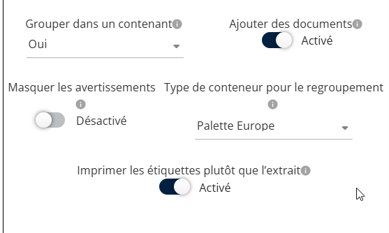<figcaption></figcaption></figure>

* Cliquez sur Enregistrer pour appliquer les modifications.

<figure>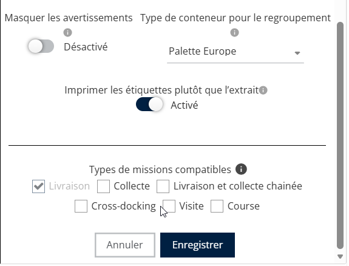<figcaption></figcaption></figure>

* Le système invite à ajouter des documents immédiatement après la création de la mission.
* Les documents peuvent être ajoutés depuis :
* Ordinateur local
* Bibliothèque de documents

<figure><figcaption></figcaption></figure>

* Cliquez sur Enregistrer pour joindre des documents.

<figure><figcaption></figcaption></figure>

* Les documents sont ajoutés avec succès à la mission.

<figure><figcaption></figcaption></figure>
