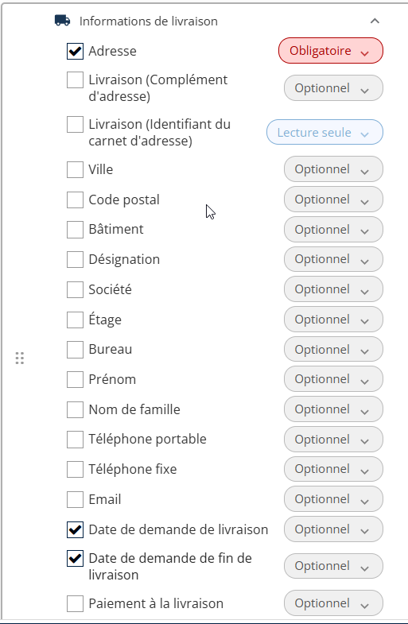
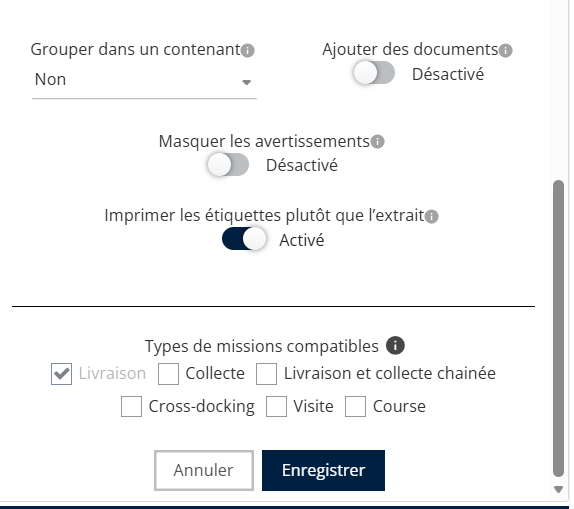
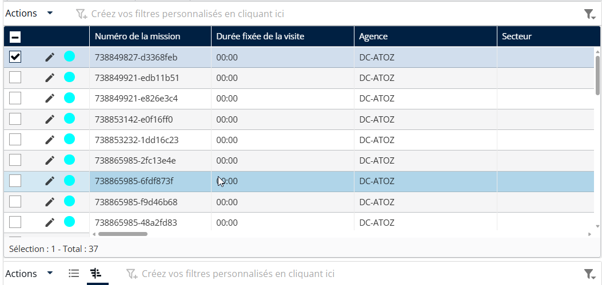
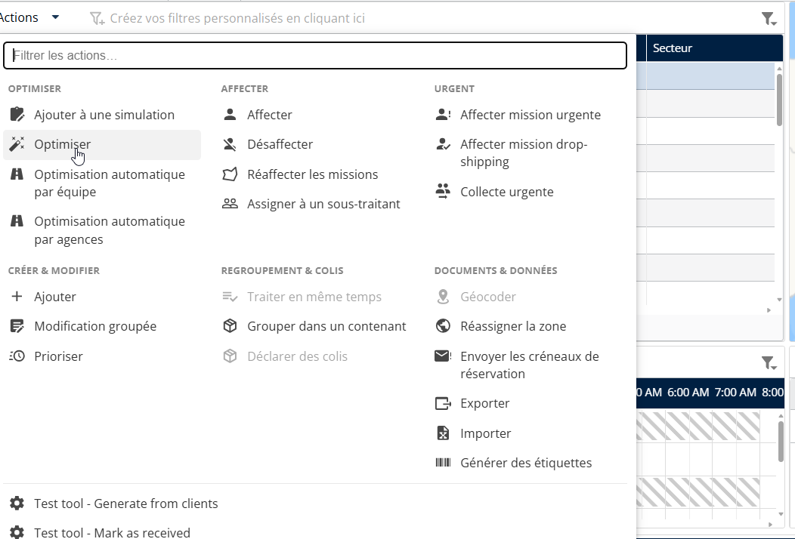

# Priorité automatique via les dates de livraison

1. Ouvrez le **création de mission** ou **modifier** écran.
2. Accédez à **Informations de livraison**.
3. Renseignez le **Date demandée de livraison** et **Date de fin demandée de livraison.**

<figure><figcaption></figcaption></figure>

4. **Enregistrez la mission :** le système définit automatiquement la priorité sur la plus élevée en fonction de ces dates d’engagement.

<figure><figcaption></figcaption></figure>

**Recalcul des priorités pendant l’optimisation**

1. Sélectionnez le **missions** ou **itinéraire parent** pour l’optimisation.

<figure><figcaption></figcaption></figure>

2. Cliquez sur **Optimiser** dans le menu Actions.

<figure><figcaption></figcaption></figure>

3. Basculez le **commutateur Recalculer les priorités** sur ACTIVÉ.
4. Lancez l’ **optimisation**.

<figure><figcaption></figcaption></figure>
