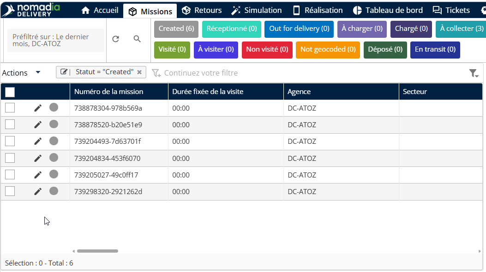
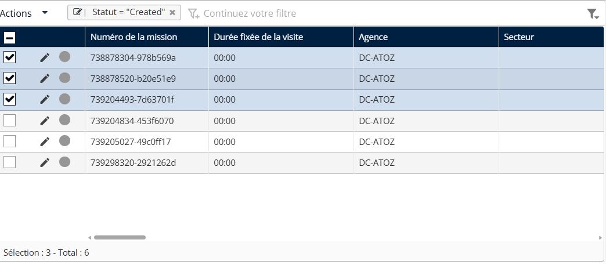
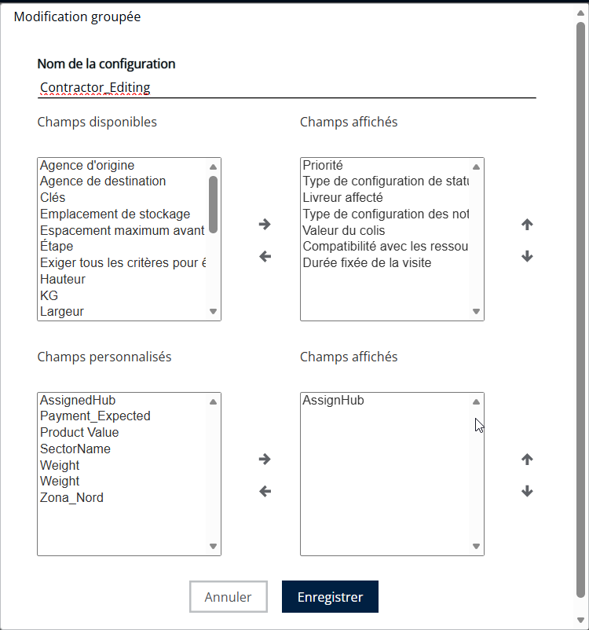
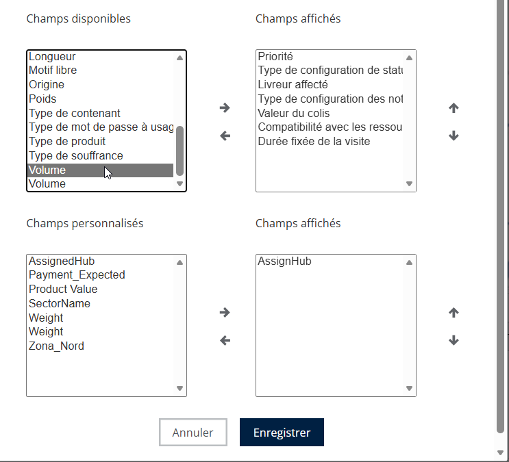
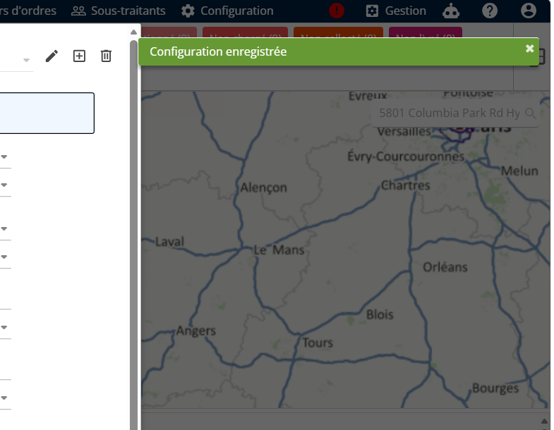
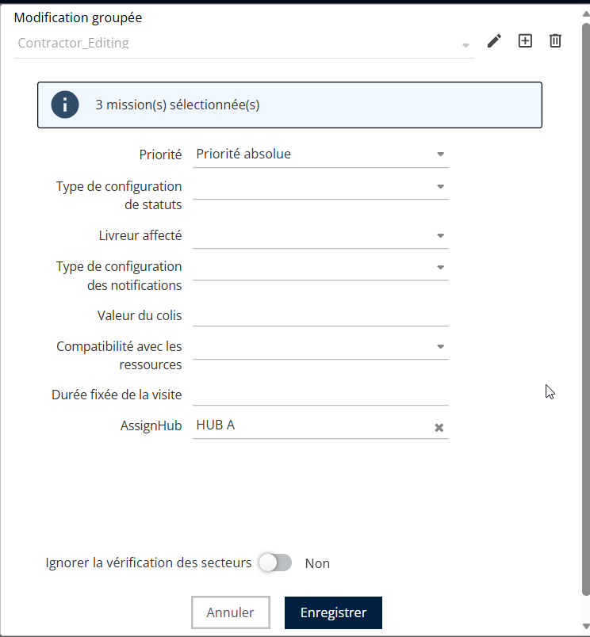
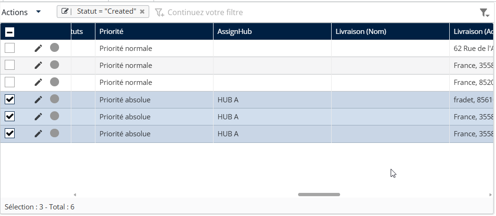

# Modifier en masse les données de mission

#### Créer une configuration d’édition en masse

L’édition en masse des données de mission permet des mises à jour à grande échelle des informations de mission, réduisant les efforts manuels et gagnant du temps en évitant les tâches répétitives.

1. Suivez les étapes ci-dessous pour modifier les données des missions en masse
2. Depuis l’en-tête principal, cliquez sur la **Missions** page.

<figure><figcaption></figcaption></figure>

3. Choisissez les missions qui vous intéressent dans le tableau des missions.

<figure><figcaption></figcaption></figure>

4. Saisissez un **Nom** pour la configuration d’édition en masse dans la fenêtre contextuelle d’édition en masse.

<figure><figcaption></figcaption></figure>

5. Sélectionnez les champs à activer pour l’édition en masse et utilisez le bouton flèche pour les déplacer vers la partie droite.

<figure><figcaption></figcaption></figure>

6. Répétez les mêmes étapes pour les champs personnalisés dans la fenêtre contextuelle d’édition en masse.
7. Cliquez sur le bouton « **Enregistrer** » pour enregistrer la configuration d’édition en masse.

<figure><figcaption></figcaption></figure>

Une fois la configuration enregistrée, un message de notification s’affiche.

<figure><figcaption></figcaption></figure>

#### Modifier les données de mission en masse

1. La fenêtre contextuelle d’édition en masse affiche le nombre de missions sélectionnées.
2. La fenêtre contextuelle d’édition en masse affiche la liste des champs sélectionnés lors de la configuration.
3. Choisissez les valeurs requises pour les champs de mission répertoriés.
4. Cliquez sur **Enregistrer**

<figure><figcaption></figcaption></figure>

Toutes les missions sélectionnées sont mises à jour simultanément avec les valeurs choisies dans la fenêtre contextuelle d’édition en masse.

<figure><figcaption></figcaption></figure>

Cette fonctionnalité améliore l’efficacité tout en maintenant le contrôle et l’intégrité des données entre les équipes.
