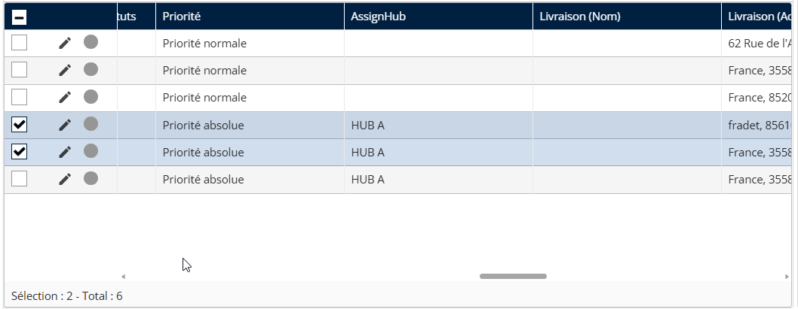
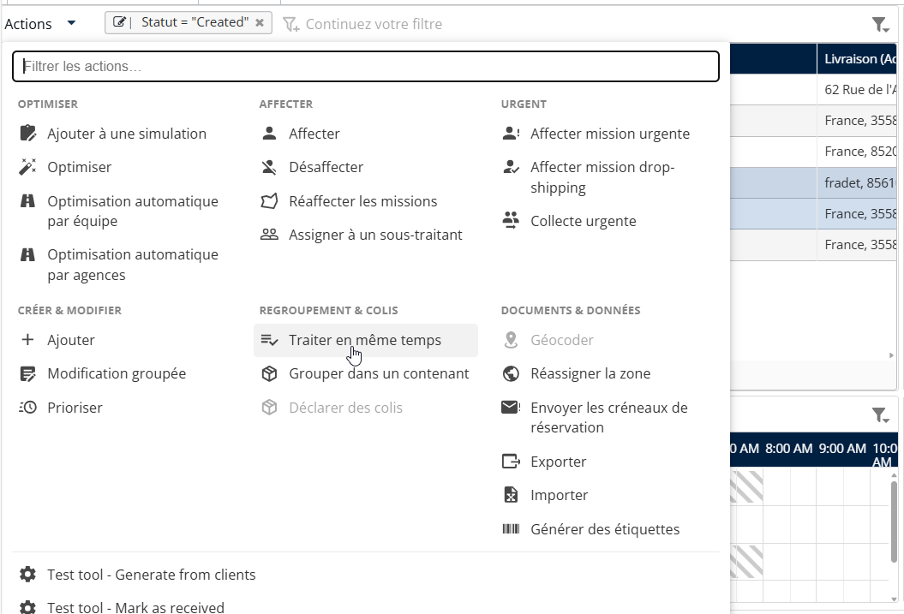
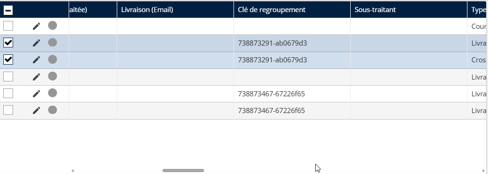

# Créer une mission « à effectuer en une seule fois »

« Exécuter en une seule fois » relie plusieurs missions individuelles destinées au même client/adresse. Contrairement au regroupement de conteneurs, cela repose sur une « clé de regroupement » pour indiquer à l’application mobile que ces éléments doivent être traités ensemble, permettant une seule étape de validation (une signature ou une photo) pour tous les éléments liés.

1. Sélectionnez plusieurs missions qui partagent exactement la même adresse de livraison.

<figure><figcaption></figcaption></figure>

2. Cliquez sur le **Actions** menu de la liste.
3. Sélectionnez **Exécuter en une seule fois**.

<figure><figcaption></figcaption></figure>

4. Le système génère une clé de regroupement pour les missions sélectionnées.

<figure><figcaption></figcaption></figure>
