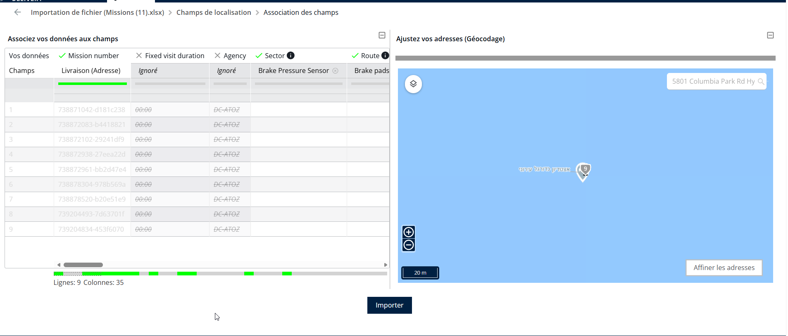

# Création de champs personnalisés lors de l’importation

L’application Nomadia Delivery permet aux utilisateurs d’ajouter dynamiquement de nouveaux champs pendant le processus d’importation. Ces champs personnalisés peuvent être liés à divers objets, notamment les prestataires, les missions et les adresses, et peuvent être créés dans différents types de données tels que Nombre, Texte, Liste de valeurs, Date, URL et Booléen.

**Étapes pour créer un champ personnalisé**:

1. Ouvrez l’application Nomadia Delivery en tant qu’utilisateur transporteur et accédez à l’une des listes Missions/Prestataires/Adresses du processus d’importation.
2. Cliquez sur le «**Actions**» bouton et cliquez sur « Importer ».
3. Glissez-déposez le fichier souhaité et faites correspondre les champs d’adresse ou X, Y
4. À l’étape « Correspondance des champs », cliquez sur n’importe quel **non mappé** champ.

<figure><figcaption></figcaption></figure>

5. Cliquez sur le «**Ajouter un champ personnalisé**» bouton depuis la section « Mes données.

<figure><figcaption></figcaption></figure>

6. Saisissez le **nom du champ**, sélectionnez le type du champ, puis cliquez sur le «**Valider**» bouton.

<figure><figcaption></figcaption></figure>

7. Le champ nouvellement créé est maintenant disponible pour le mappage.

<figure><figcaption></figcaption></figure>

 
