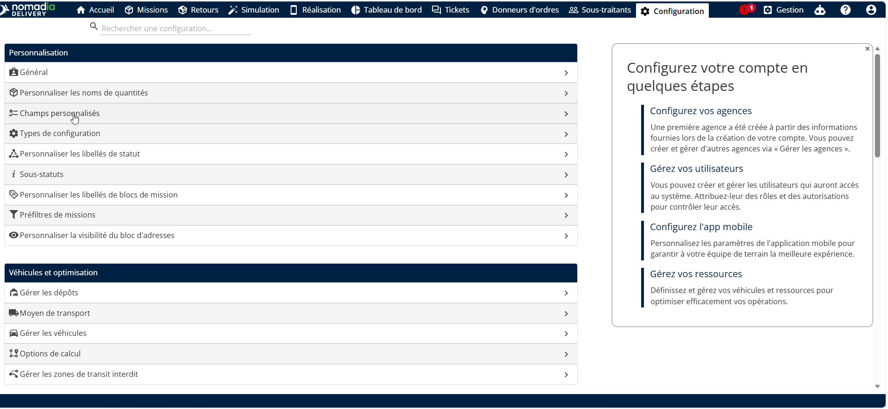
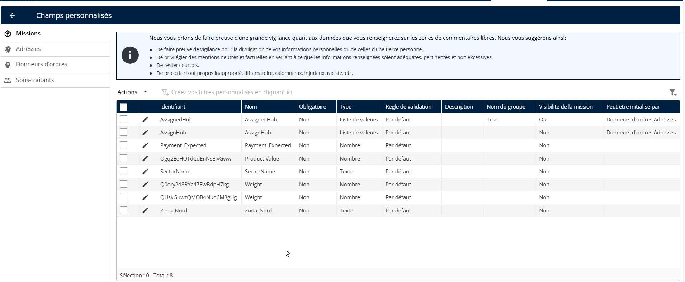
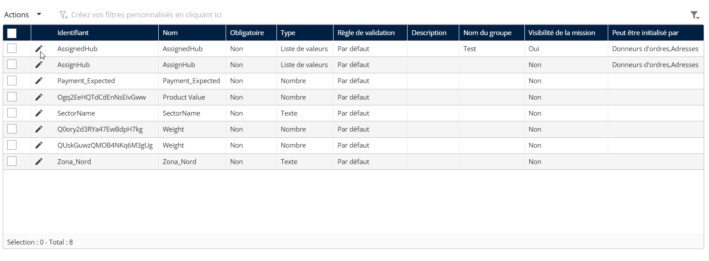
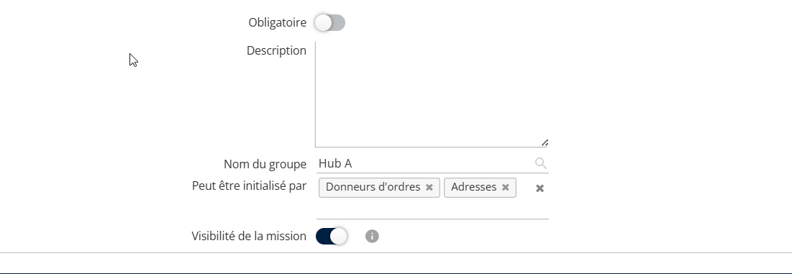
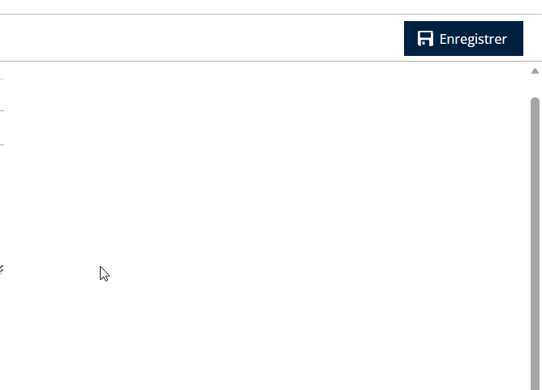
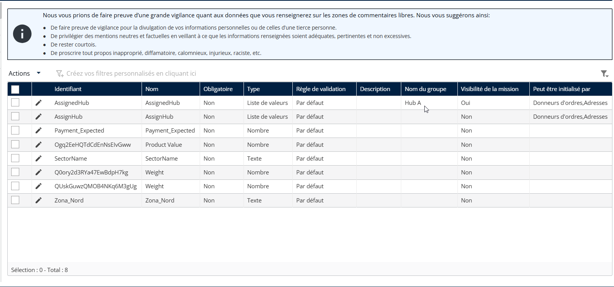

# Regroupement de champs personnalisés

Pour regrouper des champs personnalisés dans le formulaire de création de mission à l’aide d’un nom de groupe :

* Ouvrez l'application Nomadia Delivery et accédez à l'onglet **Configuration.**
* Dans la liste, sélectionnez **Champs personnalisés**.

<figure><figcaption></figcaption></figure>

* Cliquez sur **Missions**.

<figure><figcaption></figcaption></figure>

* Cliquez sur le **icône Crayon** pour modifier un champ personnalisé existant.

<figure><figcaption></figcaption></figure>

Dans le **Nom du groupe** champ :

* Saisissez un **nom du groupe**.
* Choisissez un groupe existant ou créez-en un nouveau.

<figure><figcaption></figcaption></figure>

* Cliquez sur **Enregistrer** pour appliquer les modifications.

<figure><figcaption></figcaption></figure>

* Le nom du groupe attribué sera affiché dans le tableau des champs personnalisés.

<figure><figcaption></figcaption></figure>

 
