# Missions de drop shipping

Les missions de drop-shipping simplifient les opérations de livraison en permettant aux transporteurs de livrer les colis directement des fournisseurs aux clients finaux, sans retourner à l’agence. Cette méthode améliore l’efficacité et convient particulièrement aux scénarios logistiques où la livraison directe est plus პრაქტique que les modèles traditionnels tels que le cross-docking.

Pour créer une mission de drop-shipping, les utilisateurs (donneurs d’ordre, transporteurs ou sous-traitants) doivent suivre ces étapes

1. Ouvrez l'application Nomadia Delivery et accédez à l'onglet **Missions** .
2. Cliquez sur le **menu Actions** et sélectionnez **Ajouter**.

<figure>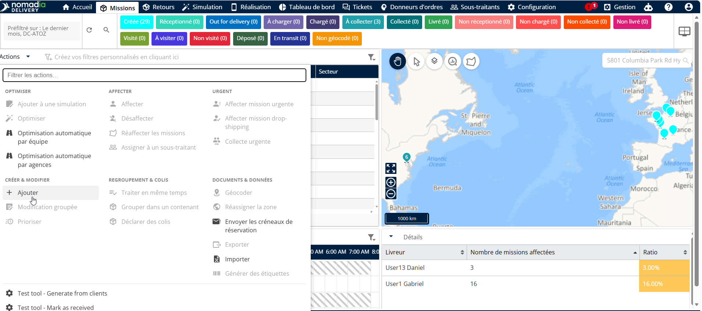<figcaption></figcaption></figure>

3. Dans la liste déroulante Type de mission, choisissez **Drop-Shipping.**

<figure>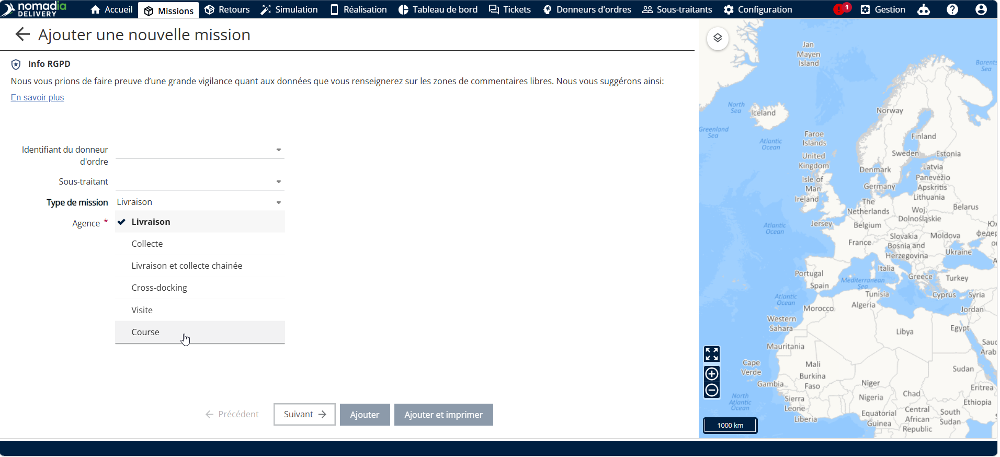<figcaption></figcaption></figure>

4. Dans la liste déroulante Identifiant du donneur d’ordre, sélectionnez le **sous-traitant** associé à la mission

<figure>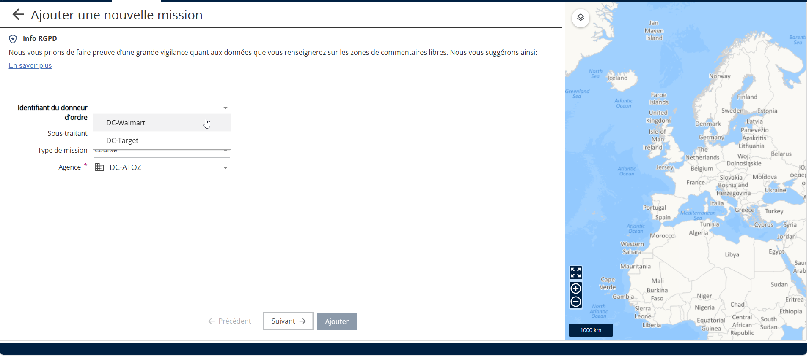<figcaption></figcaption></figure>

* Pour les missions de drop-shipping, l’adresse du donneur d’ordre (issue de la configuration du donneur d’ordre) sera automatiquement utilisée comme adresse de prise en charge par défaut.

<figure>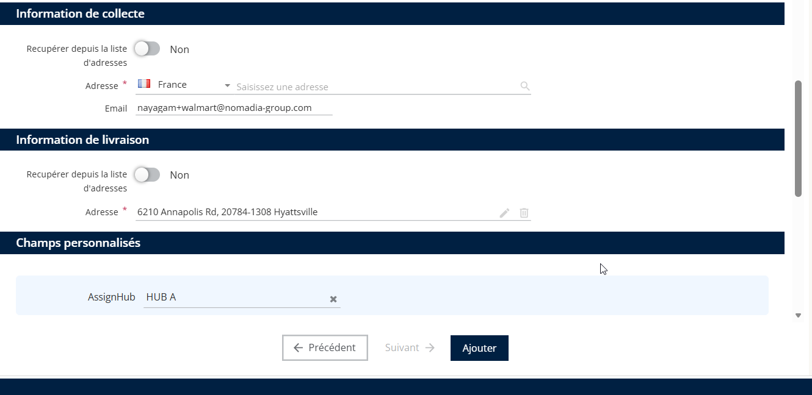<figcaption></figcaption></figure>

5. Sélectionnez le **Agence** à partir de laquelle les livreurs commenceront leur tournée.

<figure>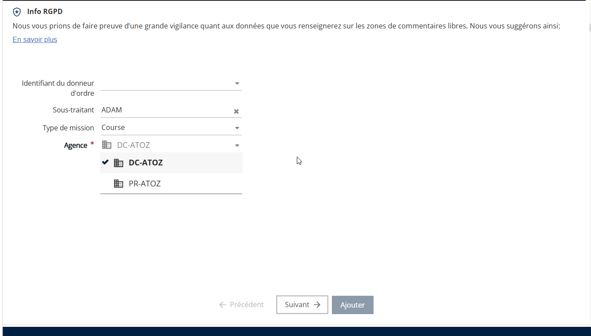<figcaption></figcaption></figure>

6. Cliquez sur **Suivant**.

<figure>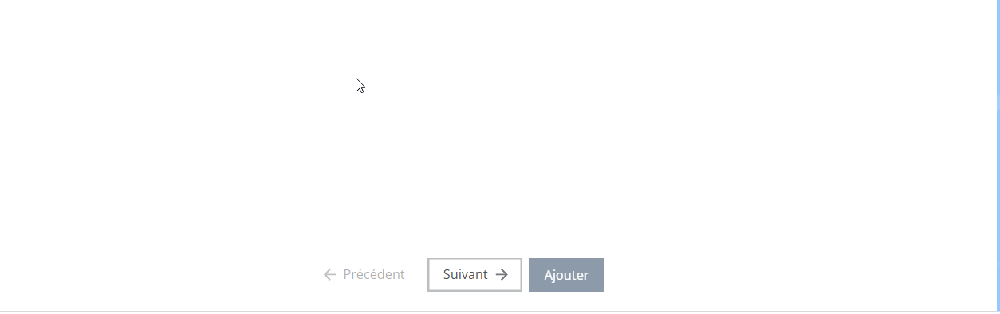<figcaption></figcaption></figure>

7. Le système affichera par défaut l’adresse du donneur d’ordre comme lieu de prise en charge

<figure>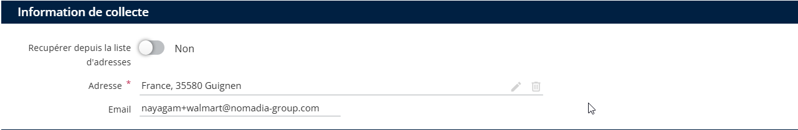<figcaption></figcaption></figure>

* Si nécessaire, cliquez sur le **Modifier** bouton à côté du champ d’adresse pour définir une autre adresse de prise en charge.

<figure>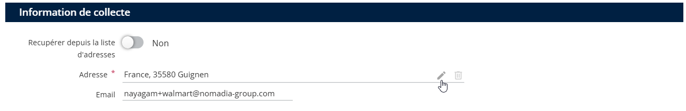<figcaption></figcaption></figure>

9. Saisissez le **adresse de livraison** du client final dans la section adresse.
10. Cliquez sur **Ajouter** pour créer la mission de drop-shipping.

<figure>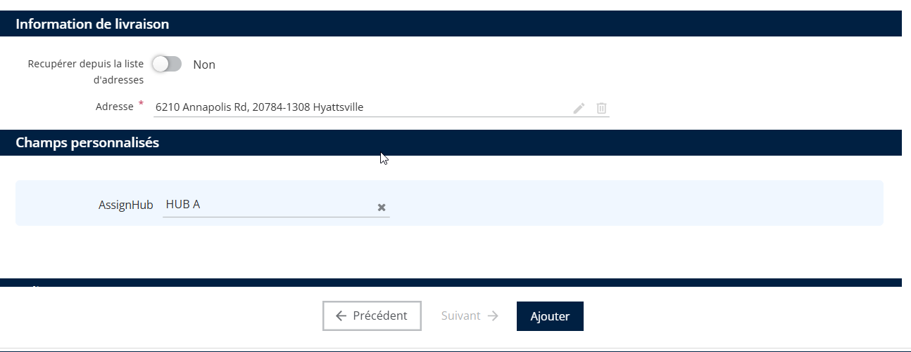<figcaption></figcaption></figure>

Une fois terminée, une nouvelle mission de type Drop-Shipping sera ajoutée au système de gestion des livraisons.

<figure>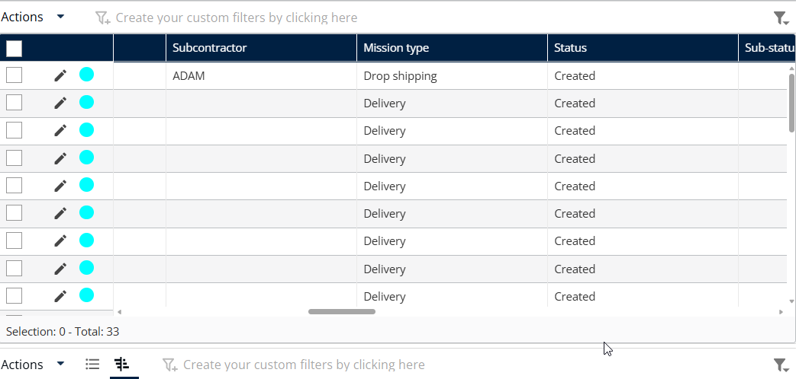<figcaption></figcaption></figure>

Suivez ces étapes pour créer une tournée de mission de drop-shipping Les missions de drop-shipping sont gérées exclusivement via le moteur d’optimisation afin de garantir l’exactitude et le strict respect de la chaîne de livraison. La planification manuelle des itinéraires est restreinte afin de préserver l’intégrité du flux de travail.

Les livraisons ne sont autorisées qu’après la fin de tous les enlèvements, ce qui évite les perturbations ou les erreurs

1. Sélectionnez les missions que vous avez créées, ouvrez le menu «**Actions**», et choisissez «**Optimiser**» pour effectuer une optimisation par lot.

<figure>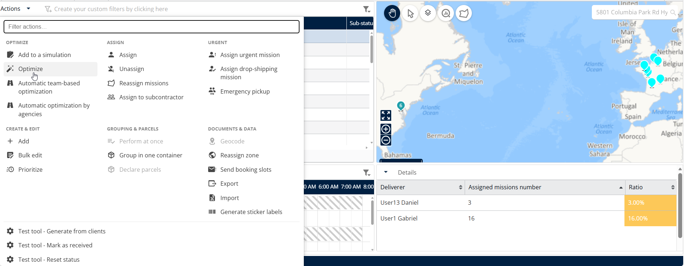<figcaption></figcaption></figure>

2. Définissez le périmètre d’optimisation en sélectionnant la plage de dates, l’équipe et les véhicules, puis cliquez sur «**Optimiser**’.

<figure>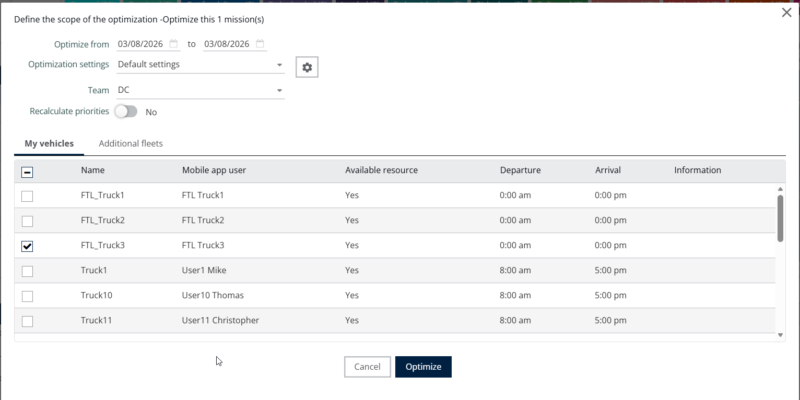<figcaption></figcaption></figure>

3. Le récapitulatif de l’optimisation s’affiche. Cliquez sur «**Afficher la simulation**» pour analyser les résultats.

<figure>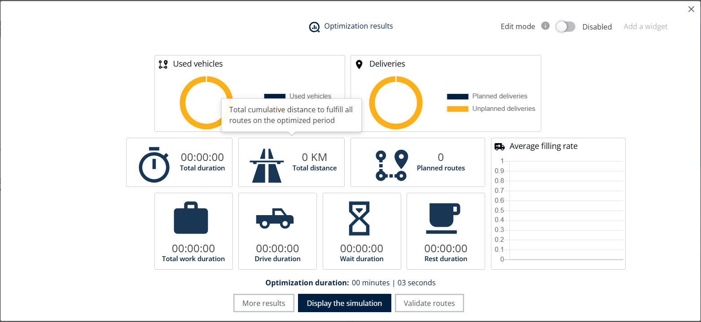<figcaption></figcaption></figure>

4. Sinon, cliquez sur «**Valider les itinéraires**» pour publier les résultats directement sans les examiner.
5. Dans le panneau «**Livraisons**», l’application préfixe tous les numéros de mission de livraison par «**DROP**» afin de différencier les événements de prise en charge et de dépôt.

<figure><figcaption></figcaption></figure>

6. Dans le panneau «**Panneau Itinéraires**», sélectionnez les itinéraires que vous souhaitez valider, ouvrez le menu «**Actions**», puis cliquez sur **Valider**.

<figure>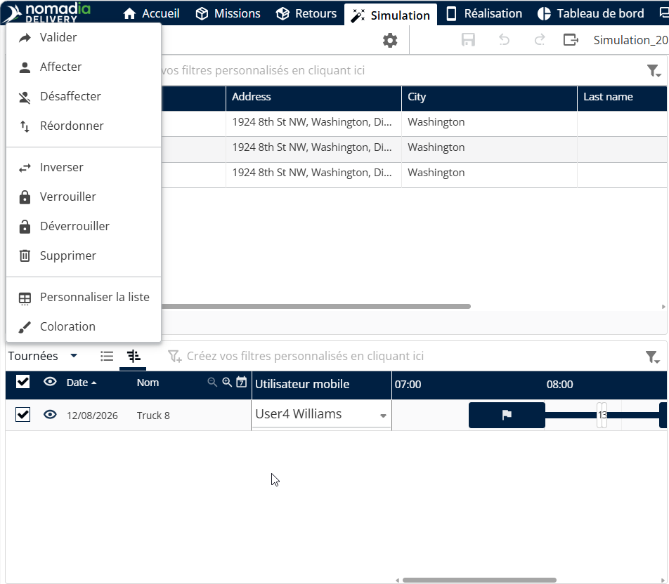<figcaption></figcaption></figure>

7. Cliquez sur ‘**OK**» pour confirmer la validation.

<figure>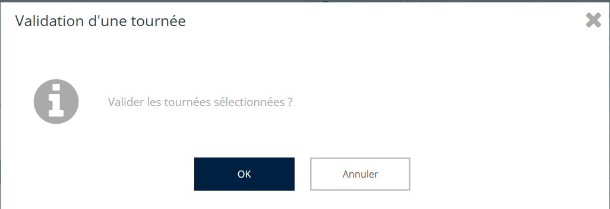<figcaption></figcaption></figure>

8. Après validation, une notification de confirmation s’affiche.

<figure>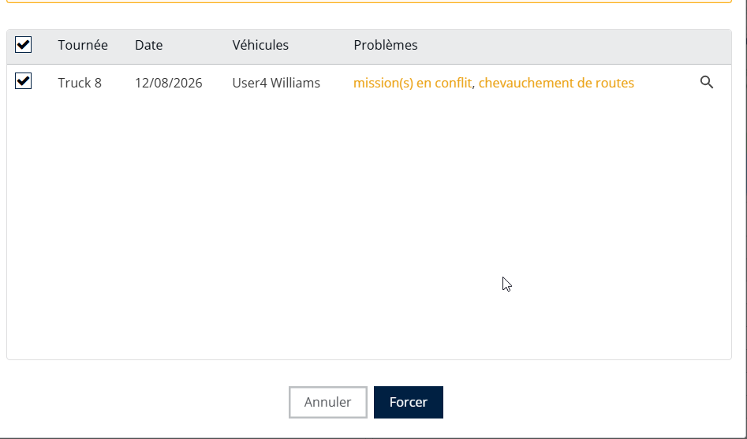<figcaption></figcaption></figure>

9. En bas de la fenêtre contextuelle, activez le commutateur «**Publier dans l’application mobile**» si vous souhaitez partager l’itinéraire avec le chauffeur.

<figure>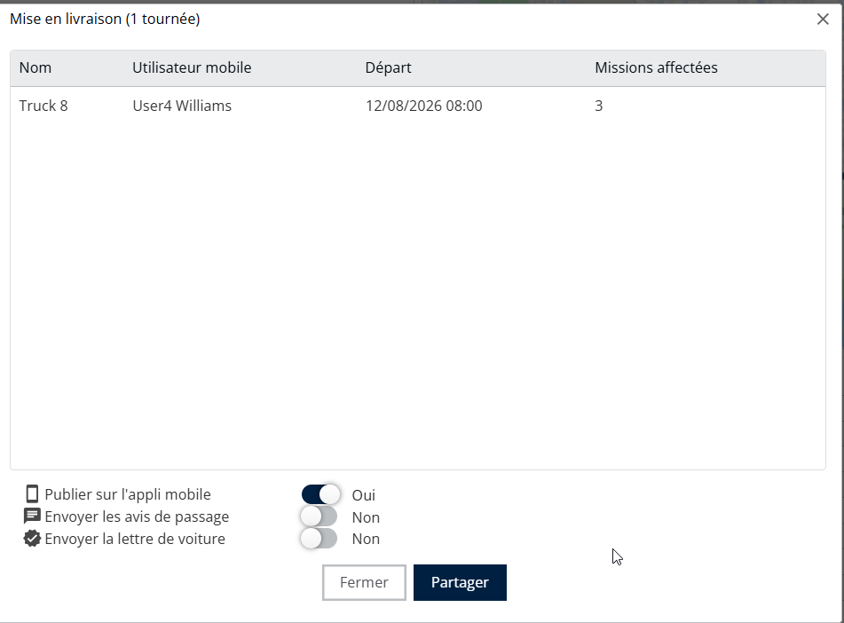<figcaption></figcaption></figure>

9. Si des conflits surviennent, la fenêtre contextuelle répertorie tous les problèmes détectés. Dans ce cas, cliquez sur «**Forcer**» pour poursuivre la validation.
10. L’itinéraire validé avec les missions de drop-shipping est ensuite publié dans l’application mobile.

<figure>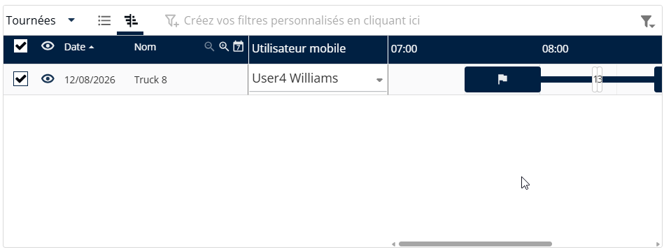<figcaption></figcaption></figure>

Les transporteurs peuvent créer des itinéraires qui partent de l’agence, récupèrent les colis directement au niveau du donneur d’ordre (fournisseur) et les livrent aux clients finaux. Contrairement aux missions de cross-docking, ces itinéraires ne nécessitent pas de retour à l’agence une fois les enlèvements terminés. 
