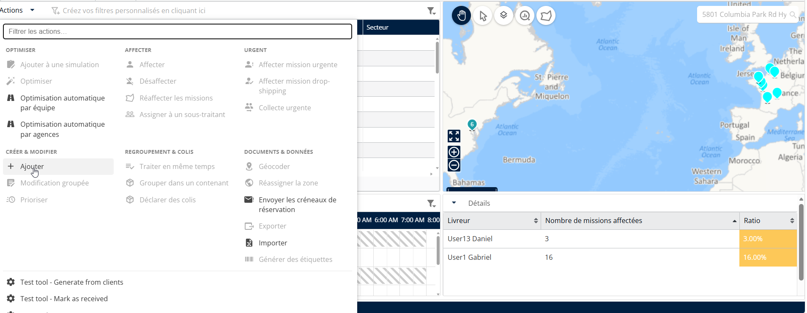
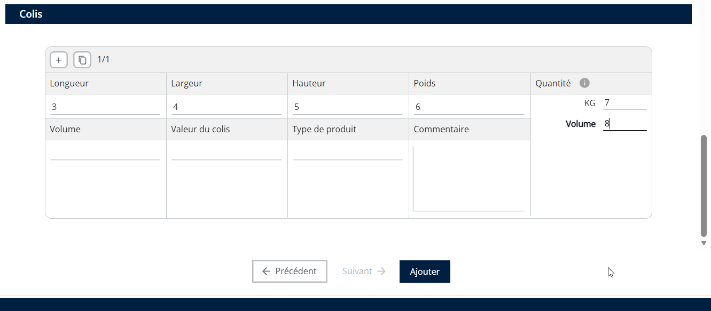
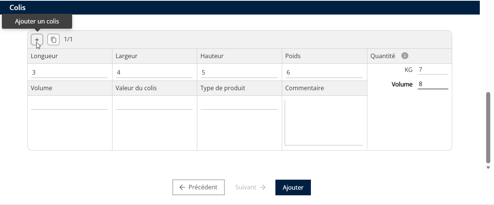
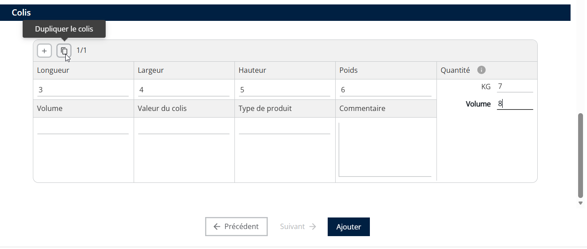
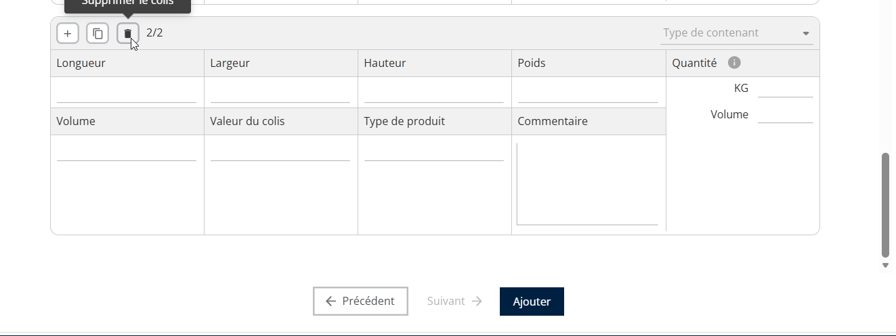
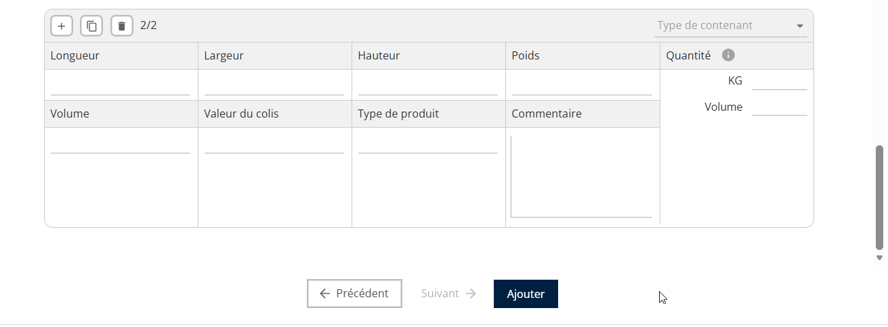
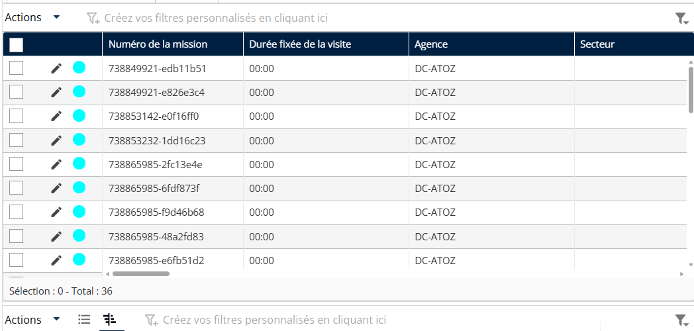

# Duplication des missions avec quantités

Ce guide explique comment les sous-traitants et les transporteurs peuvent dupliquer des missions avec quantités dans Nomadia Delivery. Cette fonctionnalité simplifie la gestion de plusieurs articles, améliorant ainsi l’efficacité et la précision dans la gestion des missions.

Étapes pour dupliquer des missions avec quantités :

1. Ouvrez l'application Nomadia Delivery et accédez à l'onglet **Missions.**

<figure><figcaption></figcaption></figure>

2. Dans le tableau des missions, cliquez sur le **menu déroulant Actions** menu et sélectionnez **Ajouter**.

<figure><figcaption></figcaption></figure>

3. Dans l’assistant de mission, renseignez les champs obligatoires selon le type de mission **(par exemple : agence, adresse de prise en charge, adresse de livraison, etc.).**
4. Dans la section Colis, saisissez les détails du colis tels que **la longueur, la largeur, la hauteur, le poids, le volume,** et **les contraintes du solveur**.

<figure><figcaption></figcaption></figure>

5. Pour ajouter un nouveau colis avec des valeurs différentes, cliquez sur le symbole «**+**».

<figure><figcaption></figcaption></figure>

6. Pour dupliquer un colis existant avec les mêmes détails, cliquez sur l’ **icône Copier.**&#x20;

<figure><figcaption></figcaption></figure>

7. Si vous ajoutez un colis par erreur, cliquez sur l’ **Supprimer** icône pour le supprimer.

<figure><figcaption></figcaption></figure>

8. Après avoir finalisé les colis à dupliquer, cliquez sur **Ajouter** pour générer le nombre requis de missions.

<figure><figcaption></figcaption></figure>

9. Les missions dupliquées apparaîtront maintenant dans le tableau des missions.

<figure><figcaption></figcaption></figure>

 
