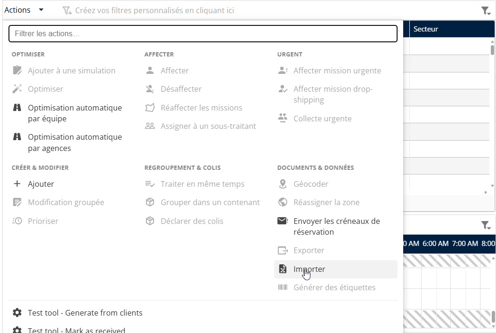
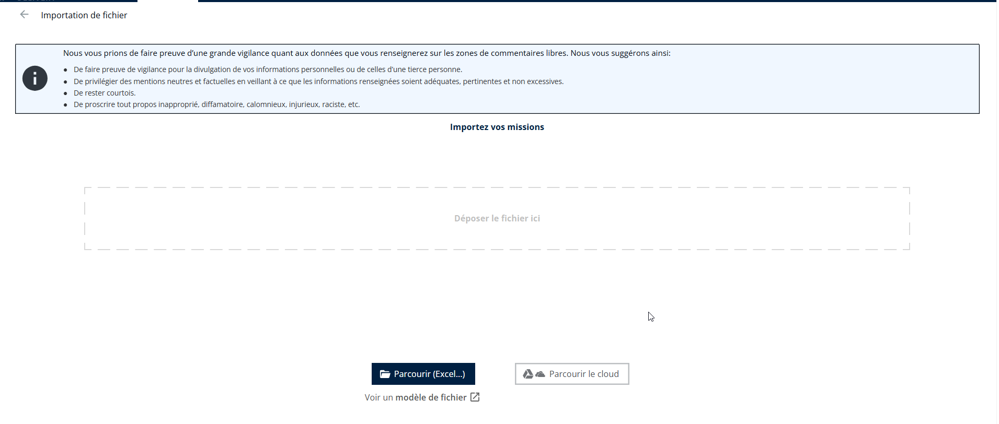
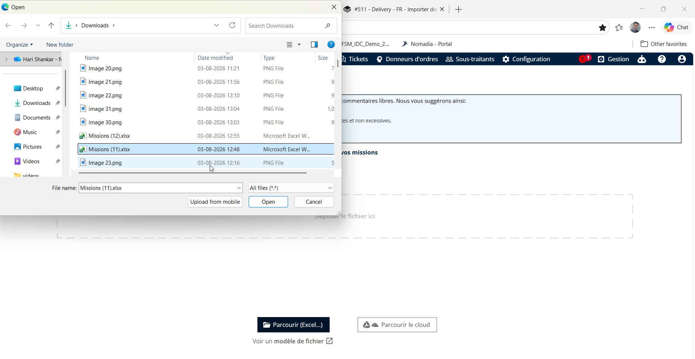
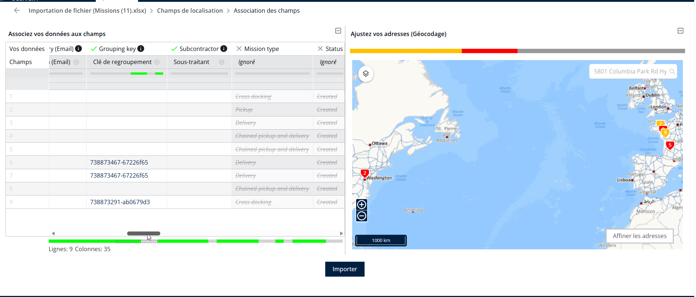
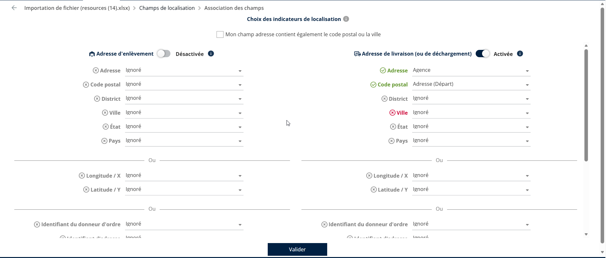
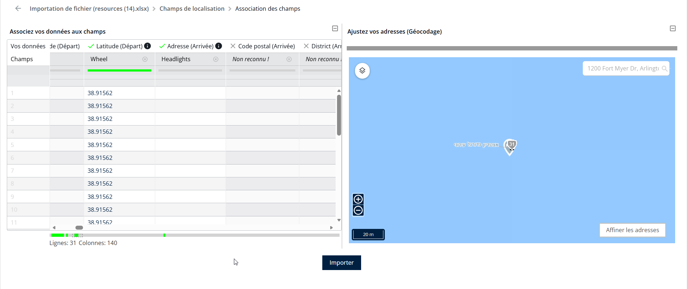
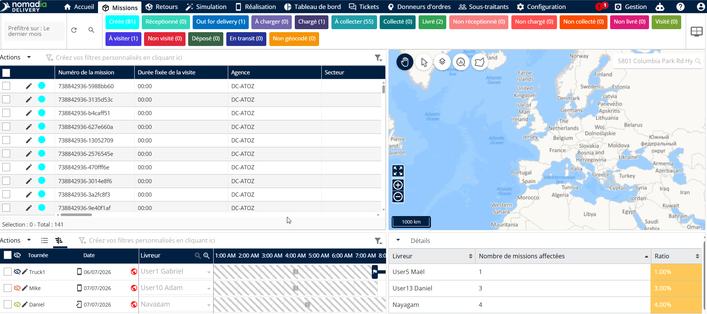

# Importer des missions

Depuis la page Missions

1. Cliquez sur **Actions**.
2. Sélectionnez **Importer** dans le menu déroulant.

<figure><figcaption></figcaption></figure>

3. Cliquez sur **Parcourir (Excel)**.

<figure><figcaption></figcaption></figure>

4. Choisissez le **Fichier Excel souhaité** depuis votre système local pour le téléverser et l’importer.

<figure><figcaption></figcaption></figure>

5. L’aperçu des feuilles Excel disponibles s’affiche. Sélectionnez l’ensemble de données requis et cliquez sur **Valider**.
6. Un aperçu des données s’affiche à la fois dans la vue en tableau et dans la vue cartographique.

<figure><figcaption></figcaption></figure>

7. Associez soit le champ d’adresse, soit les champs de latitude et de longitude pour les emplacements de mission.

<figure><figcaption></figcaption></figure>

8. Cliquez sur Importer

<figure><figcaption></figcaption></figure>

8. Les missions seront importées avec succès.

<figure><figcaption></figcaption></figure>

 
