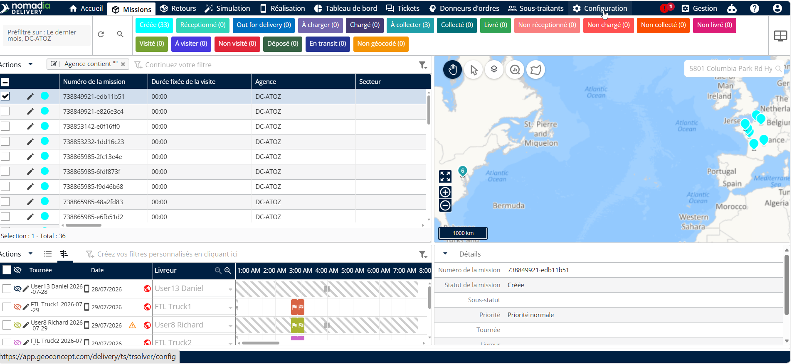
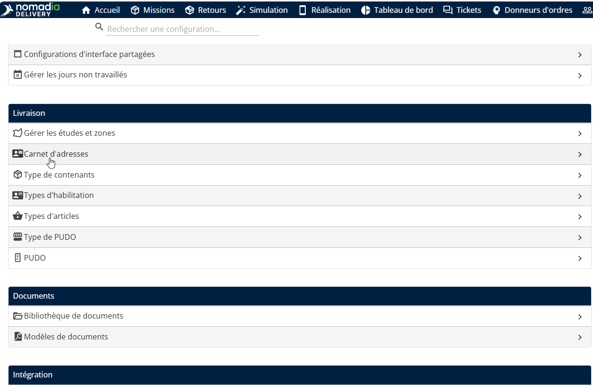
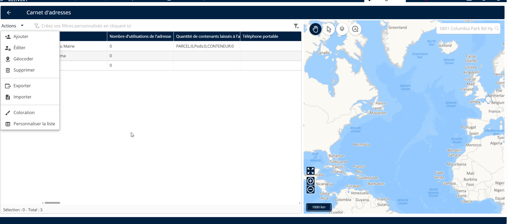
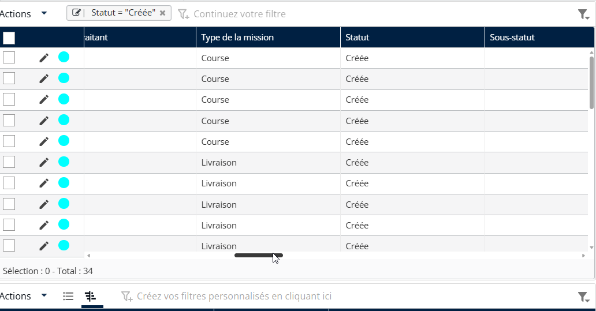
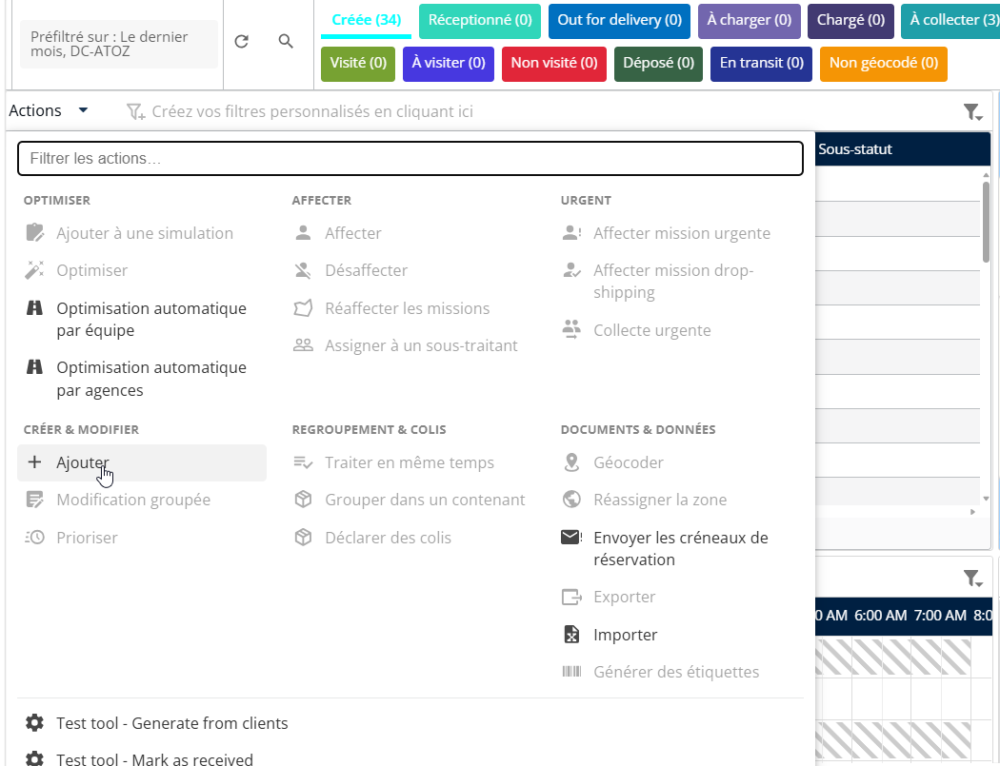
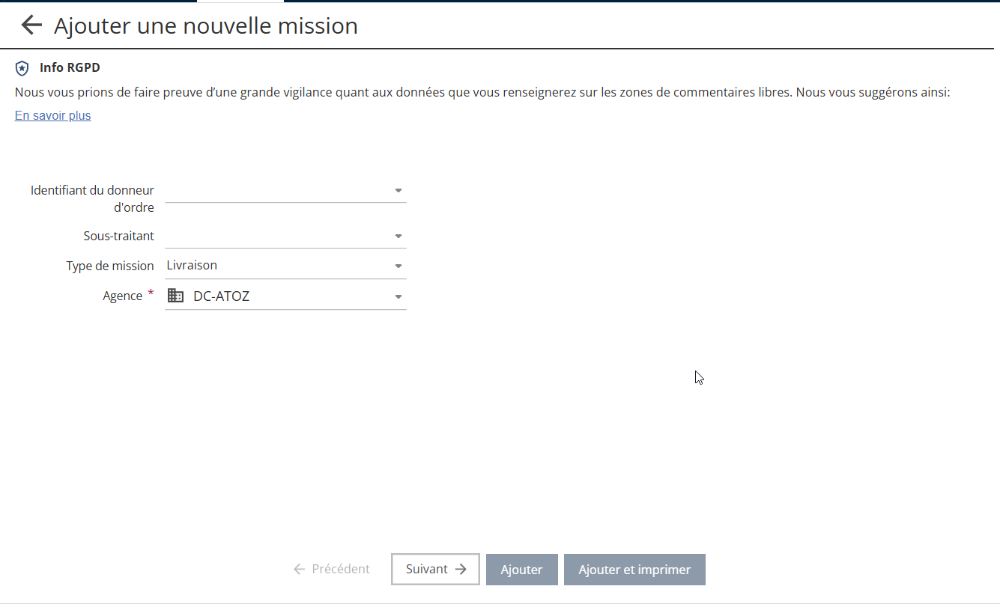
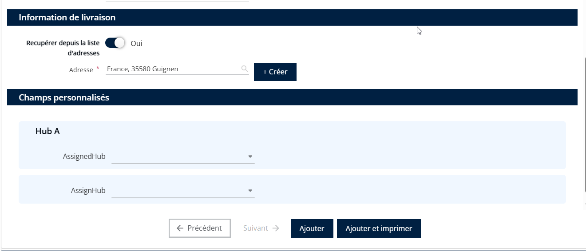

# Mapper les champs d’adresse depuis la liste globale d’adresses

La Liste d’adresses globale offre désormais un contrôle amélioré sur la manière dont les adresses sont gérées et consultées dans Nomadia Delivery. Elle n’est plus limitée aux sous-traitants et est désormais disponible directement depuis le module de Configuration. Les adresses ajoutées à la Liste d’adresses globale sont visibles et utilisables par tous les utilisateurs de Nomadia Delivery, quel que soit le sous-traitant.

Pour utiliser des adresses de la Liste d’adresses globale, suivez les étapes ci-dessous :

1. Ouvrez l'application Nomadia Delivery et accédez à l'onglet **Configuration.**

<figure><figcaption></figcaption></figure>

2. Sélectionnez **Liste d’adresses** dans le menu.

<figure><figcaption></figcaption></figure>

3. Créer un **nouvelle adresse** ou **importer des adresses** à partir d’un fichier Excel.

<figure><figcaption></figcaption></figure>

Une fois la liste d’adresses créée, accédez à la **Mission** page.

<figure><figcaption></figcaption></figure>

4. Depuis le tableau des missions, sélectionnez **Actions → Ajouter (Beta).**

<figure><figcaption></figcaption></figure>

5. Sélectionnez un **agence** dans la liste déroulante.

<figure><figcaption></figcaption></figure>

6. Cliquez sur **Suivant**

<figure><figcaption></figcaption></figure>

7. Dans le sélecteur d’adresse (prise en charge/livraison), saisissez une **adresse** de la Liste d’adresses.

<figure><figcaption></figcaption></figure>

* L’autocomplétion suggère des adresses de la Liste d’adresses globale.
* Si un sous-traitant est sélectionné lors de la création de la mission, l’autocomplétion combine les adresses du sous-traitant et les entrées de la Liste d’adresses globale dans une seule liste déroulante.

<figure><figcaption></figcaption></figure>

* Les éléments de la liste déroulante sont distingués par une icône et une infobulle, indiquant s’ils proviennent de la Liste d’adresses globale ou de la liste d’adresses du sous-traitant.

Cela garantit une expérience fluide et unifiée lors de la saisie des adresses de mission.

<figure><figcaption></figcaption></figure>
