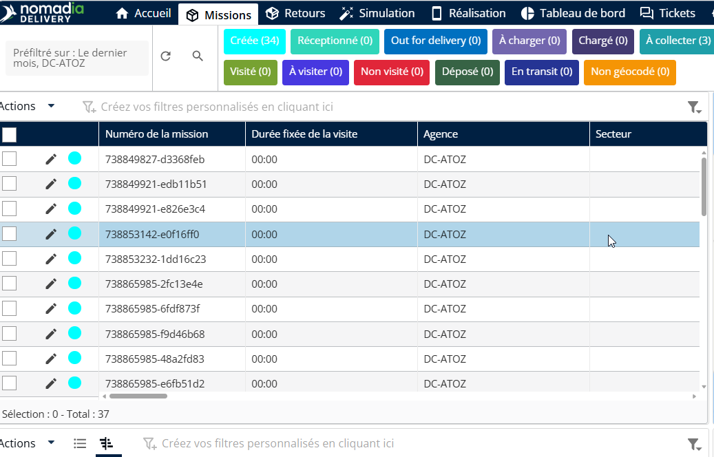
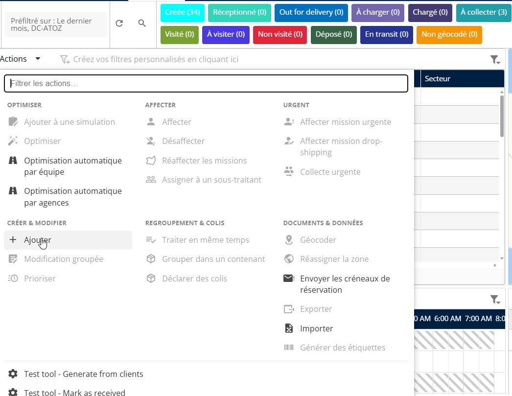
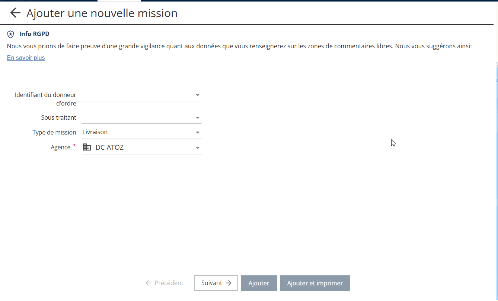
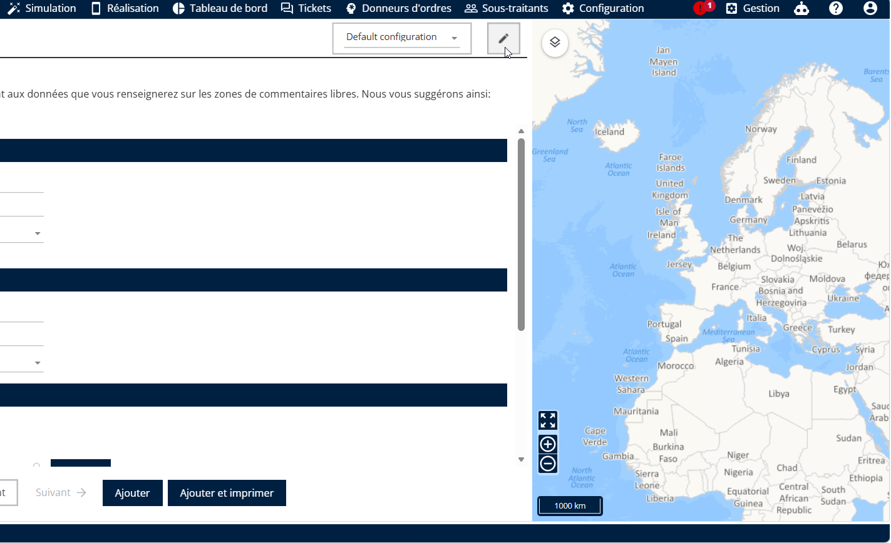
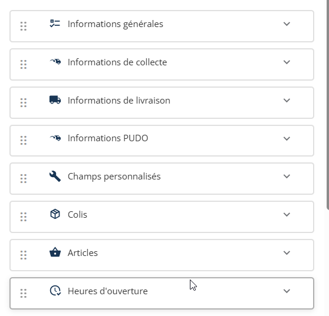
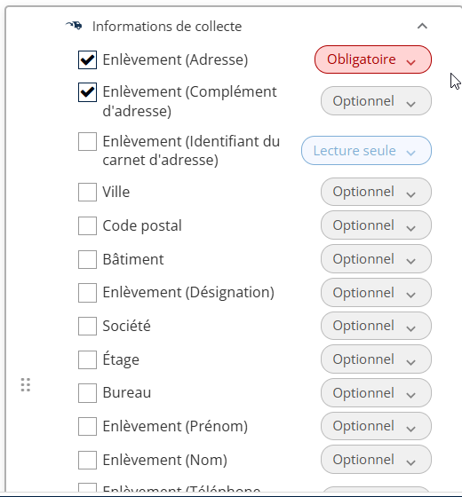
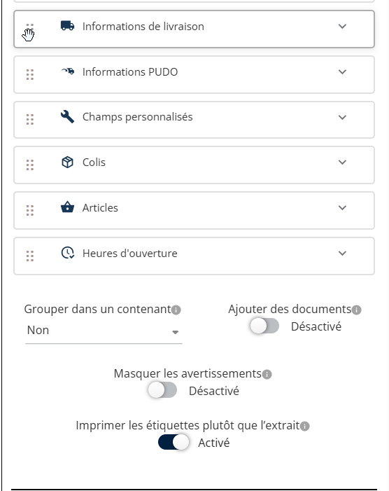
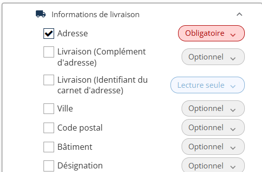
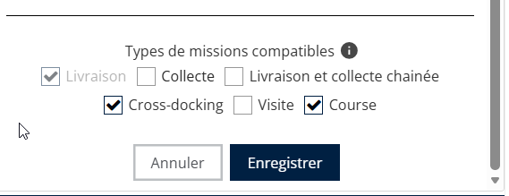

# Configuration de la création des missions

Les champs peuvent être organisés dans leurs blocs/sections respectifs afin de structurer la mise en page de création de mission selon vos besoins. Bien que l’organisation des champs à l’intérieur d’un bloc reste fixe, vous pouvez modifier la disposition globale en changeant l’ordre des blocs ou des sections.

Les blocs ou sections peuvent être réorganisés à l’aide de la fonctionnalité glisser-déposer. Toute modification effectuée par glisser-déposer est automatiquement synchronisée avec la visibilité et l’ordre affichés dans l’interface utilisateur du côté gauche.

1. Aller à **Gérer les missions**

<figure><figcaption></figcaption></figure>

2. Cliquez sur **Ajouter une mission**

<figure><figcaption></figcaption></figure>

3. Saisissez le **Type de mission, Agence**
4. Cliquez sur **Suivant**

<figure><figcaption></figcaption></figure>

5. Cliquez sur le **crayon** icône dans le coin supérieur droit.

<figure><figcaption></figcaption></figure>

6. Consultez les blocs d’informations disponibles :

* **Informations générales**
* **Informations de ramassage**
* **Informations de livraison**
* **Informations PUDO**
* **Champs personnalisés**

<figure><figcaption></figcaption></figure>

7. Configurer les champs dans chaque bloc : définir les champs comme modifiables, en lecture seule ou désactivés.

<figure><figcaption></figcaption></figure>

8. Utilisez le glisser-déposer pour :

* Réorganiser les champs à l’intérieur d’un bloc.
* Regroupez plusieurs champs dans un seul conteneur à l’aide de la poignée à six points.
*   Regroupez les colis dupliqués dans un conteneur :

    * La sélection **Oui** crée automatiquement une mission en fonction du type sélectionné ci-dessous.
    * La sélection **Non** empêche la création automatique de mission.
    * Facultatif — L’utilisateur se voit proposer cette option lors de la création de la mission.

    <figure><figcaption></figcaption></figure>

7. Développez ou réduisez les blocs selon les besoins.

<figure><figcaption></figcaption></figure>

8. **Enregistrer** la nouvelle configuration de mission.

<figure><figcaption></figcaption></figure>

 
