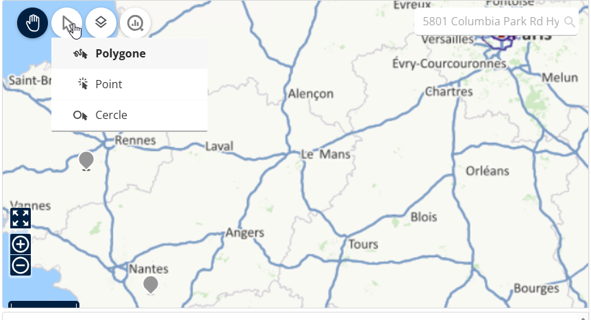
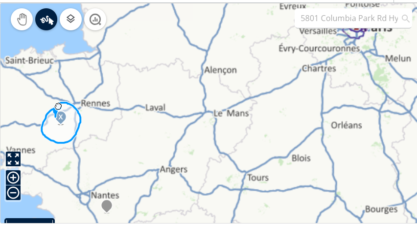
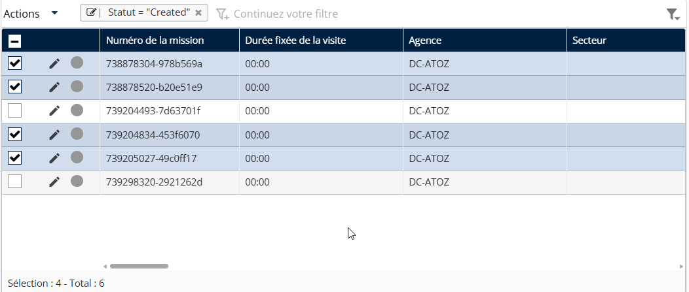

# Sélectionner des missions sur la carte

Depuis la Vue cartographique.

1. Utilisez le Sélection bouton pour choisir le méthode de sélection (par ex., polygone, cercle).

<figure><figcaption></figcaption></figure>

2. Dessinez/sélectionnez la région pour mettre en surbrillance les missions.

<figure><figcaption></figcaption></figure>

3. Les missions sélectionnées apparaîtront dans la vue en tableau du panneau de gauche.

<figure><figcaption></figcaption></figure>
