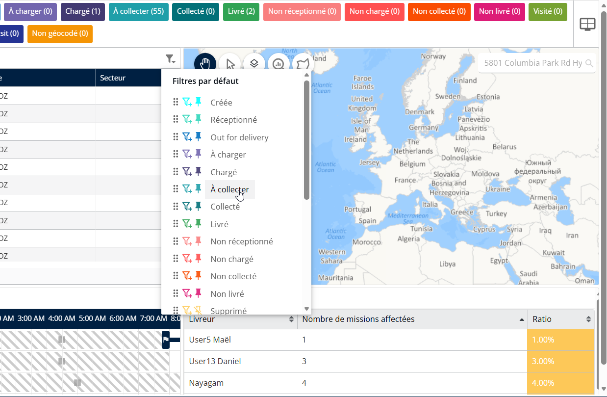
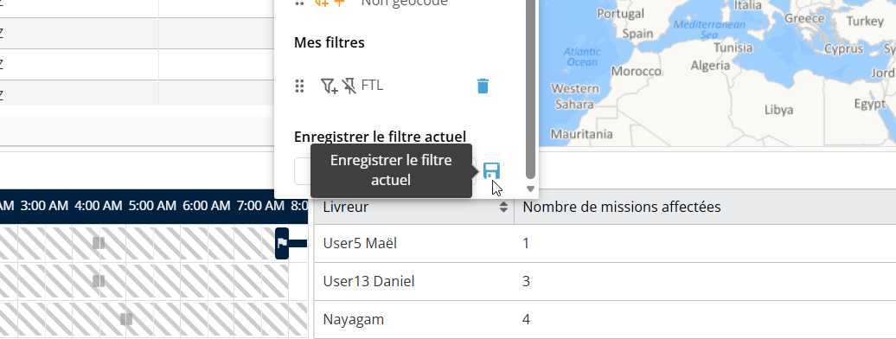

# Modifier l’ordre des raccourcis de statut des missions

### Modifier l’ordre des raccourcis des statuts de mission

1. Cliquez sur le **Icône de configuration du filtre (panneau gris).**
2. Faites glisser les statuts de mission dans l’ordre souhaité.

<figure><figcaption></figcaption></figure>

3. **Enregistrer** ou appliquez les modifications (uniquement pour la création d’un nouveau filtre)

<figure><figcaption></figcaption></figure>
