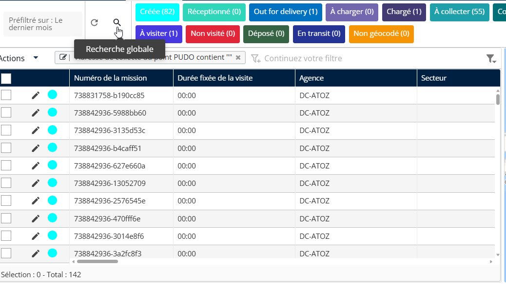
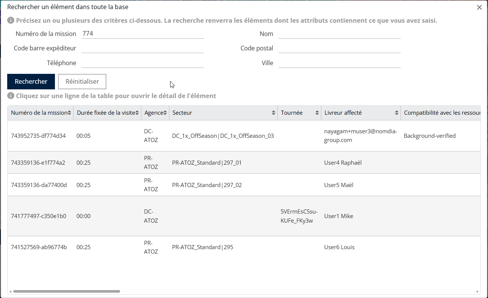

# Rechercher une mission

#### Rechercher une mission

1. Cliquez sur le **Rechercher** .

Vous pouvez effectuer une recherche à l’aide de l’un des champs suivants :

* **Numéro de mission**
* **Code-barres de l’expéditeur**
* **Numéro de téléphone**
* **Nom du client**
* **Code postal**
* **Ville**

<figure><figcaption></figcaption></figure>

2. Saisissez le **Critère souhaité** dans le champ de saisie.
3. Les détails de la mission correspondante apparaîtront ci-dessous.

<figure><figcaption></figcaption></figure>
