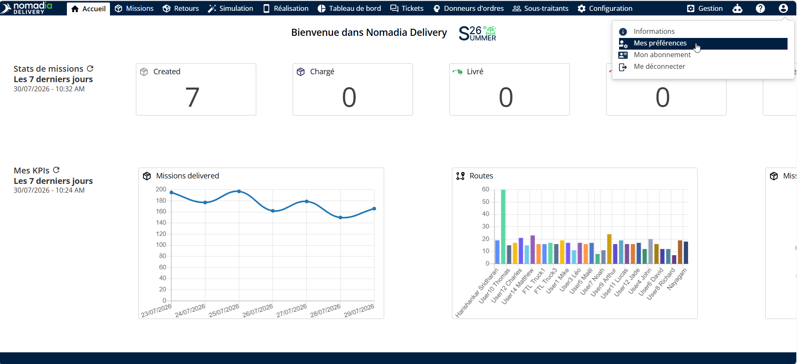
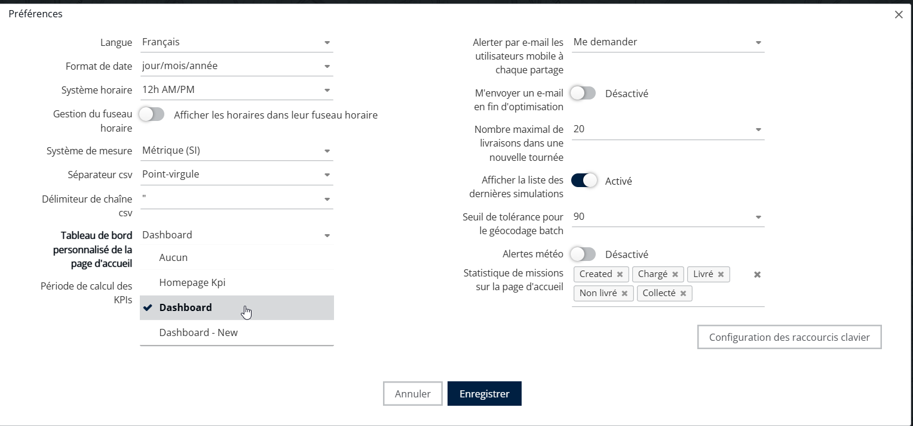
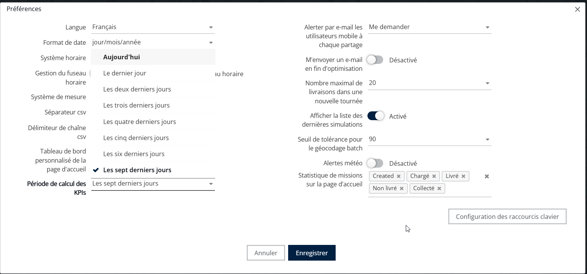
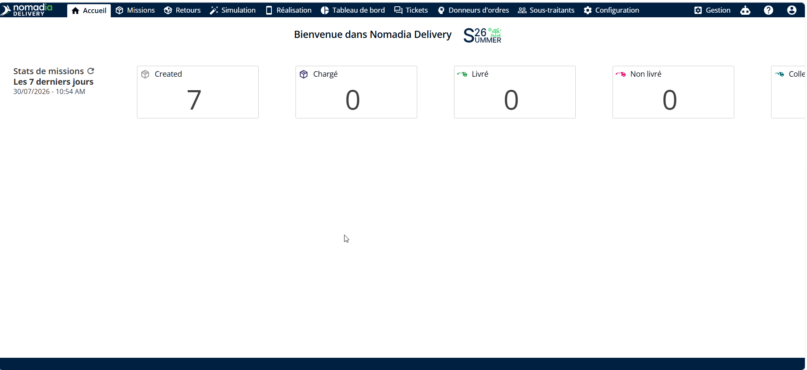

# Configurer l’affichage de mes KPI

Vous pouvez personnaliser votre écran d'accueil en sélectionnant les KPI les plus pertinents pour vos opérations. Nomadia Delivery vous permet d'afficher le tableau de bord de la page d'accueil configuré, ainsi qu'une période de calcul paramétrable allant du dernier jour aux sept derniers jours. Cela vous aide à rester concentré sur les indicateurs qui comptent le plus.

Depuis la **Page d'accueil,**

1. Cliquez sur le **Icône de compte** située dans le coin supérieur droit de l'écran.
2. Sélectionnez **Mes préférences** dans le menu déroulant

<figure><figcaption></figcaption></figure>

3. Choisissez le **Tableau de bord** depuis le tableau de bord personnalisé de la page d'accueil.

<figure><figcaption></figcaption></figure>

3. Sélectionnez une période allant du dernier jour aux sept derniers jours selon votre préférence.
4. Cliquez sur **Enregistrer**

<figure><figcaption></figcaption></figure>

5. Votre page d'accueil affichera le tableau de bord choisi.

<figure><figcaption></figcaption></figure>

 

 
